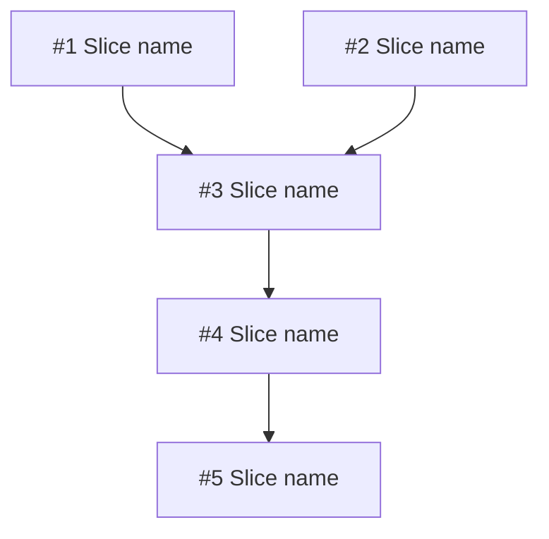

# Plan Template

Lives at `docs/agents/plans/YYYY-MM-DD-<slug>.md` (dated at creation; the slug matches its source ADR). Written by `write-plan`. Updated by `write-plan` on revisions.

This template enforces the **plain-English plan format** — a plan a human can read cold, top-to-bottom, without prior context. The shape was set in v1.22.0; the conventions are:

- **TL;DR at top** before any table. A reader who only reads the TL;DR knows what's happening.
- **Per-phase narrative intro** — 1-3 sentences of "why this phase exists" BEFORE any acceptance criteria, risk list, or mechanics.
- **Tables limited to TWO uses only** — the status block at the top (≤5 rows) and the slice list (once, in dependency order). No other tables anywhere.
- **Acceptance gates are numbered prose**, not stacked AND-clause bullets or nested checklists.
- **Risks are prose paragraphs** with embedded "Mitigation:" lines, not 3-level-nested bullets.
- **Jargon discipline** — terms with GLOSSARY entries (`pgroup`, `HITL:approval-gate`, `AFK:full-auto`, `tracer slice`, `pre-flight verification`) can be used unexplained because the GLOSSARY link is in the footer. Plan-specific identifiers (`pre-Slice-2 verification`, `pgroup-2A`) are defined inline on first use. Cross-plan jargon NOT in the GLOSSARY gets an inline definition on first use OR a GLOSSARY entry if used in 3+ plans.

The frontmatter dogfoods the telemetry convention — `Status:` is a deliberate lifecycle state; `Last-Reviewed:` is updated on review, not on every commit; `Superseded-By:` points at a replacement plan when applicable; `Version:` / `Release:` carry the release identifier.

Copy from here. Replace bracketed placeholders. Delete sections that genuinely don't apply (rare; default is to keep all sections, marking unused ones with "N/A — reason").

---

```yaml
---
Status: Active
Date-Created: YYYY-MM-DD
Last-Reviewed: YYYY-MM-DD
Superseded-By: null
Version: vX.Y.Z      # the release this plan ships in
Release: vX.Y.Z      # alias of Version; keep both or drop one. Carries spec->plan->release traceability.
Tier: Quick | Balanced | Deep
---
```

Filename convention: `docs/agents/plans/YYYY-MM-DD-<slug>.md` (slug is the uniqueness key). The version is carried in `Version:` / `Release:` above.

# Plan: [present-tense action that matches ADR title]

## TL;DR

[3-5 plain-English sentences. What we're shipping, why it matters, the rough shape. A reader picks up the plan cold and knows what's happening. NO jargon-cliff. The TL;DR must be readable BEFORE the GLOSSARY link is followed.]

| Plan ID | `plans/<slug>` |
|---|---|
| ADR | [`adrs/<NNNN-slug>`](../adrs/<NNNN-slug>.md) (or `adr-<slug>.md` if pre-release per ADR-0020 late-binding) |
| Tier | Quick \| Balanced \| Deep (inherited from spec) |
| Status | Proposed \| Active \| Done \| Superseded by `plans/<slug>` |
| Owner | [name / "AFK fleet" / "maintainer (HITL) + AFK fleet"] |

## Goal

[One sentence. The outcome a user sees when this plan is done.]

## Success measure

[One sentence. A binary, observable measurement. Examples: "p95 doc-save latency < 200ms over 7d on production traffic." "All 14 dogfood scenarios pass on `main` after the v1.X.0 release tag pushes." NOT "tests pass" or "code reviewed" — those are too generic to be contractual.]

## Phases

### Phase 1 — [short descriptive name]

[**Narrative intro (1-3 sentences).** Why this phase exists. What it accomplishes that subsequent phases depend on. Inline-define any plan-specific identifiers you'll use below. THIS PROSE IS REQUIRED — a phase that opens directly with "**Acceptance gate:**" is malformed.]

**Acceptance gate.** [Numbered prose, not stacked AND-bullets. Read as one paragraph or as a numbered list within a single paragraph. Example:] The phase is done when all four of these are simultaneously true: (1) [criterion 1]; (2) [criterion 2]; (3) [criterion 3]; (4) [criterion 4].

**Top risks.** [Prose paragraph with embedded Mitigation: lines. NOT nested bullets. Example:] The biggest risk is [specific risk]. Mitigation: [specific mitigation]. The second risk is [specific risk]. Mitigation: [specific mitigation]. The third risk is [specific risk]. Mitigation: [specific mitigation].

**Rollback hook.** [Specific operation in one sentence. "Single `git revert` per commit reverses Phase 1." OR "Feature flag `feature_x_enabled` → off." OR "ONE-WAY DOOR — no rollback after gate passes; gate raised correspondingly."]

### Phase 2 — [short name]

[Same shape. Phase 2 cannot start until Phase 1's gate passes — this is enforced by the chain reader (`tdd-loop`, `parallel-dev`), not just convention.]

### Phase 3 — [short name]

[Same shape.]

## Slice table

The slice list is the ONE table in the plan besides the status block. One row per slice. Estimates are illustrative; gates are contractual.

| ID | Name | Label | Phase | pgroup | Blocked by | Est | Rollback |
|---|---|---|---|---|---|---|---|
| #1 | [Slice name] | AFK:full-auto | 1 | pgroup-1A | — | 0.5d | `git revert` |
| #2 | [Slice name] | AFK:full-auto | 1 | pgroup-1A | — | 1d | `git revert` |
| #3 | [Slice name] | HITL:approval-gate | 1 | pgroup-1B | #1, #2 | 0.5d | `migrate resolve --rolled-back` |
| #4 | [Slice name] | HITL:per-file | 2 | pgroup-2A | #3 | 0.5d | Config revert |
| ... | ... | ... | ... | ... | ... | ... | ... |

Labels follow the GLOSSARY definitions — `AFK:full-auto`, `HITL:inline`, `HITL:approval-gate`, `HITL:per-file` (see [GLOSSARY.md § Slice](../GLOSSARY.md)). The `pgroup` column lists the parallelization group per the GLOSSARY definition — slices in the same pgroup can run concurrently via `parallel-dev`.

> Fixture identifiers are confirm-at-implementation. Where a row's Rollback or test path references a test-fixture identifier (dogfood scenario number, ADR slug, file index), record a placeholder (`tests/dogfood/<next-free-N>-<slug>/`, `adr-<slug>.md`), not a hard-coded literal. The implementer confirms against the live tree before creating the fixture.

Estimate convention: **d** = ideal engineer-day.

## Dependency DAG

The DAG renders the same dependency information as the slice table's Blocked-by column, but visually. Mermaid is preferred; ASCII is the fallback.



If the markdown viewer doesn't render Mermaid, use ASCII:

```
#1 ─┐
    ├─→ #3 ─→ #4 ─→ #5
#2 ─┘
```

## Parallelization map

- `pgroup-1A = {#1, #2}` — Phase 1, no inter-deps, both AFK. Disjoint file scopes: [one-line description per slice]. `parallel-dev` write-task dispatch via separate sub-worktrees.
- `pgroup-1B = {#3}` — single slice, sequential after pgroup-1A.
- `pgroup-2A = {#4, #5}` — Phase 2 after #3 lands. Disjoint scopes: [description].
- ...

Independence is verified against `parallel-dev`'s Phase 2 checklist (file overlap, state dependency, resource contention, ordering, implicit shared state) before two slices are co-labeled.

## Revisit triggers

This plan should be reopened — and `socratic-grill` re-run on the affected section — if any of:

- [Scale milestone, e.g., "MAU > 50k"]
- [Latency regression, e.g., "p95 > 500ms for > 10min"]
- [Capability requirement, e.g., "offline editing requested"]
- [External dependency change, e.g., "library X 2.0 ships with breaking API"]
- [ADR superseded, e.g., "ADR-NNNN status flips to Superseded"]

If a trigger fires mid-execution, halt at the current phase gate. Don't push through a triggered plan.

## Change log

(Added on first revision. Each entry: date, what changed, why.)

- YYYY-MM-DD — Initial plan written from `adrs/<NNNN-slug>.md`.
- YYYY-MM-DD — Phase 2 rollback path updated after canary surfaced X.

## References

- ADRs: [`adrs/<NNNN-slug>`](../adrs/<NNNN-slug>.md)
- Spec: [`specs/<slug>`](../specs/<slug>.md)
- Grill: [`specs/<slug>-grill`](../specs/<slug>-grill.md)
- Research: [`research/<slug>-research`](../research/<slug>-research.md) (when produced by a Deep-tier chain run)
- SYSTEM_CONTEXT: [`SYSTEM_CONTEXT.md`](../SYSTEM_CONTEXT.md)
- GLOSSARY (cross-plan jargon definitions): [`GLOSSARY.md`](../GLOSSARY.md)

---

HANDOFF: implementation ready — plan locked. Next: `tdd-loop` on Slice #1 (Phase 1, pgroup-1A). Parallelizable now: pgroup-1A = {#1, #2}. Gate to pass before Phase 2: [phase 1 acceptance gate, one line].

HANDOFF: pgroup-dispatch-ready — when `tdd-loop` is invoked on this plan, pgroups of size ≥ 2 will auto-dispatch via `parallel-dev`. Eligible pgroups: [comma-separated list].
