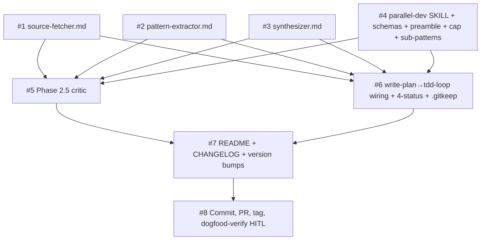

# Plan: Adopt the parallel subagent dispatch contract — v1.7.0

| Field         | Value                                                     |
|---------------|-----------------------------------------------------------|
| Plan ID       | `plans/0004-parallel-subagent-v1.7.0`                     |
| ADR           | [`adrs/0004-parallel-subagent-dispatch-contract`](../adrs/0004-parallel-subagent-dispatch-contract.md) |
| Status        | Proposed                                                  |
| Last updated  | 2026-05-12                                                |
| Owner         | Modie (Habeeb)                                            |

## Goal

Wire the four-part dispatch contract from ADR-0004 into the habeebs-skill chain so the first real callers (`prior-art-research` Phase 2.5 critic and `tdd-loop` Phase 0.5 pgroup auto-dispatch) operate against a binding, machine-readable, durable, idempotent dispatch surface — and the next invocation of `prior-art-research` would have caught the v1.6.0 hooks miss.

## Success measure

A fresh install of v1.7.0 produces all five observable behaviors within one Claude Code session running against this repo:

1. `/plugin install` succeeds with no validator errors (regression test for v1.5.4 manifest fix).
2. Invoking `prior-art-research` against dogfood scenario `07b-missing-hooks.md` produces a Phase 2.5 critic that surfaces "hooks / event handlers" as a missing category (the literal v1.6.0 audit failure mode reproduced and caught).
3. Invoking `prior-art-research` against dogfood scenario `07d-no-gap-control.md` produces a Phase 2.5 critic that returns `{approved: true}` with zero hallucinated additions (false-positive gate).
4. Invoking `tdd-loop` against dogfood scenario `08-pgroup-dispatch.md` produces (a) #1 and #2 dispatched in the same turn, (b) #3 starting only after both complete, (c) a dispatch record written at `docs/agents/dispatches/<id>.json`.
5. After v1.7.0 squash-merges into main, `/sync` runs cleanly on local main (regression test for Phase 6.5 fast-forward + ghost-commit handling carried over from v1.5.3/v1.5.4).

## Phases

### Phase 1 — Foundations

**Slices:** #1, #2, #3, #4 (the three agent prompt files + the `parallel-dev` SKILL contract update)

**Acceptance gate:** All four foundation files exist and pass mechanical checks. Specifically:
- `skills/parallel-dev/agents/source-fetcher.md`, `agents/pattern-extractor.md`, `agents/synthesizer.md` exist with correct frontmatter
- `skills/parallel-dev/SKILL.md` has new `## Return contract` section, updated Phase 4 with `Concurrency cap: default 5; per-pgroup override via opt-in \`concurrency: <N>\``, new `## Sub-patterns` section with Hypothesis-probe entry
- `skills/parallel-dev/references/dispatch-record-template.md` defines both JSON schemas (input + return) with `context_preamble` field and BLOCKED `suggested_action` enum
- Cross-ref check: `grep "agents/source-fetcher.md"`, `grep "agents/pattern-extractor.md"`, `grep "agents/synthesizer.md"` in `skills/parallel-dev/SKILL.md` all resolve to extant files
- JSON schema dry-parse: one example dispatch record hand-walked against the template; all required fields present

**Top risks:**
1. ADR-0002 interpretation drift — somebody re-reads the body and decides the dispatch-record carve-out is too aggressive (R8 from spec). Mitigated: ADR-0004 is explicit on the substrate-test failure; cross-reference inline in the dispatch-record-template.
2. JSON schemas under-specified — required vs optional unclear; consumers ambiguous about which fields fire when. Mitigated: schema dry-parse against a hand-walked example must succeed before phase gate.
3. Cross-ref breakage — Phase 1 adds three new agent files referenced by `parallel-dev/SKILL.md`; if the names drift between SKILL.md and the actual file names, downstream phases fail silently. Mitigated: cross-ref check is a literal gate.

**Rollback hook:** `git revert` per file — Phase 1 is markdown + JSON only, all new files. No data migration, no operational impact.

### Phase 2 — Wire the chain

**Slices:** #5 (Phase 2.5 critic in `prior-art-research`), #6 (`write-plan` → `tdd-loop` pgroup auto-dispatch + 4-status handling + idempotent re-invocation + `.gitkeep`)

**Acceptance gate:** Both wiring changes installed and provable via dogfood. Specifically:
- `skills/prior-art-research/SKILL.md` has a new Phase 2.5 section after current Phase 2; references `agents/category-completeness-critic.md` (new file authored as part of slice #5)
- `prior-art-research/references/output-template.md` has a new "Phase 2.5 outcome" section requiring written rejection reason per rejected critic addition
- `skills/tdd-loop/SKILL.md` has a new Phase 0.5 specifying entry-time-only pgroup walk + idempotent re-invocation via `git log --grep "Dispatch-id:"` inspection
- `skills/tdd-loop/SKILL.md` status-handling section explicitly defines DONE / DONE_WITH_CONCERNS (advance + warning) / BLOCKED (structured message, halt pgroup) / NEEDS_CONTEXT (re-dispatch once, escalate)
- `skills/write-plan/SKILL.md` Phase 4 emits new `HANDOFF: pgroup-dispatch-ready` line
- `docs/agents/dispatches/.gitkeep` committed
- **Dogfood gate (load-bearing):** invoke `prior-art-research` against `tests/dogfood/07b-missing-hooks.md` (the literal v1.6.0 miss). Critic must surface "hooks / event handlers" as a missing category. Invoke against `tests/dogfood/07d-no-gap-control.md`. Critic must return `{approved: true}` with zero hallucinated additions. If either dogfood fails, phase 2 does NOT pass.

**Top risks:**
1. **Phase 2.5 critic silent rubber-stamping (R2 from spec).** The critic prompt is too weak; it agrees with everything. Mitigated by the 4-scenario adversarial suite at `tests/dogfood/07-category-critic/` — specifically scenario 07d (no-gap control) is the false-positive gate; 07a/b/c are the false-negative gates. If the critic fails any of the four, phase 2 fails and the prompt gets tuned.
2. **Phase 2.5 critic noise (R1 from spec).** The critic surfaces too many "missing categories" that aren't actually missing. Mitigated: bounded at 1 iteration; lead must record written rejection reason per addition. High rejection-with-reason rate over the first 3 dogfood runs triggers prompt tuning.
3. **Pgroup detection breaks single-slice flows (R5 from spec).** `tdd-loop` Phase 0.5 walks plans expecting pgroups; a plan with no pgroup of size ≥2 must no-op cleanly. Mitigated: a 1-slice regression dogfood scenario (`08-no-pgroup-control.md`) added as part of slice #6; phase gate requires its zero-dispatch behavior.

**Rollback hook:** `git revert` of Phase 2 commits. If only Phase 2.5 critic misbehaves but pgroup-dispatch is fine, revert can be surgical: just revert `prior-art-research/SKILL.md` changes; tdd-loop wiring remains. (Slice-level revert is supported because slices #5 and #6 touch different SKILL files.)

### Phase 3 — Discovery surfaces

**Slices:** #7 (README + CHANGELOG + version bumps to 1.7.0)

**Acceptance gate:** All discovery surfaces reflect v1.7.0 content. Specifically:
- `README.md` mentions Phase 2.5 critic in one sentence and pgroup auto-dispatch in one sentence (methodology-tone, no feature-marketing)
- `CHANGELOG.md` has a v1.7.0 entry above v1.6.0 listing all six prior slices with a "Why" line per change, plus a "Why this is a MINOR" note (opt-in behavior — existing chains keep working unchanged)
- `.claude-plugin/plugin.json` version → `1.7.0`
- `.claude-plugin/marketplace.json` version → `1.7.0`
- Cross-reference check: both manifests match; CHANGELOG entry references the same slices the spec did

**Top risks:**
1. **MINOR vs patch confusion.** v1.6.0 was MINOR for hooks; v1.7.0 is MINOR for parallel-subagent. Risk of downstream auto-updaters mis-classifying. Mitigated: explicit "Why this is a MINOR" section in CHANGELOG, same pattern as 0003 plan used.
2. **README sprawl.** Adding two sentences may grow into a section. Mitigated: hard-cap at two sentences during slice #7 acceptance; if more is needed, defer to a sibling doc.
3. **Version drift between manifests.** Bumping one and forgetting the other was a recurring v1.5.x bug. Mitigated: cross-ref check at phase gate; both files in same commit.

**Rollback hook:** `git revert` — pure surface changes, no operational impact.

### Phase 4 — Release

**Slices:** #8 (commit, PR, tag, dogfood-verify) — HITL:inline

**Acceptance gate:** v1.7.0 is shipped and verified. Specifically:
- PR opens cleanly with all checks passing (no validator errors on the plugin manifests per v1.5.4 lessons)
- Dogfood scenarios 07a/b/c/d + 08 + 08-no-pgroup-control all run end-to-end on the PR branch and produce expected behavior
- Squash-merge into main (manual by Modie per ADR-0001 default-branch protection)
- `v1.7.0` tag created; GitHub release published with CHANGELOG copy
- Post-merge: `/sync` runs cleanly on local main (regression test for Phase 6.5 ghost-commit + fast-forward handling, v1.5.3/v1.5.4)
- ADR-0004 status flipped from Proposed → Accepted in the same commit that lands slice #8

**Top risks:**
1. **Squash-merge ghost commit (recurring pain).** Mitigated by the v1.5.3/v1.5.4 `/sync` Phase 6.5 — this phase's gate explicitly re-tests it.
2. **Tag-then-release race.** If the GitHub release is created before the tag, the release points nowhere. Mitigated: same pattern as v1.5.4/v1.6.0 — tag first, then release.
3. **Dogfood scenarios silently pass when they should fail.** If the load-bearing 07b/07d scenarios pass without exercising the critic correctly, we ship a broken critic. Mitigated: human-eye verification in slice #8 — Modie reads the critic's output on 07b and confirms it actually says "hooks/event handlers", and on 07d confirms zero hallucinated additions. This is why slice #8 is HITL:inline, not AFK.

**Rollback hook:** Pre-merge: `git reset --soft HEAD~N` and abandon PR. Post-merge: v1.7.1 hotfix can change manifest version or remove the new Phase 2.5 section (markdown revert) or remove the `tdd-loop` Phase 0.5 entry. The new agent prompt files are inert if not referenced — leaving them costs nothing. Tag publish is one-way; users who pulled v1.7.0 stay on it until v1.7.1.

## Slice table

| ID  | Name                                                                    | Label           | Phase | pgroup     | Blocked by  | Est   | Rollback hook                           |
|-----|-------------------------------------------------------------------------|-----------------|-------|------------|-------------|-------|-----------------------------------------|
| #1  | Write `skills/parallel-dev/agents/source-fetcher.md`                    | AFK:full-auto   | 1     | pgroup-1A  | —           | 0.2d  | `git revert`                            |
| #2  | Write `skills/parallel-dev/agents/pattern-extractor.md`                 | AFK:full-auto   | 1     | pgroup-1A  | —           | 0.2d  | `git revert`                            |
| #3  | Write `skills/parallel-dev/agents/synthesizer.md`                       | AFK:full-auto   | 1     | pgroup-1A  | —           | 0.3d  | `git revert`                            |
| #4  | `parallel-dev` SKILL.md + `dispatch-record-template.md` (contract)     | AFK:full-auto   | 1     | pgroup-1A  | —           | 0.5d  | `git revert`                            |
| #5  | `prior-art-research` Phase 2.5 critic + 4-scenario dogfood suite        | AFK:full-auto   | 2     | pgroup-2A  | #4          | 0.6d  | `git revert` (surgical — single SKILL)  |
| #6  | `write-plan`→`tdd-loop` pgroup wiring + 4-status handling + `.gitkeep` | AFK:full-auto   | 2     | pgroup-2A  | #4          | 0.7d  | `git revert` (surgical — two SKILLs)    |
| #7  | README + CHANGELOG + version bumps to 1.7.0                             | AFK:full-auto   | 3     | pgroup-3A  | #1-#6       | 0.2d  | `git revert`                            |
| #8  | Commit, PR, tag, dogfood-verify v1.7.0                                  | HITL:inline     | 4     | pgroup-4A  | #7          | 0.3d  | Pre-merge: `git reset --soft HEAD~N`; post-merge: v1.7.1 hotfix |

**Label legend:**
- `AFK:full-auto` — no human in the loop; safe for autonomous dispatch (but see "Sequential dispatch caveat" below)
- `HITL:inline` — human gates in the active chat session

**Estimate convention:** **d** = ideal engineer-days. Estimates illustrative for sequencing; gates contractual.

**Sequential dispatch caveat (R10 from spec — load-bearing):** Slices #1-#4 are pgroup-1A-eligible (4 independent files); slices #5-#6 are pgroup-2A-eligible (2 different SKILL files). BUT v1.7.0 itself ships the wiring that enables auto-dispatch. By construction, v1.7.0 implementation runs SEQUENTIALLY — there is no callable dispatcher yet. The pgroup labels are recorded for the first post-merge v1.8.0+ release that consumes this plan format. The chicken-and-egg constraint is structural, not a process choice.

## Dependency DAG



(ASCII fallback:)

```
#1 ──┐
#2 ──┼──→ (independent pgroup-1A) ──→ #5 ──┐
#3 ──┤                                       ├──→ #7 ──→ #8
#4 ──┘                                  #6 ──┘
                                  (pgroup-2A)
```

## Parallelization map

- `pgroup-1A` = {#1, #2, #3, #4} — Phase 1, AFK. Four distinct files at distinct paths (`agents/source-fetcher.md`, `agents/pattern-extractor.md`, `agents/synthesizer.md`, `SKILL.md` + `references/dispatch-record-template.md`). Verified against `parallel-dev` Phase 2 independence checklist: file overlap NONE; state dep NONE; resource contention NONE (markdown writes); ordering NONE; implicit shared state NONE.
- `pgroup-2A` = {#5, #6} — Phase 2, AFK. Slice #5 touches `skills/prior-art-research/SKILL.md` + `prior-art-research/references/output-template.md` + new `agents/category-completeness-critic.md` + `tests/dogfood/07-category-critic/*.md`. Slice #6 touches `skills/write-plan/SKILL.md` + `skills/tdd-loop/SKILL.md` + `docs/agents/dispatches/.gitkeep` + new `tests/dogfood/08-pgroup-dispatch.md` + new `tests/dogfood/08-no-pgroup-control.md`. Independence verified: zero file overlap; both depend on #4's contract but don't depend on each other.
- `pgroup-3A` = {#7} — Phase 3, AFK, single slice.
- `pgroup-4A` = {#8} — Phase 4, HITL:inline, single slice.

**Independence sanity:** all pgroup members verified against `parallel-dev` Phase 2 checklist (file overlap / state / resource / order / implicit state).

**Eligibility note (R10 reaffirmed):** pgroup-1A and pgroup-2A are recorded as eligible for the FIRST v1.8.0+ release that runs `tdd-loop` against this plan format. v1.7.0's OWN implementation runs sequentially because the auto-dispatch wiring (slice #6) is what this release ships — the dispatcher consumes the contract being defined. First real exercise of pgroup-1A-style parallel dispatch is on a downstream release.

**20% rule check:** 6 of 8 slices (75%) are AFK-parallelizable. Above the typical 80% red-line but justified by the prereq-heavy structure — slices #1-#4 are genuinely four independent files; slices #5-#6 are two independent skill modifications. Spec's Risk register acknowledged this in R3 (parallel writes) and resolved it via worktree isolation. Not aspirational tagging.

## Risk register

| #   | Phase | Risk                                                                | Likelihood | Impact | Mitigation                                                       |
|-----|-------|---------------------------------------------------------------------|------------|--------|------------------------------------------------------------------|
| R1  | 2     | Phase 2.5 critic noise — surfaces too many false-positive missing categories | Medium | Medium | Bounded at 1 iteration; lead must record written rejection reason per addition; high reject-with-reason rate over first 3 runs triggers prompt tuning |
| R2  | 2     | Phase 2.5 critic silent rubber-stamping — agrees with everything    | Medium     | High   | 4-scenario adversarial dogfood suite (07a/b/c/d) at `tests/dogfood/07-category-critic/` — load-bearing gate; 07d is the false-positive gate; phase 2 fails if any scenario fails |
| R3  | 2     | Pgroup auto-dispatch causes unexpected parallel writes if slice independence isn't real | Low | High | `parallel-dev` Phase 2 (existing) requires independence proof before dispatch; worktree-per-subagent makes file-level overlap impossible |
| R4  | 1     | Dispatch state file (`docs/agents/dispatches/<id>.json`) accumulates without bound | Medium | Low | Document retention rule in `parallel-dev/SKILL.md`: records older than 30 days prunable via `/sync`; revisit trigger at 1000 records |
| R5  | 2     | Pgroup detection in `tdd-loop` Phase 0.5 breaks single-slice flows that don't have pgroups | Low | High | Acceptance criterion explicitly requires no-op for plans with no pgroup ≥2; 1-slice regression dogfood at `tests/dogfood/08-no-pgroup-control.md` |
| R7  | 1     | Concurrency cap of 5 turns out to be wrong for some workloads       | Medium     | Low    | Soft cap; opt-in per-pgroup `concurrency: <N>` override field; revisit if median override usage > 50% of pgroups |
| R8  | 1     | ADR-0002 (no runtime substrate) gets interpreted as blocking the dispatch state file | Low | High | Pre-empted by ADR-0004 explicit carve-out; substrate test fails on all 4 criteria; cross-ref inline in `dispatch-record-template.md` |
| R9  | 2, 3  | Token cost amplification per chain run exceeds user tolerance       | Medium     | Medium | Phase 2.5 critic adds ~1 subagent call to research runs; pgroup dispatch only fires when pgroup ≥2 exists; documented amplification (1.2-1.4× research, 1.0× implementation-without-pgroups) in CHANGELOG |
| R10 | 1-4   | Chicken-and-egg — can't exercise new wiring on this release's own implementation | Medium | Low | Resolved by sequential implementation of v1.7.0; first real exercise of pgroup auto-dispatch is on v1.8.0+ releases — this is a load-bearing constraint, not a deferred fix |
| R11 | 4     | Squash-merge ghost commit on v1.7.0 merge to main                   | Low (after v1.5.3/v1.5.4 fixes) | Low | `/sync` Phase 6.5 explicitly re-tested in Phase 4 acceptance gate |
| R12 | 4     | Human-eye dogfood verification of 07b/07d silently passes when it should fail | Medium | High | Slice #8 is HITL:inline; Modie reads critic output verbatim on 07b ("hooks" must appear) and 07d (zero additions); not auto-merged |

**Note on R6:** R6 from spec (4-status drift if Superpowers diverges) is now ADR-0004's first revisit trigger — out of plan scope. The plan's job is to ship the snapshot; the ADR's job is to declare when to revisit.

## Revisit triggers

This plan should be re-opened if any of:

- Phase 2 dogfood scenario 07d (false-positive control) fails — critic hallucinates categories. Halt at Phase 2 gate; re-run `socratic-grill` on the Phase 2.5 critic prompt; tune.
- Phase 2 dogfood scenarios 07a/b/c pass too easily across 3+ unrelated feature types within first 30 days post-merge — critic may be pattern-matching specific dogfood structures rather than catching real gaps. Re-open with new adversarial scenarios.
- Dogfood scenario 08 flakes intermittently due to Claude Code v2 subagent-spawn races. Re-open Phase 1; consider lowering soft cap to 3 or adding retry-with-backoff in `parallel-dev`.
- A user invokes `parallel-dev` from an unrelated skill that doesn't return the 4-status contract — backwards-compat hole. Re-open plan to add a contract-validation step.
- ADR-0004 status flips to Deprecated or Superseded — plan must follow. Re-open all phases.
- `docs/agents/dispatches/` directory exceeds 1000 records on any user's install — retention policy becomes urgent. Re-open Phase 1 (slice #4) to document retention as part of the contract.
- v1.8.0 candidates (surfaces 6, 10, 11, 12, 13 from research) become urgent before v1.7.0 ships. Re-open to consider bundling.

If a trigger fires mid-execution, halt at the current phase gate and re-run `socratic-grill` on the affected sections before continuing.

## Change log

- 2026-05-12 — Initial plan written from ADR-0004 (Status: Proposed).

## References

- ADR: [`adrs/0004-parallel-subagent-dispatch-contract`](../adrs/0004-parallel-subagent-dispatch-contract.md)
- Spec: [`specs/v1.7.0-parallel-subagent`](../specs/v1.7.0-parallel-subagent.md)
- Grill record: [`specs/v1.7.0-parallel-subagent-grill`](../specs/v1.7.0-parallel-subagent-grill.md)
- Factor check: [`specs/v1.7.0-parallel-subagent-agent-factors`](../specs/v1.7.0-parallel-subagent-agent-factors.md)
- Sister plans: [`plans/0003-hooks-v1.6.0`](./0003-hooks-v1.6.0.md) — just-shipped v1.6.0 hooks plan; reference for shape/conventions
- Sister ADRs: [`adrs/0001-environment-binding-via-system-context`](../adrs/0001-environment-binding-via-system-context.md), [`adrs/0002-habeebs-skill-standalone`](../adrs/0002-habeebs-skill-standalone.md), [`adrs/0003-hooks-scope`](../adrs/0003-hooks-scope.md)
- SYSTEM_CONTEXT: [`SYSTEM_CONTEXT.md`](../SYSTEM_CONTEXT.md)
- External:
  - [Superpowers `subagent-driven-development/implementer-prompt.md`](https://github.com/obra/superpowers/blob/main/skills/subagent-driven-development/implementer-prompt.md) — 4-status return contract source
  - [Anthropic — How we built our multi-agent research system](https://www.anthropic.com/engineering/multi-agent-research-system) — lead-subagent preamble pattern source
  - [humanlayer/12-factor-agents](https://github.com/humanlayer/12-factor-agents) — F3 / F6 / F13 cited in ADR-0004

---

HANDOFF: implementation ready — plan locked at `docs/agents/plans/0004-parallel-subagent-v1.7.0.md`.
  Next: `tdd-loop` on slice #1 (Phase 1, pgroup-1A — but dispatched SEQUENTIALLY for v1.7.0 itself per R10).
  Sequential order: #1 → #2 → #3 → #4 → #5 → #6 → #7 → #8.
  Gate to pass before Phase 2: all 4 foundation files exist, cross-refs resolve, schemas dry-parse.
  Gate to pass before Phase 3: Phase 2.5 critic passes scenarios 07a/b/c/d AND pgroup dispatch passes scenario 08 AND no-pgroup regression passes 08-no-pgroup-control.
  Gate to pass before Phase 4: README + CHANGELOG + manifests all at 1.7.0.
  Phase 4 is HITL:inline — Modie verifies dogfood output on 07b and 07d before squash-merge.
