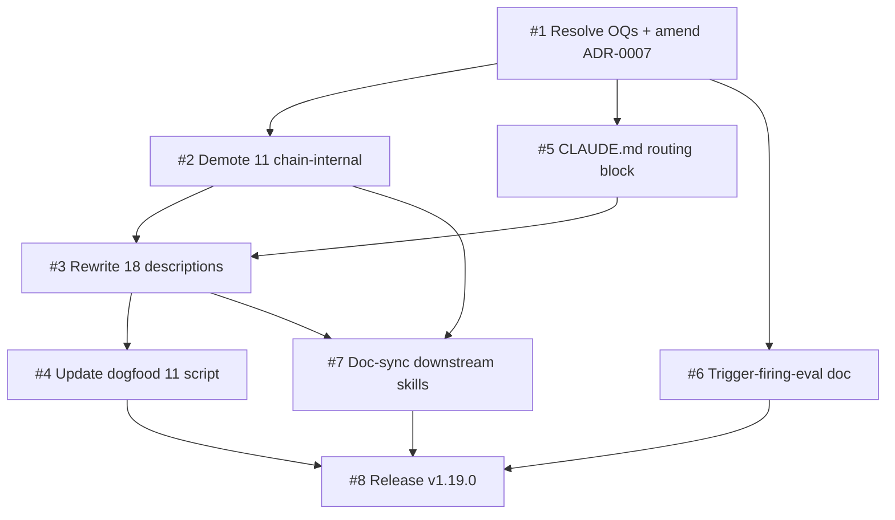

# Plan: Apply the v1.19.0 description-policy amendment — anatomy rewrite + auto-invocation scope + routing primer

| Field         | Value                                                                                  |
|---------------|----------------------------------------------------------------------------------------|
| Plan ID       | `plans/0007-description-policy-amendment-v1.19.0`                                      |
| ADR           | [`adrs/0007-description-budget-policy`](../adrs/0007-description-budget-policy.md) (amended 2026-05-24, § "## 2026-05-24 Amendment") |
| Tier          | Balanced (inherited from spec / grill)                                                 |
| Status        | Active — Phase 1 already complete (this chain locked the ADR amendment); Phase 2+ pending |
| Last updated  | 2026-05-24                                                                             |
| Owner         | ahabeeb1                                                                               |

## Goal

Skills auto-invoke reliably on natural-language dev prompts. When a user says "refactor this", "fix this bug", or "let's add a feature" without any habeebs-specific vocabulary, the matched entry-point skill fires within 2 turns.

## Success measure

**+30 days after v1.19.0 release on `main`, the real-session transcript eval (Slice 6) shows a ≥10 percentage-point improvement** in: (sessions containing any of `"build"`, `"add"`, `"refactor"`, `"fix this"`, `"design"`, `"implement"` in the user prompt AND the matched entry-point skill fires within 2 turns) / (all sessions containing any of those keywords), measured against the pre-release baseline captured before Slice 3 lands.

Below the 10pp threshold, the v1.20.0 fallback is `You MUST use this skill when…` (imperative-with-pronoun variant), NOT a revert.

## Phases

### Phase 1 — Decisions & policy lock (COMPLETE — recorded for chain-history)

**Slices:** #1 (resolve OQs + amend ADR-0007)

**Acceptance gate:** ADR-0007 carries the 2026-05-24 amendment section in `main`; 6 OQs all DECIDED; grill record committed at `docs/agents/specs/v1.19.0-auto-trigger-reliability-grill.md`. **GATE PASSED** during the chain run that produced this plan.

**Top risks:**
1. Amendment misses a load-bearing clause that surfaces during implementation — mitigation: implementation slices reference the ADR section letter (A–F) directly, so a missing clause becomes obvious at slice start.
2. v1.20.0 fallback variant assumption (`You MUST use this skill when…`) is also too advisory — mitigation: phase 5's release captures a pre-rewrite eval baseline so v1.19.0 has comparison data either way.
3. The 2 unresolved implicit ambiguities (A-7 rollback shape, A-8 `/help` interaction, A-9 layer cutover) bite during execution — mitigation: phase 2's gate explicitly probes A-8 and A-9.

**Rollback hook:** Phase 1 is **historical** — the ADR amendment is already in the repo. Rollback means writing a *new* ADR (0019+) that supersedes the 2026-05-24 amendment. Not a `git revert` because subsequent slices depend on the amended ADR's anatomy + scope clauses.

---

### Phase 2 — Structural changes (no description content yet)

**Slices:** #2 (demote 11 chain-internal via `disable-model-invocation`), #5 (CLAUDE.md routing block), #6 (trigger-firing-eval methodology doc + dogfood 13 README update)

**Acceptance gate:** **Open a fresh Claude Code session in this repo. Type three natural-language probes — `"refactor this file"`, `"I want to add a feature"`, `"this test is failing"`. For each, observe the agent's response and confirm: (a) the routed entry-point skill (`deep-modules`, `prior-art-research`, `systematic-debugging`) is named in the agent's first response; (b) typing `/spec` still launches `draft-spec` identically to v1.17.0; (c) typing `/parallel` still launches `parallel-dev`. Capture transcript as the pre-rewrite baseline for Slice 6's eval.**

This gate also closes implicit-ambiguity A-8 (`/help` interaction with `disable-model-invocation`) — running `/help` in the fresh session must still surface the 11 demoted slash-commands. If `/help` *omits* them, halt and reverse Slice 2's `disable-model-invocation: true` setting (Anthropic's frontmatter may have stricter semantics than expected).

**Top risks:**
1. `disable-model-invocation: true` removes demoted skills from `/help` *and* slash-command surfaces — would break the constraint that slash paths stay functional. Mitigation: gate probe (c) verifies before Phase 3 starts.
2. CLAUDE.md routing-table syntax contradicts Slice 2's demoted set (e.g., table lists `/research` for a "build" trigger but the table says it routes to `prior-art-research` whose slash is `/research` — verify slash-command names match `commands/*.md`). Mitigation: gate probe (b) uses `/spec` not `/draft-spec` — verify in code before write.
3. Slice 6's trigger-firing-eval doc cites a sample-set size (last 30 sessions OR 14 days) that may be unattainable on a low-traffic local repo. Mitigation: the doc states "whichever yields more" — degrades gracefully to whatever exists.

**Rollback hook:** Three reversible edits.
- Slice 2: `git revert` the frontmatter commits (one line per SKILL.md) — restores auto-invocation.
- Slice 5: `git revert` the CLAUDE.md commit — restores pre-routing CLAUDE.md.
- Slice 6: `git rm docs/agents/references/trigger-firing-eval.md` + `git checkout HEAD~ tests/dogfood/13-trigger-precision/README.md` — restores dogfood 13's primary-signal status.

All three rollbacks are independent — partial rollback (e.g., undo Slice 2 only) is supported if the gate probe surfaces one issue but not the others.

---

### Phase 3 — Description rewrite (the load-bearing edit)

**Slices:** #3 (rewrite all 18 SKILL.md descriptions)

**Acceptance gate:** **All 18 SKILL.md descriptions pass `tests/dogfood/11-description-budget/check-description-budget.sh` *after* the Phase-4 script update (Slice 4) has been applied. AND a manual review pass confirms every description has: (a) length 150-400 chars, (b) ≥2 literal user phrases in straight quotes, (c) the prescribed imperative directive (`ALWAYS use` / `You MUST use` / `Use when`), (d) no `Make sure to use this skill` legacy phrasing, (e) the matching anti-trigger clause.**

The gate is intentionally tied to Slice 4's updated script — running the *old* script on the new descriptions would produce false-positive failures (e.g., legacy `make sure to use this skill` regex). The order is: Slice 3 drafts → Slice 4 script updated → re-run script → manual review → gate passes.

**Top risks:**
1. Description rewrites lose a trigger keyword that was empirically catching some marginal user phrasing. Mitigation: the 3 keystone descriptions (`prior-art-research`, `systematic-debugging`, `deep-modules`) get extra review; manual review pass captures any obvious miss against the existing dogfood 13 corpus.
2. The 150-400 char target is unrealistic for some skills (e.g., `using-habeebs-skill` is a meta-orientation skill — its catchment is wider). Mitigation: the 1,024 char hard cap is the only mechanically-enforced rule; the 300 char avg target is enforced *across all 18*, so individual skills can exceed.
3. Slice 3 is HITL and may stall if the user runs out of time mid-rewrite. Mitigation: rewrite skills can be done in batches of 3-4 across multiple sessions; each batch commits independently. The slice does not require atomic completion.

**Rollback hook:** `git revert` the Slice 3 commits restores v1.17.0 descriptions. Slice 2's frontmatter edits remain (auto-invocation stays scoped); the routing primer in CLAUDE.md remains. So a Phase 3 revert leaves us in "demoted scope + old descriptions" state — degraded but functional.

---

### Phase 4 — Test enforcement + downstream sync

**Slices:** #4 (`check-description-budget.sh` update), #7 (doc-sync `release` / `setup-habeebs-skill` / `using-habeebs-skill` references)

**Acceptance gate:** **`bash tests/dogfood/11-description-budget/check-description-budget.sh` exits 0 against the v1.19.0 branch AND exits 1 against `main` pre-merge (regression-test the negative). All 3 SKILL.md files in Slice 7 reference the amended ADR-0007 section A-F.**

The "exits 1 on `main`" check is the canary that the script update genuinely tightened the policy — if the new script passes on v1.17.0 descriptions, something was missed.

**Top risks:**
1. Slice 4's new regex misses a legitimate description variant (e.g., a description that uses `Use when` correctly but the regex demands `use when` lowercase). Mitigation: regex is case-insensitive (`-iE`); test against all 18 Phase-3 rewrites before committing the script.
2. Slice 7's doc-sync edits introduce circular references (e.g., `release` skill references ADR-0007 amendment, which references `release` skill's doc-sync). Mitigation: edits are read-only references to ADR-0007 section letters; no skill needs to *quote* the ADR.
3. The block-scalar-rejection check (per OQ-4 resolution) may collide with future SKILL.md schemas that legitimately use folded scalars. Mitigation: the regression guard rejects `|` and `>` only on the `description:` line, not elsewhere in frontmatter; conservative scope.

**Rollback hook:** Slice 4 — `git revert` restores v1.17.0 dogfood 11 script (passes on old descriptions). Slice 7 — `git revert` restores v1.17.0 SKILL.md doc-sync text. Both independent.

---

### Phase 5 — Release (terminal)

**Slices:** #8 (version bump + CHANGELOG + PR + tag-push)

**Acceptance gate:** **Tag `v1.19.0` exists on `origin`. `plugin.json` and `marketplace.json` reflect `1.18.0`. `CHANGELOG.md` v1.19.0 entry has a Why line citing trigger-firing reliability and the ADR-0007 amendment. PR merged to `main`.**

**Top risks:**
1. The doc-sync coverage audit in `release` skill (per Slice 7 amendment) catches an undocumented change. Mitigation: Slice 7 specifically updates the audit's coverage; this is the audit's *first* run on the v1.19.0 template, so any miss surfaces as a release-skill error, not a silent gap.
2. Tag-push hook (per ADR-0015) blocks the push because of pre-release rules. Mitigation: ADR-0015 specifically allows tag-only pushes on default branch; verify the hook still honors that.
3. Post-release, the 30-day transcript eval (Slice 6 cadence) shows <10pp lift — gating the v1.20.0 candidate. Mitigation: this is *expected behavior* per the success metric. v1.20.0 is the planned response, not a regression.

**Rollback hook:** Pre-tag, standard PR-revert. Post-tag, the tag stays (immutable) but a v1.18.1 patch can revert the description changes if real-session breakage emerges. **Tagged releases are not rolled back via tag deletion** — they're superseded by a v1.18.1.

---

## Slice table

| ID  | Name                                            | Label              | Phase | pgroup     | Blocked by | Est  | Rollback hook                                          |
|-----|-------------------------------------------------|--------------------|-------|------------|------------|------|--------------------------------------------------------|
| #1  | Resolve OQs + amend ADR-0007                    | HITL:inline        | 1     | pgroup-1A  | —          | 0.5d | New ADR supersedes amendment (not git revert)          |
| #2  | Demote 11 chain-internal via `disable-model-invocation` | AFK:full-auto      | 2     | pgroup-2A  | #1         | 0.5d | `git revert` frontmatter commits                       |
| #5  | Add `## Skill routing` block to CLAUDE.md       | AFK:full-auto      | 2     | pgroup-2A  | #1         | 0.5d | `git revert` CLAUDE.md commit                          |
| #6  | Trigger-firing-eval doc + dogfood 13 README     | HITL:approval-gate | 2     | pgroup-2A  | #1         | 1d   | `git rm` new doc + `git checkout HEAD~` dogfood README |
| #3  | Rewrite 18 SKILL.md descriptions                | HITL:inline        | 3     | pgroup-3A  | #1, #2, #5 | 2d   | `git revert` description commits                       |
| #4  | Update `check-description-budget.sh` for v1.19.0 policy | AFK:full-auto      | 4     | pgroup-4A  | #1, #3     | 0.5d | `git revert` dogfood script commit                     |
| #7  | Doc-sync `release`/`setup`/`using-habeebs-skill` | AFK:full-auto      | 4     | pgroup-4A  | #1, #2, #3 | 0.5d | `git revert` doc-sync commits                          |
| #8  | Release v1.19.0 (version bump, CHANGELOG, PR, tag) | HITL:approval-gate | 5     | pgroup-5A  | all        | 0.5d | v1.18.1 supersedes (no tag deletion)                   |

**Label legend:**
- `AFK:full-auto` — no human in the loop; safe for `parallel-dev` autonomous dispatch
- `HITL:inline` — human reviews/decides in the chat session mid-slice
- `HITL:approval-gate` — human approves out-of-band (Slack/email/PR-review)

**Estimate convention:** **d** = ideal engineer-days. Estimates are illustrative for sequencing; gates are contractual.

## Dependency DAG



ASCII fallback:

```
            ┌─→ #2 ─────┬─→ #3 ─→ #4 ─┐
#1 (DONE) ──┼─→ #5 ─────┘             ├─→ #8
            └─→ #6 ─────────┬─────────┘
                            └─→ #7 ───┘
            #2,#3 ────────────→ #7 ───┘
```

## Parallelization map

- **`pgroup-1A`** = {#1} — Phase 1, single HITL slice. **COMPLETE.**
- **`pgroup-2A`** = {#2, #5, #6} — Phase 2, three slices with no inter-deps after #1. **PARALLELIZABLE.** Slice 2 edits YAML frontmatter; Slice 5 edits CLAUDE.md; Slice 6 creates a new file and edits an unrelated README. Independence verified per `parallel-dev` Phase 2 checklist:
  - File overlap: none (frontmatter / CLAUDE.md / new file + dogfood-13 README).
  - State dependency: none — each operates on a different filesystem surface.
  - Resource contention: none.
  - Ordering: none after #1 gate passes.
  - Implicit shared state: none.
- **`pgroup-3A`** = {#3} — Phase 3, single HITL slice. Intentionally NOT parallelized despite touching 18 files — each rewrite is a judgment call best done by one operator.
- **`pgroup-4A`** = {#4, #7} — Phase 4, two AFK slices with no inter-deps after #3. **PARALLELIZABLE.** Slice 4 edits `tests/dogfood/11-description-budget/`; Slice 7 edits `skills/release/SKILL.md` + `skills/setup-habeebs-skill/SKILL.md` + `skills/using-habeebs-skill/SKILL.md`. No file overlap.
- **`pgroup-5A`** = {#8} — Phase 5, single HITL release slice.

**Independence sanity:** all pgroup members verified against `parallel-dev` Phase 2 checklist (file overlap / state / resource / order / implicit state). pgroup-2A and pgroup-4A are the only multi-slice groups; both pass.

**20% rule check:** 4 of 8 slices (50%) are in multi-slice parallelizable pgroups — well under the 80% smell threshold.

## Risk register

| #   | Phase | Risk                                                                                              | Likelihood | Impact | Mitigation                                                                                              |
|-----|-------|---------------------------------------------------------------------------------------------------|------------|--------|---------------------------------------------------------------------------------------------------------|
| R1  | 1     | ADR amendment misses a load-bearing clause                                                        | Low        | Medium | Implementation slices reference ADR section letters A-F; missing clause surfaces at slice start          |
| R2  | 1     | v1.20.0 fallback assumption is also too advisory                                                  | Medium     | Low    | Phase 5 captures pre-rewrite baseline so v1.19.0 has comparison data regardless                          |
| R3  | 1     | Implicit ambiguities A-7/A-8/A-9 bite during execution                                            | Medium     | Medium | Phase 2 gate explicitly probes A-8; A-9 is sequenced via the dependency DAG; A-7 surfaces at Phase 5     |
| R4  | 2     | `disable-model-invocation: true` removes demoted skills from `/help` surface                      | Medium     | High   | Phase 2 gate probe (c) verifies before Phase 3; rollback is trivial single-line frontmatter revert       |
| R5  | 2     | CLAUDE.md routing table slash-command names don't match `commands/*.md`                           | Low        | Medium | Verify command file names before writing routing table; gate probe (b) catches at session-start         |
| R6  | 2     | Slice 6 sample-set unattainable on low-traffic local repo                                         | Medium     | Low    | Doc states "whichever yields more"; degrades gracefully                                                 |
| R7  | 3     | Description rewrites lose a trigger keyword that was catching marginal user phrasing              | Medium     | Medium | 3 keystones get extra review; manual review pass against dogfood 13 corpus                              |
| R8  | 3     | 150-400 char target unrealistic for meta skills like `using-habeebs-skill`                        | Medium     | Low    | 1,024 cap is the only mechanically-enforced rule; 300 avg is across all 18                              |
| R9  | 3     | Slice 3 stalls mid-rewrite (HITL session-time exhaustion)                                          | Medium     | Low    | Batches of 3-4 commit independently; no atomic-completion requirement                                   |
| R10 | 4     | Slice 4's new regex misses a legitimate description variant                                       | Low        | Medium | Case-insensitive regex; test against all 18 Phase-3 rewrites before committing                          |
| R11 | 4     | Block-scalar-rejection check collides with future SKILL.md schemas using folded scalars elsewhere | Low        | Low    | Regression guard rejects `|`/`>` only on `description:` line, not elsewhere                              |
| R12 | 5     | Doc-sync coverage audit catches an undocumented change                                            | Low        | Low    | Slice 7 specifically updates audit coverage; this is expected behavior, not a regression                |
| R13 | 5     | Tag-push hook blocks v1.19.0 push                                                                 | Low        | High   | ADR-0015 allows tag-only pushes on default branch; verify hook honors that pre-push                     |
| R14 | 5     | +30-day transcript eval shows <10pp lift                                                          | Medium     | Low    | This is expected v1.20.0 trigger, not regression. v1.20.0 candidate already scoped (`You MUST use...`)  |

## Revisit triggers

(Inherited from ADR-0007 amendment plus plan-specific:)

- **Post-release transcript eval at +30 days shows <10pp firing-rate lift.** Open v1.19.0 with the `You MUST use this skill when…` variant. NOT a revert.
- **CLAUDE.md grows past 200 lines.** Split routing primer to `docs/agents/SKILL_ROUTING.md`; replace inline with one-line reference.
- **Phase 2 gate probe (a) fails** — agent does NOT name the routed entry-point skill on the three natural-language probes. Halt the plan; this means description anatomy alone is insufficient and Slice 5's routing block needs to be moved earlier in CLAUDE.md, or the routing-table heading needs strengthening.
- **Phase 2 gate probe (c) fails** — `/parallel` no longer launches `parallel-dev`. Halt the plan; reverse Slice 2's frontmatter changes; investigate whether `disable-model-invocation` semantics are stricter than expected.
- **`/help` omits the 11 demoted slash-commands.** A-8 implicit ambiguity bite. Halt at Phase 2 gate; consider partial Slice 2 (demote only the 7 chain-handoff skills, keep the 4 sub-skill-invoked skills auto-invocable).
- **Anthropic ships a description-cap change.** Track the spec; update `HARD_CAP` in Slice 4.
- **2 consecutive quarters of transcript eval show persistent undertriggering on 3+ skills.** Promote the gerund-renaming alternative to v1.20.0 candidate.
- **Dogfood 13 sunset trigger fires at v1.20.0.** Sunset the synthetic corpus if real-session eval consistently outperforms.
- **ADR-0007 status flips to Superseded.** If a future ADR fully replaces the description policy, this plan is also superseded.

If a trigger fires, halt at the current phase gate and re-run `socratic-grill` on the affected sections before continuing.

## Change log

(Added on first revision. Each entry: date, what changed, why, who.)

- 2026-05-24 — Initial plan written. Phase 1 (Slice 1) already complete at write-time via the chain run that produced this plan. Owner: ahabeeb1.

## References

- ADR: [`adrs/0007-description-budget-policy`](../adrs/0007-description-budget-policy.md) (amended 2026-05-24 — see § "## 2026-05-24 Amendment" for the binding clauses A-F)
- Spec: [`specs/v1.19.0-auto-trigger-reliability`](../specs/v1.19.0-auto-trigger-reliability.md)
- Grill: [`specs/v1.19.0-auto-trigger-reliability-grill`](../specs/v1.19.0-auto-trigger-reliability-grill.md)
- Research: [`research/2026-05-24-auto-trigger-reliability`](../research/2026-05-24-auto-trigger-reliability.md)
- SYSTEM_CONTEXT: [`SYSTEM_CONTEXT.md`](../SYSTEM_CONTEXT.md) (refreshed 2026-05-24 inline during the research run)
- External:
  - [Anthropic — Skill authoring best practices](https://platform.claude.com/docs/en/agents-and-tools/agent-skills/best-practices) — 1,024-char cap, third-person rule, eval-driven development
  - [Seleznov — Why Claude Code skills don't activate (650 trials)](https://medium.com/@ivan.seleznov1/why-claude-code-skills-dont-activate-and-how-to-fix-it-86f679409af1) — empirical directive-imperative A/B
  - [Hamel Husain — Evals FAQ](https://hamel.dev/blog/posts/evals-faq/) — synthetic-corpus red flag motivating the dogfood-13 → transcript-eval pivot
