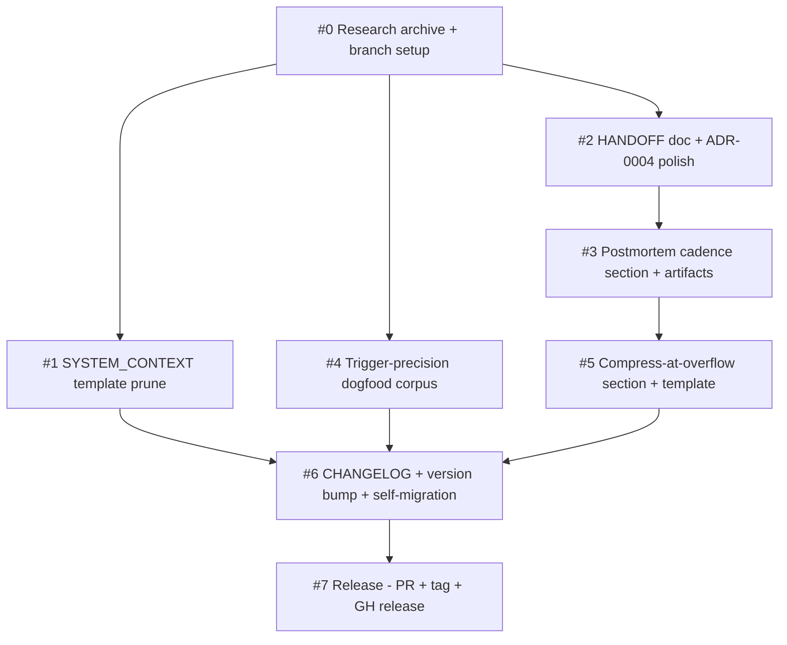

# Plan: Ship v1.10.0 — context-engineering alignment release implementing R1-R5

| Field         | Value                                                                                  |
|---------------|----------------------------------------------------------------------------------------|
| Plan ID       | `plans/0010-context-engineering-alignment-v1.10.0`                                     |
| ADR           | [`adrs/0010-system-context-contents-prune`](../adrs/0010-system-context-contents-prune.md) (primary); also batches [`adrs/0011-error-analysis-cadence`](../adrs/0011-error-analysis-cadence.md), [`adrs/0012-compress-at-overflow-protocol`](../adrs/0012-compress-at-overflow-protocol.md), [`adrs/0004-parallel-subagent-dispatch-contract`](../adrs/0004-parallel-subagent-dispatch-contract.md) (amended 2026-05-13) |
| Status        | Proposed                                                                                |
| Last updated  | 2026-05-13                                                                              |
| Owner         | Modie (Habeeb); Slice #1–#5 dispatchable to AFK fleet; Slice #7 HITL-approval-gated     |

## Goal

Ship v1.10.0 to the GitHub marketplace: prune `SYSTEM_CONTEXT.md` contents to non-re-derivable cross-session state (R1), formalize HANDOFF semantics + ADR-0004 amendment (R2 + Q5/Q7), add the error-analysis-first postmortem cadence (R3), measure description trigger precision (R4), and document the Compress-at-overflow summary-and-flush protocol (R5) — landing four ADRs (0010 / 0011 / 0012 / 0004 amended) as one release.

## Success measure

`v1.10.0` tag is on `origin/main` AND `gh release view v1.10.0` shows a published GitHub release with notes covering R1–R5 + the four ADRs AND `/plugin marketplace info ahabeeb1/skills` resolves the version field to `1.10.0` AND the post-merge repo's own `docs/agents/SYSTEM_CONTEXT.md` reflects the ADR-0010 schema (dropped sections gone, retained sections present).

## Phases

### Phase 1 — Land v1.10.0 artifacts on the feature branch

**Slices:** #0, #1, #2, #3, #4, #5 (from spec)

**Acceptance gate:** All six slices' acceptance criteria are checked; all changes are committed on the `v1.10.0-context-engineering-alignment` branch (or equivalent — see Slice #0 note on branch-vs-worktree); the full dogfood regression suite — including new scenarios `13-trigger-precision`, `14-system-context-schema`, `15-postmortem-structure`, `16-session-summary-template` — passes locally; ADR-0010 / 0011 / 0012 / amended-0004 are all readable in the branch's diff against `origin/main` (commit `1d8dec2`).

**Top risks:**
1. **`skills/using-habeebs-skill/SKILL.md` merge conflicts** between Slices #2, #3, #5 (all three add a new section). Mitigation: serialize the three slices on this file (see DAG + Parallelization map); #1 and #4 parallel-dispatch alongside.
2. **In-flight ADR artifacts already exist as uncommitted changes on `main`** at planning time (spec, grill, three new ADRs, ADR-0001/0004 amendments, this plan). Slice #0 must carry these to the feature branch cleanly — `git checkout -b <branch>` in-place preserves working-tree changes; `git worktree add` would NOT (the new worktree starts clean off `origin/main`). Decision deferred to Slice #0 execution; mitigation = use the in-place branch path documented in Slice #0 below.
3. **Description-budget regression on `using-habeebs-skill`** — three slices add body content to the umbrella skill; frontmatter description is unchanged but body length grows. Mitigation: `tests/dogfood/11-description-budget/` already asserts frontmatter only, so no test regression; manual review during Slice #6 confirms body remains scan-able (< 500 lines per Anthropic's "split when unwieldy" guidance).

**Rollback hook:** Phase 1 lives entirely on a feature branch. Rollback = `git branch -D v1.10.0-context-engineering-alignment` (and discard local working-tree changes). No production state mutated. **Reversible by branch deletion.**

### Phase 2 — Release prep (CHANGELOG + version bump + repo self-migration)

**Slices:** #6 (from spec)

**Acceptance gate:** `CHANGELOG.md` contains a `## [1.10.0] — 2026-05-13` section with sub-sections for R1–R5 and a "Documented" bucket listing ADR-0010 / 0011 / 0012 / amended-0004; both `.claude-plugin/plugin.json` and `.claude-plugin/marketplace.json` have `version: "1.10.0"`; this repo's own `docs/agents/SYSTEM_CONTEXT.md` has been regenerated via Phase 0 next-write (per ADR-0010 § Decision — the dropped sections are gone, retained sections present, `Last refreshed: 2026-05-13` with refresh reason citing Slice #6); the full dogfood regression suite (six-slice + four new) passes; `git diff origin/main..HEAD` is reviewable in one sitting (no unintended changes).

**Top risks:**
1. **Repo self-migration of `SYSTEM_CONTEXT.md` is the first real exercise of ADR-0010** — the new template + the Phase 0 single-writer migration path get dogfood-tested here. Risk: the regen accidentally drops retained sections (Active steering, Last reconciliation outcome) if the new template under-specifies them. Mitigation: Slice #1 acceptance criterion asserts the template produces all six retained sections; Slice #6 verifies the regen actually retained them on this repo's file.
2. **Manifest version mismatch** between `plugin.json` and `marketplace.json` (a v1.9.0 release-cycle bug noted in CHANGELOG; fixed there but the failure mode is generic). Mitigation: explicit acceptance criterion that both files read `1.10.0`; grep-based assertion in Slice #6.
3. **CHANGELOG entry under-summarizes a slice** and ships a release with missing release-notes fidelity (which then needs a v1.10.1 patch to fix the notes). Mitigation: CHANGELOG sub-section per R1–R5 with explicit ADR pointers; reviewed against the spec's "Concrete picks" table.

**Rollback hook:** Phase 2 still lives on the feature branch. Rollback = `git reset --hard HEAD~N` to before Slice #6's commit(s), or `git restore CHANGELOG.md .claude-plugin/*.json docs/agents/SYSTEM_CONTEXT.md`. **Reversible by branch reset.**

### Phase 3 — Ship v1.10.0

**Slices:** #7 (from spec)

**Acceptance gate:** PR #13 (or next available) is merged to `main`; local `main` is synced via `using-worktrees` Phase 6.5 (`/sync`) and shows no ghost-commit divergence; `v1.10.0` tag exists on `origin` (created via chore-branch workaround per [`memory/feedback_release_tag_hook_misfire`](../../../../.claude/projects/C--Users-Abdullah-CascadeProjects-skills/memory/feedback_release_tag_hook_misfire.md) — `preventing-commits-to-default.sh` blocks `git tag` on main, hence the workaround); `gh release view v1.10.0` shows a published release with comprehensive notes covering R1–R5 + the four ADRs + the eight research case-study sources; the feature branch `v1.10.0-context-engineering-alignment` is deleted post-merge (locally + on `origin`).

**Top risks:**
1. **Squash-merge ghost-commit divergence** (per [`memory/feedback_squash_merge_pain`](../../../../.claude/projects/C--Users-Abdullah-CascadeProjects-skills/memory/feedback_squash_merge_pain.md)) — local `main` and `origin/main` diverge after merge because squash creates a new SHA on `origin`. Mitigation: invoke `/sync` (using-worktrees Phase 6.5) explicitly between merge and tag.
2. **Release-tag hook misfire** (per memory): `git tag v1.10.0` on `main` is blocked by `preventing-commits-to-default.sh` even though tagging is non-destructive. Mitigation: create a temporary chore branch at the merge commit SHA, run `git tag` there, push the tag, delete chore branch.
3. **GitHub release notes accidentally omit an ADR or a case-study source** — release page lives on GitHub, not in repo, so post-publish fixes require `gh release edit`. Mitigation: assemble release notes from the spec's "Concrete picks" + ADR titles + the eight Phase 6 source URLs *before* invoking `gh release create`; review for completeness as a Slice #7 sub-step.

**Rollback hook:** Once `v1.10.0` tag is pushed and the GitHub release is published, **this is a partial one-way door.** Tag deletion (`git push --delete origin v1.10.0`) is technically reversible but signals release withdrawal — costly for users who pulled the version. Release-page edits are reversible; a re-released tag is not. **If a critical bug surfaces post-tag, prefer shipping `v1.10.1` over withdrawing `v1.10.0`.** Pre-tag, all of Phase 3 is reversible via PR revert + branch restore.

## Slice table

| ID  | Name                                                              | Label              | Phase | pgroup     | Blocked by       | Est  | Rollback hook                          |
|-----|-------------------------------------------------------------------|--------------------|-------|------------|------------------|------|----------------------------------------|
| #0  | Research record archive + feature branch setup                    | AFK:full-auto      | 1     | pgroup-1A  | —                | 0.2d | `git branch -D <branch>`; discard WT   |
| #1  | SYSTEM_CONTEXT template prune (Slice 1 work; ADR-0010 already written) | AFK:full-auto  | 1     | pgroup-1B  | #0               | 0.5d | `git revert <slice-1-commit>`          |
| #2  | HANDOFF semantics in using-habeebs-skill + ADR-0004 amendment polish | AFK:full-auto   | 1     | pgroup-1B  | #0               | 0.3d | `git revert <slice-2-commit>`          |
| #3  | ADR-0011 postmortem cadence section + postmortems/README + retrospective entry + verify-output cross-ref | AFK:full-auto | 1 | pgroup-1C | #2 (shared file) | 0.5d | `git revert <slice-3-commit>` |
| #4  | Trigger-precision dogfood corpus + audit-report                   | AFK:full-auto      | 1     | pgroup-1B  | #0               | 0.8d | `git revert <slice-4-commit>`          |
| #5  | ADR-0012 Compress-at-overflow section + session-summary-template + tdd-loop cross-ref | AFK:full-auto | 1 | pgroup-1D | #3 (shared file) | 0.4d | `git revert <slice-5-commit>` |
| #6  | CHANGELOG + version bump + repo SYSTEM_CONTEXT self-migration + full dogfood | AFK:full-auto | 2 | pgroup-2A  | #1, #2, #3, #4, #5 | 0.4d | `git reset --hard HEAD~1` (pre-merge) |
| #7  | Release: PR → merge → sync → tag → GitHub release                 | HITL:approval-gate | 3     | pgroup-3A  | #6               | 0.3d | Pre-tag: PR revert. Post-tag: ship v1.10.1 (one-way door) |

**Label legend:**
- `AFK:full-auto` — no human in the loop; safe for `parallel-dev` autonomous dispatch
- `HITL:inline` — human reviews/decides in the chat session mid-slice
- `HITL:approval-gate` — human approves out-of-band (PR review here)

**Estimate convention:** **d** = ideal engineer-days. Estimates illustrative for sequencing; gates are contractual. Phase 1 total ≈ 2.7d wall-clock if pgroup-1B runs in true parallel; ≈ 3.5d serialized.

**Critical note on Slice #0:** the v1.10.0 spec said "create worktree at `../skills-v1.10.0/`". Reality at plan time is that the spec, grill record, three new ADRs (0010 / 0011 / 0012), the ADR-0001/0004 amendments, and this plan **already exist as uncommitted changes on `main`** (created during this conversation via the chain: research → spec → grill → record → plan). A `git worktree add ../skills-v1.10.0 -b v1.10.0-context-engineering-alignment origin/main` would create a clean branch off `origin/main` — losing the in-flight work. Slice #0 therefore executes the **in-place branch path** documented in `using-worktrees` § "Existing in-flight work": `git checkout -b v1.10.0-context-engineering-alignment` (no `origin/main` arg — branch from current HEAD), then `git add` the in-flight artifacts and commit as Slice #0's first commit. The "(or equivalent)" caveat in the spec's Slice #0 description explicitly allows this. Per ADR-0003 hooks scope, no commit hits `main`.

## Dependency DAG



ASCII fallback:

```
                    #0
       ┌────────────┼────────────┐
       ▼            ▼            ▼
      #1           #2           #4
       │            ▼            │
       │           #3            │
       │            ▼            │
       │           #5            │
       └────────────┼────────────┘
                    ▼
                   #6
                    ▼
                   #7
```

The DAG is acyclic. The serial chain `#2 → #3 → #5` exists solely because all three slices edit `skills/using-habeebs-skill/SKILL.md` (different sections each; same file). `parallel-dev`'s Phase 2 independence checklist fails on file-overlap for any pair of {#2, #3, #5}.

## Parallelization map

- `pgroup-1A` = {#0} — Phase 1, single slice (must complete first; carries in-flight work onto the feature branch)
- `pgroup-1B` = {#1, #2, #4} — Phase 1, max-concurrency 3, all AFK, no inter-deps, no file overlap → `parallel-dev` dispatches concurrently after #0
- `pgroup-1C` = {#3} — Phase 1, single slice, sequential after #2 (shared file: using-habeebs-skill)
- `pgroup-1D` = {#5} — Phase 1, single slice, sequential after #3 (shared file: using-habeebs-skill)
- `pgroup-2A` = {#6} — Phase 2, single slice (after all of Phase 1)
- `pgroup-3A` = {#7} — Phase 3, single slice, HITL-approval-gate

**Independence sanity-check (mandatory per write-plan Phase 4):** pgroup-1B members verified against `parallel-dev` Phase 2 checklist:

| Pair      | File overlap | State dep | Resource | Order | Implicit state | Verdict      |
|-----------|--------------|-----------|----------|-------|----------------|--------------|
| #1 ↔ #2   | None (template + dogfood-14 vs. using-habeebs body + ADR-0004) | None | None | None | None | ✅ Parallel |
| #1 ↔ #4   | None (template + dogfood-14 vs. dogfood-13) | None | None | None | None | ✅ Parallel |
| #2 ↔ #4   | None (using-habeebs body + ADR-0004 vs. dogfood-13) | None | None | None | None | ✅ Parallel |

`pgroup-1B` of 3 AFK slices is the *only* meaningful parallel group; serial chain `#2 → #3 → #5` accounts for the rest of Phase 1.

**20% rule check:** 3 of 8 slices (37.5%) are parallel-tagged. Below the 80% smell threshold; well-clustered single parallel group rather than spread-bet across the DAG. Healthy.

## Risk register

| #    | Phase | Risk                                                                  | Likelihood | Impact | Mitigation                                                                                  |
|------|-------|-----------------------------------------------------------------------|------------|--------|---------------------------------------------------------------------------------------------|
| R1   | 1     | `using-habeebs-skill/SKILL.md` merge conflicts across #2 / #3 / #5    | Medium     | Medium | Serial chain enforced by DAG; #3 blocked-by #2; #5 blocked-by #3                            |
| R2   | 1     | In-flight uncommitted work lost during branch setup                   | Low        | High   | In-place `git checkout -b` (not `worktree add`); explicit commit of in-flight artifacts in #0 |
| R3   | 1     | Description-budget regression on `using-habeebs-skill`                | Low        | Low    | `tests/dogfood/11-description-budget/` asserts frontmatter only; body length is not budgeted |
| R4   | 1     | Slice #4 corpus design accidentally synthesizes the descriptions      | Medium     | High   | Q6 grill resolution = 15/15 happy-path/adversarial mix; corpus.md acceptance criterion enumerates adversarial categories explicitly |
| R5   | 1     | Slice #1 template under-specifies retained sections → repo self-migration in #6 drops them | Low | Medium | Template acceptance criterion enumerates all 6 retained sections; Slice #6 grep-verifies post-migration |
| R6   | 2     | Manifest version mismatch (plugin.json ≠ marketplace.json)            | Low        | High   | Explicit acceptance criterion both files read `1.10.0`; grep assertion in #6                |
| R7   | 2     | CHANGELOG sub-section misses a slice's deliverable                    | Low        | Low    | Cross-check CHANGELOG against the spec's "Concrete picks" table during Slice #6 review      |
| R8   | 3     | Squash-merge ghost-commit divergence (memory: `feedback_squash_merge_pain`) | High | Medium | `/sync` (using-worktrees Phase 6.5) invoked between merge and tag steps in Slice #7         |
| R9   | 3     | `git tag` blocked on main by `preventing-commits-to-default.sh`       | High       | Low    | Chore-branch workaround per `feedback_release_tag_hook_misfire`; documented in Slice #7 acceptance criteria |
| R10  | 3     | GitHub release notes omit an ADR or case-study source                 | Medium     | Low    | Pre-publish notes assembly from spec's "Concrete picks" + ADR titles + 8 case-study URLs; review before `gh release create` |
| R11  | 1     | `tests/dogfood/15-postmortem-structure/` template assertion mis-specified, doesn't catch retrospective backfill | Low | Low | Slice #3 dogfood explicitly tests both forward + retrospective entries (one example committed) |
| R12  | 1     | Slice #5 `.scratch/` template assumes a user convention not in this repo's CLAUDE.md | Low | Low | Slice #5 commits the template file at `docs/agents/templates/` (in-repo); `.scratch/` is invocation-time output, not committed |

## Revisit triggers

- **Slice #4 audit surfaces a skill with measured precision < 0.5** → halt Phase 1, re-run that skill's description through `prior-art-research` description-tuning sub-pass; document as v1.10.0 follow-up if not blocking.
- **Slice #6 repo self-migration fails** (Phase 0 next-write doesn't produce the new schema) → halt Phase 2, re-run ADR-0010 Decision through `socratic-grill` — the migration path may have a gap.
- **Slice #1 reader audit surfaces a chain skill that depends on a dropped section** → halt #1, evaluate whether that section deserves retention (amend ADR-0010 § Decision) OR fix the reader skill to derive from manifests instead.
- **R1 trigger fires** (`using-habeebs-skill/SKILL.md` merge conflict occurs in Phase 1 despite serial chain) → halt, root-cause via `systematic-debugging`; likely a stale subagent context didn't see prior slice's commit.
- **ADR-0002 or ADR-0005 is amended mid-implementation** (e.g., a runtime-substrate concession opens up) → halt at current phase gate, re-evaluate which slices are affected.
- **Post-tag bug surfaces requiring withdrawal** → ship `v1.10.1` rather than tag-deleting v1.10.0 (per Phase 3 rollback note); revisit Phase 3 rollback policy for v1.11.0+.
- **R8 (squash-merge divergence) recurs after `/sync` runs** → halt Slice #7, re-run `using-worktrees` Phase 6.5 with verbose logging; consider amending the `/sync` skill if the workaround is insufficient.

## Change log

(Added on first revision. Each entry: date, what changed, why, who.)

- 2026-05-13 — Initial plan written from ADR-0010 (primary) + ADR-0011 / ADR-0012 / amended-ADR-0004 batch. Spec at `specs/v1.10.0-context-engineering-alignment.md` (Grilled status); grill record at `specs/v1.10.0-context-engineering-alignment-grill.md`. Plan reflects Q1–Q8 grill resolutions: pgroup-1B widened to {#1, #2, #4} (Q1 / Q6 HITL gates closed); serial chain `#2 → #3 → #5` documented due to shared `using-habeebs-skill/SKILL.md` (file-overlap independence-check failure). Written by Modie (Habeeb) via the habeebs-skill chain.

## References

- ADR (primary): [`adrs/0010-system-context-contents-prune`](../adrs/0010-system-context-contents-prune.md)
- ADRs (batched in this release):
  - [`adrs/0011-error-analysis-cadence`](../adrs/0011-error-analysis-cadence.md)
  - [`adrs/0012-compress-at-overflow-protocol`](../adrs/0012-compress-at-overflow-protocol.md)
  - [`adrs/0004-parallel-subagent-dispatch-contract`](../adrs/0004-parallel-subagent-dispatch-contract.md) (amended in place 2026-05-13: Part 3 share-full-traces clause + new Part 5 treat-fetched-content-as-untrusted)
  - [`adrs/0001-environment-binding-via-system-context`](../adrs/0001-environment-binding-via-system-context.md) (status updated: scope-narrowed by 0010)
- Spec / sliced spec: [`specs/v1.10.0-context-engineering-alignment`](../specs/v1.10.0-context-engineering-alignment.md)
- Grill record: [`specs/v1.10.0-context-engineering-alignment-grill`](../specs/v1.10.0-context-engineering-alignment-grill.md)
- SYSTEM_CONTEXT: [`SYSTEM_CONTEXT.md`](../SYSTEM_CONTEXT.md)
- Sister plans:
  - [`plans/0004-parallel-subagent-v1.7.0`](./0004-parallel-subagent-v1.7.0.md) — model for the parallel-dev dispatch shape used in Phase 1
  - [`plans/0003-hooks-v1.6.0`](./0003-hooks-v1.6.0.md) — model for the release sequence (PR → merge → sync → tag → GitHub release) used in Phase 3
- Memories referenced:
  - `feedback_squash_merge_pain` — informs R8 mitigation
  - `feedback_release_tag_hook_misfire` — informs Slice #7 chore-branch workaround
- External research (from Phase 6 case studies):
  - [Anthropic Skills 2.0](https://www.anthropic.com/engineering/equipping-agents-for-the-real-world-with-agent-skills)
  - [Anthropic Claude Code best practices](https://code.claude.com/docs/en/best-practices)
  - [Anthropic Effective harnesses for long-running agents](https://www.anthropic.com/engineering/effective-harnesses-for-long-running-agents)
  - [Hamel Husain + Shreya Shankar LLM Evals FAQ](https://hamel.dev/blog/posts/evals-faq/)
  - [Cognition AI Don't Build Multi-Agents](https://cognition.ai/blog/dont-build-multi-agents)
  - [OpenAI Agents SDK](https://openai.github.io/openai-agents-python/)
  - [Google ADK Workflow Agents](https://adk.dev/agents/workflow-agents/)
  - [LangChain Context Engineering for Agents](https://blog.langchain.com/context-engineering-for-agents/)
