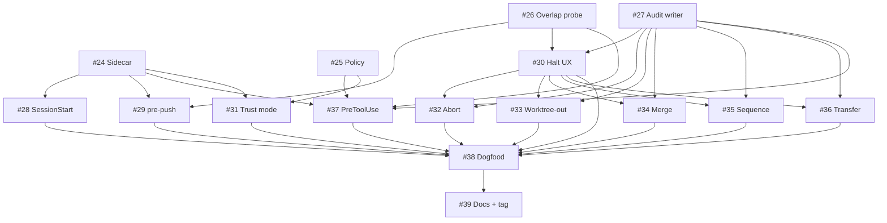

# Plan: Ship cross-session conflict detection per ADR-0018

| Field         | Value                                                                            |
|---------------|----------------------------------------------------------------------------------|
| Plan ID       | `plans/0018-cross-session-conflict-detection-v1.16.0`                            |
| ADR           | [`adrs/0018-amend-adr-0002-for-advisory-in-flight-reads`](../adrs/0018-amend-adr-0002-for-advisory-in-flight-reads.md) |
| Tier          | Deep (inherited from spec)                                                       |
| Status        | Proposed                                                                          |
| Last updated  | 2026-05-23                                                                        |
| Owner         | AFK fleet (16 AFK slices) + Modie for end-of-phase gate verification              |

## Goal

When two Claude Code sessions touch overlapping lines in the same shared working tree, the second session halts before silent overwrite, surfaces both diffs, and offers the user one of five actions (merge / sequence / transfer / abort / worktree-out) — every event audited to an in-repo JSON file.

## Success measure

The dogfood test suite (`tests/dogfood/19-cross-session-conflict-detection/`) passes all 6 scenarios on `feat/cross-session-conflict-detection`, AND v1.16.0 tag pushed to `origin`, AND `SYSTEM_CONTEXT.md` reconciled to v1.16.0 in a follow-on commit. Binary and observable from git state without telemetry (per ADR-0002).

## Phases

### Phase 1 — SessionStart detection lands

**Slices:** #24 (Sidecar lifecycle), #25 (Policy load), #26 (Overlap probe), #27 (Audit writer), #28 (SessionStart hook)

**Acceptance gate:** Opening a second Claude Code session in the `habeebs-skill` repo while a first session has a live sidecar produces a `SessionStart` warn-only output naming the first session's worktree path and start-time, plus the opt-in hint for `pretool_use: true`. Verified by dogfood scenarios 1a (peer present → warn output) and 1b (no peer → zero output, exit 0).

**Top risks:**
1. **Windows cross-shell PID-probe brittleness** — sidecar `env` field designed to detect this, but PowerShell ↔ WSL ↔ Git Bash probe behavior unverified at scale; first dogfood run on Windows is the validation.
2. **SessionStart hook fires too noisy on solo sessions** — if peer-detection has an off-by-one (e.g., session counts its own sidecar), every solo session prints a warning. Mitigation: hook must explicitly exclude the calling session ID from glob results.
3. **`git stash create` exceeds 100ms on large repos** — sidecar's `stash_sha` field assumes sub-second capture; pathological repo size (>1M files) could break the budget. Mitigation: profile during slice #24; downgrade to a no-stash-SHA mode for huge repos if it bites.

**Rollback hook:** Remove `SessionStart` hook entry from `.claude/settings.json`. Sidecars auto-cleanup via 24h TTL even if writer code is removed. Foundation slices (#24, #25, #26, #27) are dead code without the hook — no observable behavior, safe to leave in place during rollback.

### Phase 2 — Pre-push backstop + halt UX surfaces

**Slices:** #29 (pre-push hook), #30 (Halt UX renderer), #32 (Abort action)

**Acceptance gate:** `git push` from a session with uncommitted overlapping changes against a live peer's `stash_sha` exits non-zero, renders the 5-option halt menu, and the `[4/a] Abort` action completes a full cleanup (sidecar removed, branch preserved, audit JSON written). Verified by dogfood scenarios 2a (overlap blocks push), 2b (clean push succeeds), 2c (abort completes cleanup, audit JSON present).

**Top risks:**
1. **pre-push hook composability** — if the user has an existing `.git/hooks/pre-push`, the new hook must chain-call rather than overwrite (slice #29 AC). Common breakage shape: existing hook is a husky-managed file with non-standard wrapper. Mitigation: detect husky / pre-commit-framework wrappers; refuse to install if detected and surface clear error message.
2. **Halt UX pager integration breaks in non-interactive contexts** — CI / cron / piped invocations have no `$PAGER`; halt UX must fall back gracefully to plain stdout, not block on terminal input.
3. **Abort action leaves orphaned worktrees if interrupted mid-cleanup** — SIGINT during the cleanup sequence could leave `.git/worktrees/<name>/` referenced after the directory is gone. Mitigation: order operations so the on-disk worktree directory is removed BEFORE `git worktree prune`-able state is touched.

**Rollback hook:** Remove pre-push hook entry from `.claude/settings.json`. Halt UX renderer and Abort action become dead code without the hook firing them.

### Phase 3 — Remaining action handlers ship

**Slices:** #33 (Worktree-out), #34 (Merge), #35 (Sequence), #36 (Transfer)

**Acceptance gate:** Each of the 4 remaining action menu options completes correctly for its primary use case AND its conflict audit JSON records the matching `resolution` value. Verified by dogfood scenarios 3a (worktree-out preserves uncommitted state in new tree), 3b (merge inserts conflict markers + opens $EDITOR), 3c (sequence resumes when peer sidecar disappears within 30s), 3d (transfer note is visible to peer on next sidecar read).

**Top risks:**
1. **Worktree-out stash flow fails on dirty index with untracked-but-staged files** — `git stash create` may not capture all the relevant state when staged + unstaged + untracked mix is unusual. Mitigation: dogfood scenario 3a must cover the dirty mix explicitly.
2. **Sequence poll loop hangs indefinitely on peer-removal race** — if peer removes sidecar between Session B's check and Session B's re-dispatch, Session B may register the wait-marker after peer is gone. Mitigation: max-wait timeout (sequence_max_wait_seconds, default 86400); exponential backoff (1s → 30s).
3. **Merge action injects `<<<<<<<` markers into binary files** — if `overlap.files` includes a non-text file, marker injection corrupts it. Mitigation: detect binary via `git check-attr binary` or trailing-NUL probe; skip marker injection for binaries and warn in halt UX output.

**Rollback hook:** Remove individual action handlers from the halt UX dispatch table. Each handler is its own file/module per slice; rollback is per-action, not all-or-nothing. Audit JSON written by previous resolutions stays tracked (no data loss).

### Phase 4 — Opt-in extensions

**Slices:** #37 (PreToolUse hook, opt-in), #31 (Trust mode: require_signed_signals)

**Acceptance gate:** Flipping `pretool_use: true` in `.claude/habeebs-policy.json` makes the PreToolUse hook annotate Edit attempts on peer-claimed files without blocking, AND flipping `require_signed_signals: true` makes unsigned peer sidecars produce a warning line instead of triggering halt. Verified by dogfood scenarios 4a (pretool_use off → silent), 4b (pretool_use on → annotation visible), 4c (signed peer → trusted), 4d (unsigned peer + require_signed_signals → warn-not-halt).

**Top risks:**
1. **PreToolUse hook latency compounds across every Edit** — even a sub-second hook fires on every `Edit | Write | NotebookEdit` call. Over a session of 100 Edits, even 200ms each is 20s of dead time. Mitigation: aggressive early-exit when `pretool_use: false`; cache liveness probe result for 30s within a single hook invocation chain.
2. **`git verify-commit` shell-outs are expensive** — if every peer sidecar triggers a verify-commit subprocess, the cost balloons in collab repos with many peers. Mitigation: cache verification result for the duration of the calling hook invocation (slice #31 AC); only run verification when `require_signed_signals: true`.

**Rollback hook:** Remove `PreToolUse` hook from `.claude/settings.json`. Trust mode requires no hook entry — controlled entirely by the policy flag, which can stay `false` by default. Policy schema accepts the keys whether or not the hooks fire.

### Phase 5 — Validate + ship

**Slices:** #38 (Dogfood suite), #39 (Docs + SYSTEM_CONTEXT + CHANGELOG)

**Acceptance gate:** All 6 dogfood scenarios pass on `feat/cross-session-conflict-detection`, `SYSTEM_CONTEXT.md` reflects v1.16.0 + ADR-0018 + new tracked directory `docs/agents/conflicts/`, `CHANGELOG.md` v1.16.0 entry references ADR-0018 + dogfood outcomes, ADR-0002 status updated to "Accepted (amended by 0018)", `docs/agents/adrs/README.md` index lists ADR-0018, AND `v1.16.0` git tag pushed to origin via the `release` skill.

**Top risks:**
1. **Dogfood scenarios miss edge cases discovered during Phase 3** — the 6 listed scenarios may not cover all action-handler edge cases (e.g., binary-file merge from Phase 3 R3). Mitigation: when Phase 3 surfaces an edge case, add a scenario in Phase 3 itself, not as a v1.1 follow-up; Phase 5 only ships if the suite reflects what Phase 3 found.
2. **SYSTEM_CONTEXT drift during the implementation** — multi-day implementation means SYSTEM_CONTEXT may go stale by Phase 5. Mitigation: slice #39 explicitly refreshes SYSTEM_CONTEXT; Phase 5 gate verifies the refresh landed.

**Rollback hook:** ONE-WAY DOOR — once v1.16.0 is tagged and pushed, rollback is a follow-up v1.16.1 amendment, not a revert. Compensating control: Phase 5 gate is the highest in the plan; dogfood suite must be GREEN before tag.

## Slice table

| ID | Name | Label | Phase | pgroup | Blocked by | Est | Rollback hook |
|----|------|-------|-------|--------|------------|-----|---------------|
| #24 | Sidecar schema, writer, reader, liveness probe | AFK:full-auto | 1 | pgroup-1A | — | 1d | Remove sidecar writer call; existing sidecars TTL out |
| #25 | Policy file load + 4-scope precedence | AFK:full-auto | 1 | pgroup-1A | — | 0.5d | Defaults apply when file absent; safe to remove |
| #26 | git merge-tree overlap probe primitive | AFK:full-auto | 1 | pgroup-1A | — | 0.5d | Pure function; remove call sites |
| #27 | Conflict audit JSON writer | AFK:full-auto | 1 | pgroup-1A | — | 0.5d | Remove writer call; existing JSON tracked |
| #28 | SessionStart hook (warn-only peer scan) | AFK:full-auto | 1 | pgroup-1B | #24 | 0.5d | Remove hook entry from settings.json |
| #29 | pre-push hook (block-only on overlap) | AFK:full-auto | 2 | pgroup-2A | #24, #26 | 1d | Remove hook entry; chain-call preserved |
| #30 | Halt UX renderer (5-option menu) | AFK:full-auto | 2 | pgroup-2A | #26, #27 | 1.5d | Dead code without hook calling it |
| #32 | Action handler: Abort | AFK:full-auto | 2 | pgroup-2B | #27, #30 | 0.5d | Remove from dispatch table |
| #33 | Action handler: Worktree-out | AFK:full-auto | 3 | pgroup-3A | #27, #30 | 1d | Remove from dispatch table |
| #34 | Action handler: Merge | AFK:full-auto | 3 | pgroup-3A | #27, #30 | 0.5d | Remove from dispatch table |
| #35 | Action handler: Sequence | AFK:full-auto | 3 | pgroup-3A | #27, #30 | 0.75d | Remove from dispatch table |
| #36 | Action handler: Transfer | AFK:full-auto | 3 | pgroup-3A | #27, #30 | 0.5d | Remove from dispatch table |
| #37 | PreToolUse hook (opt-in, annotate-only) | AFK:full-auto | 4 | pgroup-4A | #24, #25, #26, #27 | 1d | Default `pretool_use: false` makes inert |
| #31 | Trust mode: require_signed_signals | AFK:full-auto | 4 | pgroup-4A | #24, #25 | 0.5d | Default `require_signed_signals: false` makes inert |
| #38 | Dogfood test suite | AFK:full-auto | 5 | pgroup-5A | #28, #29, #30, #32, #33, #34, #35, #36, #37, #31 | 1.5d | Tests can be skipped via env var; tests don't ship to users |
| #39 | Docs: SYSTEM_CONTEXT + CHANGELOG + ADR-0002 + README | AFK:full-auto | 5 | pgroup-5B | #38 | 0.5d | ONE-WAY DOOR with tag push; see Phase 5 rollback |

**Label legend:**
- `AFK:full-auto` — no human in the loop; safe for `parallel-dev` autonomous dispatch

**Estimate convention:** **d** = ideal agent-days (since AFK fleet is the implementer). Total: ~12d. Estimates are illustrative for sequencing; gates are contractual.

## Dependency DAG



ASCII fallback:

```
Phase 1                Phase 2              Phase 3               Phase 4         Phase 5
=======                =======              =======               =======         =======

#24 ─┬─→ #28 ─┐        #29 ─┐               #33 ──┐               #37 ─┐
     ├─→ #29  │              ├─→ #30 ─┬─→ #32 ─┐   ├─→ ... ─┐    #31 ─┤
     ├─→ #37  │              │        ├─→ #33  │       all     │
     └─→ #31  │              │        ├─→ #34  │       slices  │
#25 ─┬─→ #37  │              │        ├─→ #35  │       feed    │
     └─→ #31  │              │        └─→ #36  │       into    │
#26 ─┬─→ #29  │              │                 │     #38 ────→ #39
     ├─→ #30  │              │                 │
     └─→ #37  │              │                 │
#27 ─┬─→ #30  │              │                 │
     ├─→ #32  │              │                 │
     ├─→ #33,34,35,36       │                 │
     └─→ #37                │                 │
```

## Parallelization map

- **`pgroup-1A` = {#24, #25, #26, #27}** — Phase 1, all Foundation. Zero file overlap: #24 writes `.git/habeebs-sessions/`, #25 writes `.claude/`, #26 reads git refs (no file writes), #27 writes `docs/agents/conflicts/`. Dispatch concurrently via `parallel-dev`.
- **`pgroup-1B` = {#28}** — Phase 1, single slice (sequential after pgroup-1A).
- **`pgroup-2A` = {#29, #30}** — Phase 2. #29 implements `pre-push` hook file; #30 implements halt UX renderer module. Different files. Dispatch concurrently.
- **`pgroup-2B` = {#32}** — Phase 2, single (sequential after pgroup-2A).
- **`pgroup-3A` = {#33, #34, #35, #36}** — Phase 3, all remaining action handlers. Each touches its own module file under `skills/cross-session-detect/actions/<name>.sh` (or equivalent). Independent. Dispatch concurrently.
- **`pgroup-4A` = {#37, #31}** — Phase 4. #37 implements PreToolUse hook; #31 implements trust-mode verifier. Different files. Dispatch concurrently.
- **`pgroup-5A` = {#38}** — Phase 5, dogfood single.
- **`pgroup-5B` = {#39}** — Phase 5, docs single (sequential after #38).

**Independence sanity:** all multi-member pgroups verified against `parallel-dev` Phase 2 checklist:
- File overlap: ✅ (verified per pgroup above)
- State dependency: ✅ (each slice has its own state surface)
- Resource contention: ✅ (each pgroup ≤ 5 slices, within parallel-dev concurrency cap)
- Ordering: ✅ (within a pgroup, order doesn't affect correctness)
- Implicit shared state: ✅ (no shared env vars or singletons mutated mid-slice)

**20% rule honest read:** All 16 slices are AFK, but only ~11 are parallelizable (within pgroups). The remaining 5 (#28, #32, #38, #39, plus single-pgroup phases) are sequential. ~69% parallelizable — under the 80% smell threshold. Action handlers are genuinely independent because each is its own module; this is feature shape, not a missed dependency.

## Risk register

| # | Phase | Risk | Likelihood | Impact | Mitigation |
|---|-------|------|------------|--------|------------|
| R1 | 1 | Windows cross-shell PID-probe brittleness (WSL ↔ PowerShell ↔ Git Bash) | Medium | Medium | Sidecar `env` field detects mismatch → TTL fallback; first Windows dogfood run validates |
| R2 | 1 | SessionStart hook prints noise on solo sessions if peer-detection is off-by-one | Medium | Low | Slice #28 AC mandates excluding calling session from glob; tested in scenario 1b (no peer → zero output) |
| R3 | 1 | `git stash create` exceeds 100ms on pathological repos | Low | Medium | Profile during slice #24; add no-stash-SHA fallback mode if it bites |
| R4 | 2 | pre-push hook composability breaks user's existing pre-push hook | Medium | High | Slice #29 must detect husky/pre-commit-framework wrappers + refuse-with-error; alternative chain-call mechanism |
| R5 | 2 | Halt UX pager fails in non-interactive contexts (CI, cron) | High | Low | Plain-stdout fallback when `[ -t 0 ]` is false; never block on input |
| R6 | 2 | Abort action leaves orphaned worktree directories on SIGINT | Low | Medium | Ordered cleanup: rm worktree dir BEFORE `git worktree prune`-able state touched |
| R7 | 3 | Worktree-out stash fails on staged + unstaged + untracked mix | Medium | Medium | Scenario 3a explicitly tests dirty mix; if `stash create` insufficient, fall back to `--include-untracked` |
| R8 | 3 | Sequence poll loop hangs on peer-removal race | Low | Low | `sequence_max_wait_seconds` timeout + exponential backoff caps the wait |
| R9 | 3 | Merge action injects markers into binary files | Low | High | `git check-attr binary` + trailing-NUL probe; skip binary files + warn in halt UX |
| R10 | 4 | PreToolUse hook latency compounds across many Edits per session | Medium | Medium | Aggressive early-exit when `pretool_use: false`; cache liveness for 30s within hook chain |
| R11 | 4 | `git verify-commit` shell-outs expensive in many-peer collab repos | Low | Low | Cache verification result for hook invocation; only run when `require_signed_signals: true` |
| R12 | 5 | Dogfood scenarios miss edge cases surfaced in Phase 3 | Medium | High | Phase 3 slice gates require adding new scenarios in-phase, not deferring to v1.1 |
| R13 | 5 | SYSTEM_CONTEXT drift during multi-day implementation | High | Low | Slice #39 explicitly refreshes; gate verifies refresh landed |

## Revisit triggers

This plan re-opens if any of:

- **Collab usage scales beyond occasional same-checkout sessions** → advisory-only model becomes insufficient; re-evaluate Alternative 4 (server-mediated locking) from ADR-0018. Re-run `socratic-grill` on the trust-mode design.
- **PreToolUse false-positive rate empirically below ~1%** → could flip `pretool_use` default to `true`; would require updating the spec + adding telemetry workaround (likely aggregated user reports).
- **Windows liveness probe reports surface despite the env-field mitigation** → revisit slice #24 design; possibly add a heartbeat-update field.
- **`git stash create` profile in slice #24 exceeds 500ms on Modie's repos** → R3 fires; halt phase 1 gate; revisit sidecar schema to make stash_sha optional.
- **Dogfood suite fails > 2 scenarios on first end-to-end run** → halt phase 5 gate; re-run `socratic-grill` on the failing slice's surface; do NOT promote to v1.16.0 tag.
- **Conflict audit volume exceeds 1000 records in any single repo** → retention policy revisit consistent with ADR-0004's 1000-record threshold.
- **Reactive `[5/w] Worktree-out` halts feel annoying after a week of dogfood use** → triggers v1.1 design for proactive `prefer_worktree` policy.

If any trigger fires mid-execution, halt at the current phase gate. Do NOT push through.

## Change log

(Added on first revision.)

- 2026-05-23 — Initial plan written from ADR-0018 + spec v1.16.0 + grill record (2026-05-22). 16 AFK slices across 5 phases; ~12 agent-days estimated.

## References

- ADR: [`adrs/0018-amend-adr-0002-for-advisory-in-flight-reads`](../adrs/0018-amend-adr-0002-for-advisory-in-flight-reads.md)
- Spec: [`specs/v1.16.0-cross-session-conflict-detection`](../specs/v1.16.0-cross-session-conflict-detection.md)
- Grill record: [`grill-records/2026-05-22-cross-session-conflict-detection`](../grill-records/2026-05-22-cross-session-conflict-detection.md)
- Research: [`research/2026-05-22-cross-session-conflict-detection`](../research/2026-05-22-cross-session-conflict-detection.md)
- SYSTEM_CONTEXT: [`SYSTEM_CONTEXT.md`](../SYSTEM_CONTEXT.md)
- GitHub Issues: #24-#39 (`afk-ready`, `v1.16.0` labels) on `ahabeeb1/skills`
- External:
  - [`git-merge-tree(1)`](https://git-scm.com/docs/git-merge-tree)
  - [`git-worktree(1)`](https://git-scm.com/docs/git-worktree)
  - Vim `:help swap-file` — 30-year sidecar precedent
