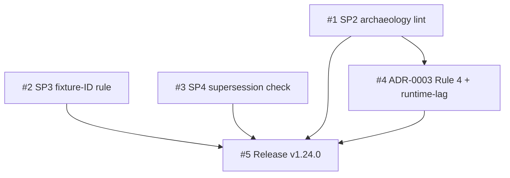

# Plan: Encode methodology conventions as corpus-tested bash assertions

## TL;DR

We are adding three executable guards to the chain so that three conventions stop depending on a human remembering them: a lint that catches self-referential archaeology prose in skill bodies, a rule that test-fixture identifiers are confirmed against the live tree at implementation, and a check that superseded ADRs carry a valid forward link. All three are bash dogfood scenarios (no new dependency), plus a one-paragraph doctrine amendment for an already-shipped hook fix. The work splits into two phases: Phase 1 lands the three assertions on a feature branch and proves them green; Phase 2 locks the hook doctrine, adds a runtime-lag note, and ships v1.24.0. The load-bearing slice is #1 — the archaeology lint's regex is subject-aware (a corpus test proved the naive phrase set was 100% false-positive), and it gates the doctrine prose in Phase 2.

| Plan ID | `plans/2026-06-01-chain-fidelity-executable-assertions` |
|---|---|
| ADR | [chain-fidelity-executable-assertions](../adrs/2026-06-01-chain-fidelity-executable-assertions.md) + ADR-0003 Rule 4 amendment |
| Tier | Balanced (inherited from spec) |
| Status | Active |
| Owner | Modie (HITL) + AFK fleet |

## Goal

Three recurring chain-friction conventions become mechanically guarded so they never silently regress again.

## Success measure

All three new dogfood scenarios (34/35/36) pass on `main` after the v1.24.0 tag pushes, with no regression in the existing suite (22/23/25 Changesets machinery untouched; 26/27/28 body lints still green) and the two known reds (16/29) unchanged.

## Phases

### Phase 1 — Executable assertions land

This phase ships the three guards themselves on the feature branch. It exists first because the assertions are the substance of the release and because Slice #1's archaeology lint must exist before Phase 2's doctrine prose can be verified against it. Slice #1 is a tracer slice — it fires on planted offenders, then proves silent on the clean corpus — and it is HITL because the subject-aware regex needs human ruling on edge cases. Slices #2 and #3 are independent AFK write-tasks that form pgroup-1A (the parallelizable set of Phase 1); they touch disjoint scopes and carry no self-application coupling (the fixture-ID rule #2 introduces is doctrine the implementer follows, not a runtime gate #3 must wait for).

**Acceptance gate.** The phase is done when all five of these are simultaneously true: (1) scenario 34 fires on the planted session-offender fixtures and is silent on the clean live corpus; (2) scenario 34 is blocking (nonzero exit on a hit) and passes none of the four measured false-positive shapes; (3) scenario 35 confirms the fixture-ID late-binding rule text is present in draft-spec, write-plan, and tdd-loop; (4) scenario 36 enforces the supersession invariant and passes against the live ADR-0020 ↔ dated-ADR pair while failing its negative fixtures; (5) the full existing suite shows no new red beyond the pre-existing 16/29.

**Top risks.** The biggest risk is the archaeology regex re-introducing false positives as it widens to catch more shapes. Mitigation: the regex is subject-aware (requires a self/skill subject), and the `(e)` live-corpus case fails loud if any FP appears — corpus-test before finalizing, per the ADR. The second risk is Slice #2's instruction text itself tripping Slice #1's lint (the rule prose could read as archaeology). Mitigation: write the rule in present-tense imperative ("confirm identifiers against the live tree"), never as "this used to be hard-coded." The third risk is pgroup-1A's two AFK slices colliding on a shared file. Mitigation: disjoint scopes are verified at parallel-dev Phase 2 before dispatch (#2 = skills/draft-spec + write-plan + tdd-loop + tests/dogfood/35; #3 = skills/release + tests/dogfood/36).

**Rollback hook.** Single `git revert` per slice commit reverses any of the three assertions independently; none touch shared runtime state.

### Phase 2 — Doctrine locked and shipped

This phase converts the already-shipped v1.23.0 hook fix into locked doctrine (the ADR-0003 Rule 4 amendment is written; this slice adds the runtime-lag note) and then cuts the release. It comes second because Slice #4's new doctrine prose must pass Slice #1's archaeology lint, and because the release (Slice #5) gates on all prior slices being green.

**Acceptance gate.** The phase is done when all four of these are simultaneously true: (1) the ADR-0003 Rule 4 amendment and the README + tdd-loop Phase 0 runtime-lag notes are present and pass scenario 34; (2) a minor-bump changeset for v1.24.0 exists and the aggregation moves 1.23.0 → 1.24.0; (3) the release doc-sync audit runs scenario 36 as its supersession gate and reports clean; (4) v1.24.0 is tagged with the full dogfood suite green except the unchanged 16/29.

**Top risks.** The biggest risk is the release accidentally touching the Changesets machinery the ADR marks untouched. Mitigation: Slice #5's acceptance explicitly re-runs 22/23/25 and confirms `.changeset/*` + aggregate-changesets.sh are unmodified. The second risk is the doctrine amendment prose reading as version-archaeology and tripping the new lint it ships alongside. Mitigation: the amendment lives in the ADR (frontmatter + dated filename are exempt) and the README/tdd-loop notes are written present-tense; both are checked against scenario 34 before tagging. The third risk is the runtime-lag note being noise rather than signal. Mitigation: keep it to one sentence per location, stating only the actionable fact (fixes take effect on plugin reinstall).

**Rollback hook.** Pre-tag, a single `git revert` reverses the doctrine commit; post-tag the release is a one-way door per ADR-0015 tag semantics — the gate is raised correspondingly (full suite green required before the tag pushes).

## Slice table

| ID | Name | Label | Phase | pgroup | Blocked by | Est | Rollback |
|---|---|---|---|---|---|---|---|
| #1 | SP2 self-referential-archaeology lint (scenario 34) | HITL:inline | 1 | pgroup-1A-pre | — | 1d | `git revert` |
| #2 | SP3 fixture-ID late-binding rule + scenario 35 | AFK:full-auto | 1 | pgroup-1A | — | 0.5d | `git revert` |
| #3 | SP4 supersession-link integrity check (scenario 36) | AFK:full-auto | 1 | pgroup-1A | — | 0.5d | `git revert` |
| #4 | SP1 ADR-0003 Rule 4 amendment + runtime-lag doc | HITL:approval-gate | 2 | pgroup-2A | #1 | 0.5d | `git revert` |
| #5 | Release v1.24.0 | HITL:approval-gate | 2 | pgroup-2B | #1, #2, #3, #4 | 0.5d | ONE-WAY DOOR post-tag |

## Dependency DAG



ASCII fallback:

```
#1 ─┬─────────────→ #4 ─┐
    │                   ├─→ #5
#2 ─┼───────────────────┤
#3 ─┴───────────────────┘
```

## Parallelization map

- `pgroup-1A = {#2, #3}` — Phase 1, no inter-deps, both AFK. Disjoint file scopes: #2 writes `skills/draft-spec` + `skills/write-plan` + `skills/tdd-loop` + `tests/dogfood/35-fixture-id-late-binding/`; #3 writes `skills/release` + `tests/dogfood/36-supersession-link-integrity/`. `parallel-dev` write-task dispatch via separate sub-worktrees. This is the eligible auto-dispatch pgroup.
- `pgroup-1A-pre = {#1}` — Phase 1, HITL tracer slice run first (or concurrently with 1A by Modie); #4 in Phase 2 depends on it. Not auto-dispatched (HITL).
- `pgroup-2A = {#4}` — Phase 2, single HITL slice after #1 lands.
- `pgroup-2B = {#5}` — Phase 2, release; sequential after all.

Independence for pgroup-1A is verified against `parallel-dev`'s Phase 2 checklist (file overlap, state dependency, resource contention, ordering, implicit shared state) before dispatch. Per grill Item 8, the fixture-ID rule #2 introduces is doctrine #3 follows at creation time, not a runtime dependency — so #2 and #3 remain genuinely independent. The 20% rule holds: 2 of 5 slices parallelizable (40% — but #1, #4, #5 are genuinely ordered by the regex-gate and release dependencies).

## Revisit triggers

This plan should be reopened — and `socratic-grill` re-run on the affected section — if any of:

- Scenario 34 produces >1 false positive per release cycle (re-evaluate the subject-aware regex; mirrors the ADR trigger).
- A third "resolve-from-target" or context-resolution bug appears (promote ADR-0003 Rule 4 to a standalone hook-authoring reference).
- The dogfood suite crosses ~50 scenarios (suite-as-product maintainability becomes its own project).
- The Changesets machinery needs to change (out of scope here — the ADR marks it untouched; a change re-opens the release-coordination decision).
- Either pre-existing red (16 or 29) starts blocking an unrelated release (triggers the deferred triage).

If a trigger fires mid-execution, halt at the current phase gate. Don't push through a triggered plan.

## Change log

(Added on first revision. Each entry: date, what changed, why.)

- 2026-06-01 — Initial plan written from `adrs/2026-06-01-chain-fidelity-executable-assertions.md`.
- 2026-06-01 — Slice #1 (SP2 scenario 34) DONE at `8c34d25`. RED→GREEN→REFACTOR clean; subject-aware regex passes all 7 cases incl. live-corpus scan. Next: pgroup-1A = {#2, #3} parallel dispatch.
- 2026-06-01 — pgroup-1A dispatched (disp-v1240-1a): Slice #2 (SP3 fixture-ID rule) DONE at `3816e4e`, Slice #3 (SP4 supersession check) DONE at `bc01f6d`. Both merged into feature branch (no conflict). Full suite 19 pass / 2 fail (19+29 pre-existing reds, confirmed not regressions). Phase 1 acceptance gate PASSED. Two findings: grill OQ-1 undercounted Superseded records (2 not 1 — ADR-0020 + ADR-0001); plan-template.md L5 has a pre-existing "set in v1.22.0" phrase outside scenario 34's scan scope. Next: Phase 2 (slices #4 + #5).
- 2026-06-01 — Slice #4 DONE. Part A (ADR-0003 Rule 4 resolve-from-target) landed in prep commit `0708c54`; Part B (runtime-lag note in README + tdd-loop Phase 0) at `10385c6`. New prose passes scenario 34 + 26/27/28. All four build slices complete; Phase 2 remaining work is Slice #5 (release).

## References

- ADRs: [chain-fidelity-executable-assertions](../adrs/2026-06-01-chain-fidelity-executable-assertions.md) + [ADR-0003 Rule 4 amendment](../adrs/0003-hooks-scope.md)
- Spec: [2026-06-01-v1.24.0-chain-fidelity-hardening](../specs/2026-06-01-v1.24.0-chain-fidelity-hardening.md)
- Grill: [2026-06-01-v1.24.0-chain-fidelity-hardening-grill](../specs/2026-06-01-v1.24.0-chain-fidelity-hardening-grill.md)
- Research: [2026-06-01-v1.24.0-chain-fidelity-hardening-research](../research/2026-06-01-v1.24.0-chain-fidelity-hardening-research.md)
- SYSTEM_CONTEXT: [SYSTEM_CONTEXT.md](../SYSTEM_CONTEXT.md)
- GLOSSARY (cross-plan jargon definitions): [GLOSSARY.md](../GLOSSARY.md)

---

HANDOFF: implementation ready — plan locked. Next: `tdd-loop` on Slice #1 (Phase 1, tracer slice, HITL). Parallelizable now: pgroup-1A = {#2, #3}. Gate to pass before Phase 2: scenario 34 fires on planted offenders + silent on clean corpus, 35 + 36 green, no new red beyond 16/29.

HANDOFF: pgroup-dispatch-ready — when `tdd-loop` is invoked on this plan, pgroups of size ≥ 2 will auto-dispatch via `parallel-dev`. Eligible pgroups: pgroup-1A.
  Each subagent runs its own red-green-refactor cycle in its own worktree per `using-worktrees`. Concurrency cap: 5 default.
