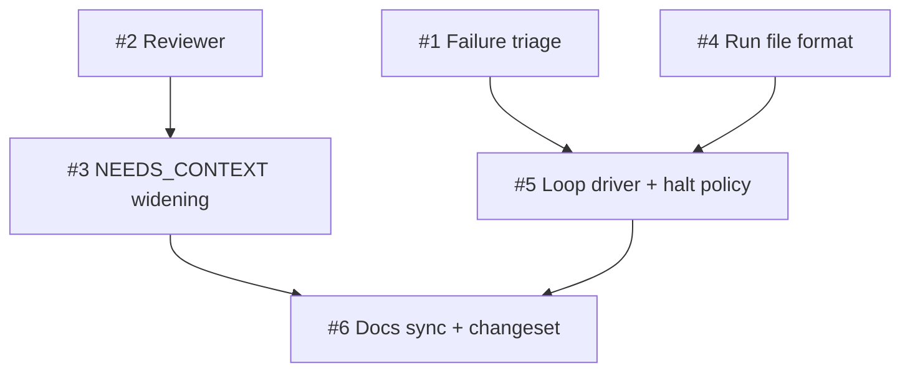

# Plan: Ship the fresh-context-per-slice loop harness

## TL;DR

We're making the chain loop-capable: `/tdd --loop` will run a whole plan overnight, dispatching each slice in fresh context, fixing what it can within fixed budgets, and parking what needs a human in a structured halt report you read with coffee. The work is six markdown-contract slices across `tdd-loop`, `parallel-dev`, one ADR amendment, and one new run-file artifact class — no hooks, no new substrate. Phase 1 lands the three independent foundations (failure triage, the reviewer, the run-file format), Phase 2 turns the loop on, Phase 3 syncs the docs and cuts the changeset. Everything is AFK; the human gates are the phase boundaries.

| Plan ID | `plans/2026-06-10-loop-harness-fresh-context-outer-loop` |
|---|---|
| ADR | [`adrs/2026-06-10-loop-harness-fresh-context-outer-loop`](../adrs/2026-06-10-loop-harness-fresh-context-outer-loop.md) |
| Tier | Deep (inherited from spec) |
| Status | Proposed |
| Owner | Modie (HITL at phase gates) + AFK fleet |

## Goal

A user can point `/tdd --loop` at a plan, walk away, and return to either a finished plan or a RUN_SUMMARY whose parked halts each resume with one `/tdd --resume <run-id>` command.

## Success measure

All loop-harness dogfood scenarios (one per route in slice 1, both-sided reviewer test in slice 2, escalation fixture in slice 3, run-file assertions in slice 4, loop-to-done plus park-and-continue fixtures in slice 5) pass on the release branch, and the v1.26.0 doc-sync audit reports zero WARN findings.

## Phases

### Phase 1 — Foundations

The loop's three load-bearing contracts have disjoint file surfaces and no inter-dependencies, so they land together as one parallel dispatch: the failure-triage rule in `tdd-loop` (#1), the context-starved reviewer in `parallel-dev` (#2), and the run-file / RUN_SUMMARY / halt-report format reference (#4). Phase 2's driver consumes all three, so nothing loop-shaped can start until this gate passes. This phase carries the grill's two merged-slop and runaway-waste success criteria: bounded retries and an independent reviewer exist before any loop ever runs.

**Acceptance gate.** The phase is done when all four of these are simultaneously true: (1) each of the three triage routes is demonstrated by its dogfood fixture — a transient-shaped failure re-runs once and succeeds, a structural failure auto-invokes `systematic-debugging` with the evidence payload, and budget exhaustion emits a well-formed `BLOCKED` halt payload; (2) the reviewer's both-sided dogfood test passes — the planted spec violation is caught from the input triple alone AND the clean control diff yields no hallucinated Critical findings; (3) a fixture run file passes the executable assertions for the format reference, including the session-identity field and the halt-report shape; (4) all three slices passed `verify-output` and their dispatch records exist.

**Top risks.** The biggest risk is that the triage rule reads well but isn't executable — classification language vague enough that the implementing agent routes inconsistently. Mitigation: one dogfood fixture per route is a slice AC; the rule isn't done until all three fixtures discriminate. The second risk is reviewer false positives poisoning the loop (a reviewer that blocks everything makes AFK useless). Mitigation: the clean-control fixture is mandatory and gaps-not-style is a stated constraint with severity tiers. The third risk is run-file format churn after Phase 2 starts consuming it. Mitigation: the format is frozen at this gate per the recorded two-way-door undo cost — breaking field changes need a new grill round.

**Rollback hook.** Single `git revert` per slice commit reverses Phase 1; no artifact outside the repo exists yet.

### Phase 2 — The loop goes live

With the foundations frozen, the driver and the widened retry bound land: `/tdd --loop` promotes Phase 0.5 to an iteration driver with the tiered halt policy (#5), and the ADR-0004 NEEDS_CONTEXT amendment plus `parallel-dev` wording update ships (#3). The two slices touch disjoint surfaces (`tdd-loop` + run file vs `parallel-dev` + ADR) and run as one parallel pair. This phase is where the user's own riskiest-behavior example must reproduce: a structural halt on one slice parks it while independent siblings continue.

**Acceptance gate.** The phase is done when all four of these are simultaneously true: (1) the 2-slice plan fixture loops to plan-done with the run file updated each iteration and a RUN_SUMMARY written at termination; (2) the planted-ambiguity fixture parks the affected scope with a well-formed halt report, continues unaffected siblings, and the RUN_SUMMARY names `/tdd --resume <run-id>` in the halt section; (3) the NEEDS_CONTEXT escalation fixture shows a second re-dispatch with unchanged input escalating immediately to `BLOCKED`, and ADR-0004's in-place amendment is committed; (4) `/tdd --resume <run-id>` re-enters a parked slice from its halt report in a fresh session.

**Top risks.** The biggest risk is the loop halting so often that AFK mode is pointless (premortem risk #2). Mitigation: the three provisional confirmation gates proceed on green checks rather than parking, and the park-and-continue rule keeps independent scope moving. The second risk is the driver edits in #5 colliding with #1's triage edits in the same `tdd-loop/SKILL.md`. Mitigation: phase ordering makes this sequential by construction — #5 starts from #1's merged text. The third risk is the iteration ceiling (2× open slices) truncating a legitimately converging run. Mitigation: `--max-iterations` override exists from day one and the effective ceiling is recorded in run-file frontmatter for the morning read.

**Rollback hook.** Single `git revert` per slice commit; the ADR-0004 amendment reverts with #3's commit since it's amend-in-place with a changelog line.

### Phase 3 — Ship

Docs catch up with behavior and the release becomes cuttable: GLOSSARY terms, the chain-at-a-glance update, the Grill 2.0 ADR changelog entry that formally discharges its fired line-76 revisit trigger, and the changeset (#6). This phase exists so the doc-sync audit — the release skill's verifier — sees a coherent corpus, which is the grill's ceremony-stays-thin criterion made checkable.

**Acceptance gate.** The phase is done when all three of these are simultaneously true: (1) the release skill's doc-sync audit passes with zero WARN findings; (2) the five new GLOSSARY terms resolve and `using-habeebs-skill` shows the loop driver in the chain-at-a-glance; (3) the Grill 2.0 ADR changelog entry closing the line-76 trigger and the v1.26.0 minor changeset are both committed.

**Top risks.** The biggest risk is doc drift — slices 1–5 shipped wording that the docs slice paraphrases inconsistently. Mitigation: #6 quotes contract language from the landed SKILL.md text rather than from the spec. The second risk is the changeset under-describing the ADR-0004 amendment, which release telemetry reads. Mitigation: the changeset references the ADR changelog line verbatim.

**Rollback hook.** Single `git revert`; documentation-only.

## Slice table

The slice list is the ONE table in the plan besides the status block. One row per slice. Estimates are illustrative; gates are contractual.

| ID | Name | Label | Phase | pgroup | Blocked by | Est | Rollback |
|---|---|---|---|---|---|---|---|
| #1 | Failure-triage rule + bounded retry in tdd-loop | AFK:full-auto | 1 | pgroup-1A | — | 0.5d | `git revert` |
| #2 | Reviewer subagent in parallel-dev | AFK:full-auto | 1 | pgroup-1A | — | 0.5d | `git revert` |
| #4 | Run file + RUN_SUMMARY + halt report | AFK:full-auto | 1 | pgroup-1A | — | 0.5d | `git revert` |
| #3 | NEEDS_CONTEXT bounded multi-retry (ADR-0004 amendment) | AFK:full-auto | 2 | pgroup-2A | #2 | 0.5d | `git revert` |
| #5 | Outer-loop driver + tiered halt policy | AFK:full-auto | 2 | pgroup-2A | #1, #4 | 1d | `git revert` |
| #6 | Docs sync + changeset | AFK:full-auto | 3 | pgroup-3A | #3, #5 | 0.5d | `git revert` |

Labels follow the GLOSSARY definitions (see [GLOSSARY.md § Slice](../GLOSSARY.md)). Severability under scope pressure (grill decision): #3 defers first, then #2, then #4; #1 and #5 are the spine and not severable.

> Fixture identifiers are confirm-at-implementation. Every dogfood path in this plan is a placeholder (`tests/dogfood/<next-free-N>-<slug>/`); the implementer confirms the next free N against the live tree before creating the fixture.

Estimate convention: **d** = ideal engineer-day.

## Dependency DAG



ASCII fallback:

```
#1 ─┐
    ├─→ #5 ─┐
#4 ─┘       ├─→ #6
#2 ─→ #3 ───┘
```

## Parallelization map

- `pgroup-1A = {#1, #2, #4}` — Phase 1, no inter-deps, all AFK. Disjoint file scopes: #1 edits `tdd-loop/SKILL.md`, #2 edits `parallel-dev/SKILL.md`, #4 creates a new reference doc. `parallel-dev` write-task dispatch via separate sub-worktrees.
- `pgroup-2A = {#3, #5}` — Phase 2 after the Phase 1 gate. Disjoint scopes: #3 touches `parallel-dev/SKILL.md` + `docs/agents/adrs/0004-*.md`; #5 touches `tdd-loop/SKILL.md` + the run-file reference. #5 starts from #1's merged text and #3 from #2's, which the phase boundary guarantees.
- `pgroup-3A = {#6}` — single slice, sequential after both Phase 2 slices.

Independence is verified against `parallel-dev`'s Phase 2 checklist (file overlap, state dependency, resource contention, ordering, implicit shared state) before dispatch.

## Revisit triggers

This plan should be reopened — and `socratic-grill` re-run on the affected section — if any of:

- Retry budgets repeatedly hit on legitimately converging fixes → make budgets configurable (ADR trigger).
- Re-grill rounds fire >2× during this release's implementation (Grill 2.0 trigger, doubly load-bearing here).
- Field evidence of a legitimate long-wait failure misclassified as structural → add the wait-exemption deferred at grill.
- The ADR flips to Superseded, or the deferred ADR-0003 Stop-hook carve-out is taken mid-release.
- The 2026-06-15 headless credit-pool change lands before Phase 2 completes and materially alters fresh-session economics.

## Change log

- 2026-06-10 — Initial plan written from [`adrs/2026-06-10-loop-harness-fresh-context-outer-loop`](../adrs/2026-06-10-loop-harness-fresh-context-outer-loop.md).

## References

- ADR: [`adrs/2026-06-10-loop-harness-fresh-context-outer-loop`](../adrs/2026-06-10-loop-harness-fresh-context-outer-loop.md)
- Spec: [`specs/2026-06-09-loop-harness`](../specs/2026-06-09-loop-harness.md)
- Grill: [`specs/2026-06-09-loop-harness-grill`](../specs/2026-06-09-loop-harness-grill.md)
- Research: [`research/2026-06-09-loop-harness-research`](../research/2026-06-09-loop-harness-research.md)
- SYSTEM_CONTEXT: [`SYSTEM_CONTEXT.md`](../SYSTEM_CONTEXT.md)
- GLOSSARY (cross-plan jargon definitions): [`GLOSSARY.md`](../GLOSSARY.md)

---

HANDOFF: implementation ready — plan locked. Next: `tdd-loop` on Slice #1 (Phase 1, pgroup-1A). Parallelizable now: pgroup-1A = {#1, #2, #4}. Gate to pass before Phase 2: all three triage routes + both-sided reviewer test + run-file assertions green, with verify-output passes and dispatch records present.

HANDOFF: pgroup-dispatch-ready — when `tdd-loop` is invoked on this plan, pgroups of size ≥ 2 will auto-dispatch via `parallel-dev`. Eligible pgroups: pgroup-1A, pgroup-2A.
