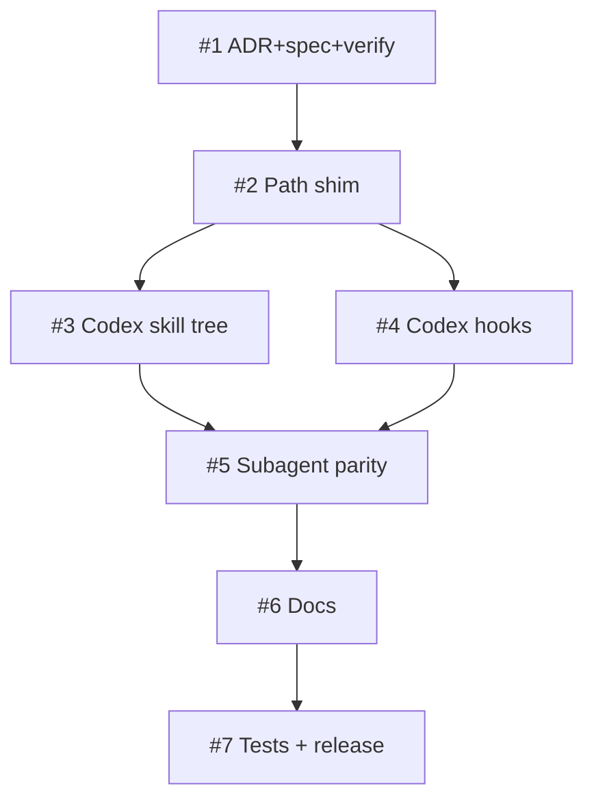

# Plan: Achieve dual-native Claude Code + Codex parity from a single canonical skill source

## TL;DR

habeebs-skill is a Claude Code plugin today. Codex CLI has since grown a native skills system, a hooks engine that mirrors Claude's `hooks.json` schema, and native subagents — so the repo's "Codex can only read markdown" story is outdated. This plan makes the bundle first-class on both harnesses from one authored source: `skills/` stays canonical, a sync script generates the Codex `.agents/skills/` tree, a `.codex/config.toml` reuses the same hook scripts, subagents run on both, and a CI drift-check keeps the generated tree honest. It ships additively as v1.29.0 — no change to how Claude users install or run anything.

| Plan ID | `plans/2026-06-25-codex-dual-native-parity` |
|---|---|
| ADR | [`adrs/2026-06-25-dual-native-claude-codex-parity`](../adrs/2026-06-25-dual-native-claude-codex-parity.md) |
| Tier | Deep (inherited from spec) |
| Status | Active |
| Owner | maintainer (HITL) + AFK fleet |

## Goal

A user running either Claude Code or Codex CLI gets the same habeebs-skill chain — skills, hooks, and subagents — with no Codex-second-class fallback.

## Success measure

`tests/run-all.sh` (including the new `tests/codex/` parity suite and the skill-tree drift-check) passes on the branch, and a live Codex session resolves `$prior-art-research`, fires the commit-block hook, and dispatches a Deep-mode subagent — all verified before the v1.29.0 tag pushes.

## Phases

### Phase 1 — Lock decisions and verify the riskiest assumption

This phase exists to make the parity contract real before any code depends on it, and to retire the one empirical unknown: whether Codex tolerates Claude's `disable-model-invocation` frontmatter key. Everything downstream assumes the minimal-frontmatter pick; if Codex rejects it, we want to know in Phase 1, not Phase 4.

**Acceptance gate.** The phase is done when all three are simultaneously true: (1) the ADR and spec are committed and the ADR index row is appended; (2) a `SKILL.md` carrying `disable-model-invocation` has been loaded under a live Codex CLI and the outcome recorded in the spec; (3) if Codex errored on that key, the frontmatter pick has been switched to the dual-key superset and the ADR's frontmatter line amended.

**Top risks.** The biggest risk is that the frontmatter check is skipped "because it'll probably be fine," letting a latent incompatibility ship. Mitigation: the recorded outcome is a hard gate criterion — a non-empty result is required to pass. The second risk is no live Codex being available to test against. Mitigation: fall back to Codex's published skill-schema validator and record that as the evidence source.

**Rollback hook.** Single `git revert` per commit reverses the doc artifacts; no runtime state changes in this phase.

### Phase 2 — Make the substrate portable

This phase removes the hard dependency on Claude-only path resolution so a single hook/command body runs under both harnesses. It is the foundation both the Codex skill tree and the Codex hook registration build on, which is why it precedes them.

**Acceptance gate.** The phase is done when all three are simultaneously true: (1) every hook script resolves its own directory through the shim order `CLAUDE_PLUGIN_ROOT` → `CURSOR_PLUGIN_ROOT` → `git rev-parse --show-toplevel` with no single env var required; (2) command files reference skills via a path that resolves under both harnesses; (3) the existing `tests/hooks/` suite still passes and a new test asserts correct resolution with each env var unset in turn.

**Top risks.** The biggest risk is a `git rev-parse` fallback firing outside a git tree and breaking a hook. Mitigation: the shim degrades to a clean no-op exit (matching the existing not-in-git-tree guards) rather than erroring. The second risk is silent behavior drift in the 17 command files. Mitigation: the path change is mechanical and covered by the resolution test.

**Rollback hook.** Single `git revert` per commit; the shim is isolated to a sourced helper.

### Phase 3 — Stand up the Codex surfaces

This phase produces the two Codex-facing artifacts — the generated `.agents/skills/` tree (with its drift-check) and the `.codex/config.toml` hook registration. They are independent (disjoint file scopes) and run as a parallelization group.

**Acceptance gate.** The phase is done when all four are simultaneously true: (1) `bin/sync-codex.sh` regenerates `.agents/skills/` deterministically from `skills/`; (2) the drift-check test exits non-zero on a stale tree and zero when in sync; (3) `.codex/config.toml` registers the SessionStart/PreToolUse/PostToolUse hooks against the existing scripts with matchers valid in both dialects; (4) a live Codex smoke resolves `$prior-art-research` and blocks a commit-to-default attempt.

**Top risks.** The biggest risk is matcher-dialect mismatch (Claude literal vs Codex `^Bash$` regex) silently disabling a hook. Mitigation: anchored both-valid forms plus the Codex hook smoke test. The second risk is drift-check flakiness from nondeterministic generation ordering. Mitigation: the sync script sorts deterministically and the test diffs against a fresh generation.

**Rollback hook.** Delete `.agents/skills/` and `.codex/config.toml` and revert `bin/sync-codex.sh` — Claude behavior is unaffected because these paths are Codex-only.

### Phase 4 — Full subagent parity

This is the heaviest phase: wiring Codex subagent dispatch into `prior-art-research` Deep mode and `parallel-dev` so the `agents/*.md` prompts run on both harnesses under the same dispatch contract (ADR-0004). It builds on the portable substrate (Phase 2) and the Codex surfaces (Phase 3).

**Acceptance gate.** The phase is done when all three are simultaneously true: (1) Deep-tier research dispatches `source-fetcher`, `pattern-extractor`, `synthesizer`, and `category-completeness-critic` under Codex; (2) `parallel-dev`'s write-batch isolation and 4-status return contract (ADR-0004) hold under Codex; (3) behavior matches the Claude path on a shared fixture.

**Top risks.** The biggest risk is the Codex subagent dispatch contract diverging from ADR-0004's payload shape, breaking idempotent resume. Mitigation: map the Codex dispatch fields explicitly to the ADR-0004 contract and assert the 4-status return in the parity test. The second risk is write-batch isolation not being enforceable identically under Codex. Mitigation: keep per-worktree isolation via `using-worktrees`, which is harness-agnostic git.

**Rollback hook.** Feature-guard the Codex dispatch path so it falls back to single-agent Balanced if disabled; revert the wiring commit to restore Claude-only dispatch.

### Phase 5 — Reconcile docs and release

This phase corrects the now-false Codex framing across `AGENTS.md`/README/`CLAUDE.md`, consolidates the parity tests into `tests/run-all.sh`, and runs the v1.29.0 release flow.

**Acceptance gate.** The phase is done when all four are simultaneously true: (1) `AGENTS.md` describes native Codex skills/hooks/subagents with no "no plugin system" claim, README reflects native Codex install, and `CLAUDE.md` links the ADR; (2) `tests/run-all.sh` includes and passes the `tests/codex/` suite; (3) a changeset is present and the release skill has applied the v1.29.0 bump to `plugin.json` + `marketplace.json` with a CHANGELOG entry; (4) doc-sync audit is clean and the tag pushes.

**Top risks.** The biggest risk is doc drift between the three doc files restating the Codex story differently. Mitigation: the doc-sync audit step in the release flow cross-checks them. The second risk is the version landing as a major by accident if a skill path moved. Mitigation: the plan keeps `skills/` canonical, so the bump stays minor — verified by the path audit.

**Rollback hook.** ONE-WAY DOOR at tag-push — the gate is raised correspondingly (full `tests/run-all.sh` green + live-Codex smoke) before the tag is cut. Pre-tag, single `git revert` per commit.

## Slice table

| ID | Name | Label | Phase | pgroup | Blocked by | Est | Rollback |
|---|---|---|---|---|---|---|---|
| #1 | ADR + spec + frontmatter verify gate | HITL:approval-gate | 1 | pgroup-1A | — | 0.5d | `git revert` |
| #2 | Harness-agnostic path shim | AFK:full-auto | 2 | pgroup-2A | #1 | 1d | `git revert` |
| #3 | Generated Codex skill tree + drift-check | AFK:full-auto | 3 | pgroup-3A | #1, #2 | 1d | delete `.agents/skills/` |
| #4 | Codex hook registration (`.codex/config.toml`) | AFK:full-auto | 3 | pgroup-3A | #2 | 1d | delete `.codex/` |
| #5 | Full Codex subagent parity | HITL:approval-gate | 4 | pgroup-4A | #2, #3, #4 | 2d | feature-guard fallback |
| #6 | Docs reconciliation | AFK:full-auto | 5 | pgroup-5A | #3, #4, #5 | 0.5d | `git revert` |
| #7 | Parity test suite + release | HITL:approval-gate | 5 | pgroup-5B | #5, #6 | 0.5d | pre-tag `git revert` |

Labels follow GLOSSARY definitions ([GLOSSARY.md § Slice](../GLOSSARY.md)). Estimate convention: **d** = ideal engineer-day.

## Dependency DAG



ASCII fallback:

```
#1 → #2 ─┬─→ #3 ─┐
         └─→ #4 ─┴─→ #5 → #6 → #7
```

## Parallelization map

- `pgroup-3A = {#3, #4}` — Phase 3, both depend on #2, disjoint scopes (#3 writes `.agents/skills/` + `bin/`; #4 writes `.codex/`). `parallel-dev` write-task dispatch via separate sub-worktrees.
- All other slices are sequential (single-slice pgroups).

Independence for pgroup-3A is verified against `parallel-dev`'s Phase 2 checklist (file overlap, state dependency, resource contention, ordering, implicit shared state) before co-dispatch.

## Revisit triggers

- Codex changes skill discovery paths, frontmatter schema, or the hooks-event contract.
- Drift-check proves insufficient (≥3 drift escapes reaching a release) → escalate to single-tree (Option C → 2.0.0).
- Slice 1 frontmatter verification fails → switch to dual-key superset and re-grill affected picks.
- Claude Code adds native `.agents/skills/` discovery → collapse the two trees.

If a trigger fires mid-execution, halt at the current phase gate.

## Change log

- 2026-06-25 — Initial plan written from `adrs/2026-06-25-dual-native-claude-codex-parity.md`.

## References

- ADR: [`adrs/2026-06-25-dual-native-claude-codex-parity`](../adrs/2026-06-25-dual-native-claude-codex-parity.md)
- Spec: [`specs/2026-06-25-codex-dual-native-parity`](../specs/2026-06-25-codex-dual-native-parity.md)
- SYSTEM_CONTEXT: [`SYSTEM_CONTEXT.md`](../SYSTEM_CONTEXT.md)
- GLOSSARY: [`GLOSSARY.md`](../GLOSSARY.md)

---

HANDOFF: implementation ready — plan locked. Next: `tdd-loop` on Slice #1 (Phase 1, pgroup-1A). Gate to pass before Phase 2: ADR+spec committed, index row appended, and the Codex frontmatter verification recorded.

HANDOFF: pgroup-dispatch-ready — when `tdd-loop` is invoked on this plan, pgroups of size ≥ 2 auto-dispatch via `parallel-dev`. Eligible pgroups: pgroup-3A.
