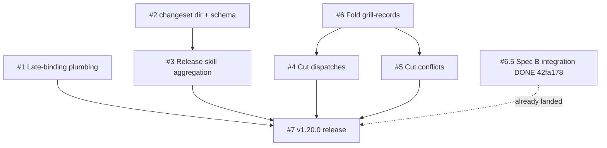

# Plan: Adopt late-binding ADR IDs and Changesets-shape version bumps and cut dormant methodology folders

| Field         | Value                                                                                              |
|---------------|----------------------------------------------------------------------------------------------------|
| Plan ID       | `plans/v1.20.0-methodology-overhaul`                                                               |
| ADR           | [`adr-late-binding-and-changesets`](../adrs/adr-late-binding-and-changesets.md) + [`adr-methodology-folder-cuts`](../adrs/adr-methodology-folder-cuts.md) |
| Tier          | Balanced (inherited from spec; user override of Deep research tier)                                |
| Status        | Proposed                                                                                           |
| Last updated  | 2026-05-25                                                                                         |
| Owner         | Modie (Habeeb) + AFK fleet                                                                         |

## Goal

End-of-v1.20.0 state: any branch can write new ADRs without integer collision; any release-worthy PR carries an append-only `.changeset/<slug>.md` that the `release` skill aggregates; `docs/agents/` has 7 declared subdirectories instead of 9 (with two ADRs amended in place tombstoning the cuts).

## Success measure

A v1.20.0 release runs the new mechanism against itself end-to-end: `.changeset/v1.20.0-methodology-overhaul.md` is aggregated into a single bump commit, both new ADRs (`adr-late-binding-and-changesets.md` + `adr-methodology-folder-cuts.md`) are renamed to `NNNN-<slug>.md` with `adrs/README.md` regenerated, all 5 baseline + 5 new dogfood scenarios pass, and the v1.20.0 tag is pushed post-merge. **Binary measure: `git -C <worktree> describe --tags --exact-match HEAD` returns `v1.20.0` AND every dogfood scenario in `tests/dogfood/{11,14,21,22,23,24,25}/*.sh` returns exit 0.**

## Phases

### Phase 1 — Foundation (substrate + tracer)

**Slices:** #1, #2 (pgroup-1A — parallel)

**Acceptance gate:** Late-binding mechanism proven on the smallest end-to-end tracer-bullet AND changeset substrate is in place. Specifically: `bash tests/dogfood/21-late-binding-adr/check-late-binding.sh` returns exit 0 across all 5 fixture cases (happy path, collision halt, `--dry-run`, `--help`, separation-of-writers); `bash tests/dogfood/22-changeset-schema/check-schema.sh` returns exit 0 (validates `.changeset/EXAMPLE.md` + verifies the schema-parser handles malformed fixtures); all 5 baseline dogfood tests (description-budget, disabled-list, chain-integrity, no-next-skills, system-context-schema) still pass.

**Top risks:**
1. **Slice 1 is the load-bearing tracer.** Every late-binding-dependent slice (Slice 6, Slice 7 ADR rename) depends on the rename script being correct. A bug here ripples downstream and surfaces loudly only at Slice 7's self-dogfood release. Mitigation: dogfood scenario 21 has 5 fixture cases including the collision halt — must pass before Phase 2 starts.
2. **`decision-record` SKILL.md change is a one-way door for the convention.** Once the skill writes `adr-<slug>.md`, every future ADR follows the new path. If the rename script is broken, ADRs pile up unnumbered until manual intervention. Mitigation: dogfood scenario 21 assertion (e) "separation-of-writers — `decision-record` output never matches `^[0-9]{4}-` pattern" catches the regression direction.
3. **`.changeset/` directory presence triggers no behavior on its own.** Phase 1 does NOT activate the aggregation logic (that's Slice 3). A reviewer who skims could miss that Phase 1 alone has no observable behavior change at release time. Mitigation: the acceptance gate is mechanical (dogfood scenarios pass), not behavioral; phase boundary is correct as defined.

**Rollback hook:** `git revert <slice-1-commit> <slice-2-commit>` — both slices are pure additions (new SKILL.md content + new directory + new helper script + new dogfood scenarios). Zero in-flight state to unwind. Worst case: `decision-record` writes `adr-<slug>.md` against the un-rolled-back skill text and a contributor has to manually rename one ADR. **Not a one-way door.**

### Phase 2 — Methodology aggregation + folder retirement prep

**Slices:** #3, #6 (pgroup-2A — parallel)

**Acceptance gate:** `release` skill aggregates `.changeset/*.md` into version-bump commits AND `docs/agents/grill-records/` is folded into `specs/<name>-grill.md` naming. Specifically: `bash tests/dogfood/23-changeset-aggregation/check-aggregation.sh` returns exit 0 (3-changeset fixture aggregates to next minor + 3-bullet CHANGELOG + atomic-or-rollback semantics verified by forced-failure fixture); `bash tests/dogfood/25-changeset-required-check/check-path-audit.sh` returns exit 0 (3 path-class fixtures + 5 named error-message asserts); `bash tests/dogfood/24-folder-cuts/check-grill-records-folded.sh` returns exit 0 (file moved via `git mv` preserves history; dir deleted; ADR present). All 5 baseline + 2 Phase-1 dogfood tests still pass.

**Top risks:**
1. **Slice 3 integrates with v1.19.0's existing release skill — high regression risk on the description-policy audit.** v1.19.0's `## Description-policy audit (v1.19.0+)` section runs `bash tests/dogfood/11-description-budget/{check-description-budget,check-disabled-list}.sh` before tag-push. Slice 3 EXTENDS that section to also run aggregation + path-audit; the extension must not break the existing description-policy flow. Mitigation: Phase 2 gate explicitly requires baseline tests pass post-edit.
2. **Slice 6 ADR-writing responsibility partially complete (drift from spec).** Slice 6 spec says "New ADR written as `adrs/adr-methodology-folder-cuts.md`" but that ADR was already written out of slice order in commit `11cdc4e` (decision-record run). Slice 6's remaining work is `git mv` + dir delete + dogfood scenario. **The plan reflects the true as-built state; the spec has drift documented in the Slice table notes.** Risk is misreading the spec and re-writing the ADR.
3. **`git mv` of the single grill-records file must preserve history.** A `cp` + delete + new commit would lose the file's authorship trail. Mitigation: dogfood scenario 24/check-grill-records-folded asserts the file is moved (not copied) by checking `git log --follow` resolves to the original commit.

**Rollback hook:** `git revert <slice-3-commit>` reverts the release-skill edits cleanly (Slice 3 is pure additions to the release SKILL.md + 2 helper scripts + 2 new dogfood scenarios — no destructive ops). `git revert <slice-6-commit>` reverts the `git mv` (restores `grill-records/<file>.md`, removes `specs/v1.16.0-cross-session-conflict-detection-grill.md`). **Not a one-way door at the phase boundary** — the ADR-int rename happens at Slice 7 release time, not at Slice 6.

### Phase 3 — Folder cuts (tombstone amendments + cross-reference cleanup)

**Slices:** #4, #5 (pgroup-3A — parallel)

**Acceptance gate:** `docs/agents/dispatches/` and `docs/agents/conflicts/` are deleted; ADR-0004 and ADR-0018 are amended in place with Status-flip lines; cross-references in `CLAUDE.md` / `AGENTS.md` / `parallel-dev/SKILL.md` / `cross-session-detect/SKILL.md` are updated; `grep -rn "dispatches/" --include="*.md"` and `grep -rn "conflicts/" --include="*.md"` return hits ONLY in (a) the amended ADRs themselves, (b) the new `adr-methodology-folder-cuts.md`, (c) historical specs/grills/research (immutable per Pattern B). Specifically: `bash tests/dogfood/24-folder-cuts/check-no-dispatches.sh` returns exit 0; `bash tests/dogfood/24-folder-cuts/check-no-conflicts.sh` returns exit 0; all 5 baseline + 4 prior-phase dogfood tests still pass.

**Top risks:**
1. **Cross-reference cleanup checklist may be incomplete.** Each slice has a per-file checklist (CLAUDE.md line 84, AGENTS.md, parallel-dev SKILL.md, cross-session-detect SKILL.md), but new references could exist that the spec didn't enumerate. Mitigation: the `grep -rn` step at the gate verifies — if it surfaces unexpected hits, the slice halts.
2. **SYSTEM_CONTEXT.md drift is INTENTIONAL until next `prior-art-research` Phase 0** (per ADR-0005 single-writer invariant). SYSTEM_CONTEXT.md still mentions `dispatches/` and `conflicts/` after Phase 3 lands. This is by design per `adr-methodology-folder-cuts.md` § "SYSTEM_CONTEXT.md updates are DEFERRED." Risk: a future reader sees the drift and reverts. Mitigation: the slice commit messages list the needed SYSTEM_CONTEXT updates explicitly so the reconciliation is unambiguous when the next Phase 0 runs.
3. **In-place ADR amendments must not break the existing ADR's other clauses.** ADR-0004 has multiple parts (Part 1 = dispatch contract, Part 2 = dispatches/ directory); the amendment only retires Part 2. Same for ADR-0018. Mitigation: the amendment is a date-stamped section appended after the original Decision, not a rewrite. Existing cross-references to the ADRs continue resolving to a tombstone that points forward.

**Rollback hook:** `git revert <slice-4-commit> <slice-5-commit>` restores the deleted directories (empty) and reverts the ADR amendments. **Hardest rollback of the plan** but still mechanical — git history preserves; recovery is `git revert` + run dogfood scenario 24 fixtures in reverse to verify state.

### Phase 4 — Self-dogfood v1.20.0 release

**Slices:** #7 (sequential; depends on Phases 1-3 + Slice 6.5)

**Acceptance gate:** A v1.20.0 release runs end-to-end using the new mechanism. Specifically: `.changeset/v1.20.0-methodology-overhaul.md` exists with `bump: minor` + the aggregated `why:` line covering both ADRs and Slice 6.5 integration; running the `release` skill aggregates the changeset → bumps `plugin.json` + `marketplace.json` to `1.20.0` → writes CHANGELOG entry → deletes the changeset → assigns next sequential ints to `adr-late-binding-and-changesets.md` + `adr-methodology-folder-cuts.md` (renames to `0020-*.md` + `0021-*.md` in alphabetic slug order) → regenerates `adrs/README.md` → opens release PR → after merge, pushes `v1.20.0` tag. **Binary measure:** `git describe --tags --exact-match HEAD` returns `v1.20.0` AND `bash tests/dogfood/{11,14,21,22,23,24,25}/*.sh` ALL return exit 0 AND `verify-output` returns DONE or DONE_WITH_CONCERNS. CHANGELOG entry includes the migration note: "Migration note: any open PR modifying `skills/`, `hooks/`, or `.claude-plugin/` must add a `.changeset/<slug>.md` before merging."

**Top risks:**
1. **Self-dogfood failure surfaces ALL prior-slice bugs at once.** If Slice 1's rename is buggy, Slice 3's aggregation is buggy, or Slice 4/5's amendments left stale references, Phase 4 fails LOUD. This is by design (the audit explicitly called out "loud failure mode > silent drift"), but the coordination cost is real — debugging requires walking back through every prior phase. Mitigation: per-phase acceptance gates prevent Phase 4 from running against any phase that didn't pass its own gate.
2. **Two-PR race window (per ADR `adr-late-binding-and-changesets` OQ-3) is open at release time.** If the user opens a second release PR while Slice 7 is in flight, the second merge will fail loudly on `CHANGELOG.md` + `plugin.json` conflict. Acceptable per the ADR but worth flagging — Phase 4 should not be running while any other release-worthy PR is open. Mitigation: operator discipline (single-author scale makes this a non-issue in practice).
3. **README index regeneration is the last unproven step.** Slice 1's dogfood scenario 21 tests the rename + README update on a fixture; Slice 7 is the first run against the actual repo state with 19 existing ADRs + 2 new ones. A real-data edge case (e.g., trailing whitespace in the existing README, an existing ADR whose filename doesn't perfectly match `NNNN-<slug>.md` pattern) could break the regeneration. Mitigation: dry-run the rename first via `bash skills/release/scripts/assign-adr-ids.sh --dry-run` before the live run.

**Rollback hook:** If aggregation fails mid-flight, the changeset is NOT consumed (atomic-or-rollback per OQ-2; aggregation script's temp-staging-dir approach). Clean retry from clean state via `git checkout -- .changeset/ plugin.json marketplace.json CHANGELOG.md`. If the rename fails mid-flight, ADR files may be partially renamed — recovery is `git checkout -- adrs/` to restore originals. If the release PR opens but tests fail in CI-equivalent, close PR + revert the bump commit + re-run from clean. **Tag push is the final irreversible step** — once `git push origin refs/tags/v1.20.0` succeeds, rollback requires `git push origin :refs/tags/v1.20.0` + a v1.20.1 hotfix release. Flag this in the Phase 4 acceptance: gate raised correspondingly.

## Slice table

| ID    | Name                                              | Label                | Phase | pgroup     | Blocked by       | Est  | Rollback hook                                                  |
|-------|---------------------------------------------------|----------------------|-------|------------|------------------|------|----------------------------------------------------------------|
| #1    | Late-binding ADR rename plumbing                  | HITL:approval-gate   | 1     | pgroup-1A  | —                | 0.5d | `git revert` (pure additions; no destructive ops)              |
| #2    | `.changeset/` dir + minimal schema + EXAMPLE.md   | AFK:full-auto        | 1     | pgroup-1A  | —                | 0.25d| `git revert` (pure additions)                                  |
| #3    | Release skill aggregation + path audit phases     | HITL:approval-gate   | 2     | pgroup-2A  | #2               | 1d   | `git revert` (extends v1.19.0 audit; v1.19.0 path preserved)   |
| #6    | Fold `grill-records/` + dogfood scenario 24       | HITL:approval-gate   | 2     | pgroup-2A  | None (drift; see notes) | 0.25d| `git revert` (restores `git mv`)                               |
| #4    | Cut `dispatches/` + amend ADR-0004 in place       | AFK:full-auto        | 3     | pgroup-3A  | #6 (ADR ref)     | 0.25d| `git revert` (restores empty dir + reverts amendment)          |
| #5    | Cut `conflicts/` + amend ADR-0018 in place        | AFK:full-auto        | 3     | pgroup-3A  | #6 (ADR ref)     | 0.25d| `git revert` (restores empty dir + reverts amendment)          |
| #6.5  | Spec B integration (parallel-dev + worktrees)     | AFK:full-auto        | —     | —          | —                | DONE | `git revert 42fa178` (already landed; tested on PASS baseline) |
| #7    | Self-dogfood v1.20.0 release                      | HITL:approval-gate   | 4     | pgroup-4A  | #1, #2, #3, #4, #5, #6 | 0.5d | Pre-tag: `git checkout -- .changeset/ plugin.json marketplace.json CHANGELOG.md`. Post-tag: hotfix release. |

**Label legend:**
- `AFK:full-auto` — no human in the loop; safe for `parallel-dev` autonomous dispatch
- `HITL:inline` — human reviews/decides in the chat session mid-slice
- `HITL:approval-gate` — human approves out-of-band (Slack/email or in-session approval before commit)

**Estimate convention:** **d** = ideal engineer-days (or model-turn equivalents for AFK slices). Estimates are illustrative for sequencing; gates are contractual.

**Spec drift notes (must be fixed in spec before TDD):**
- Slice 6's spec acceptance criterion #3 says "New ADR written as `adrs/adr-methodology-folder-cuts.md`." That ADR was written out of slice order in commit `11cdc4e` (decision-record run). Slice 6's remaining work is `git mv` + dir delete + dogfood scenario only. Spec should be updated to mark criterion #3 as "DONE in 11cdc4e — see Slice 6 effective scope reduced."
- Slice 6's spec "Blocked by: #1 (need late-binding mechanism for new ADR)" is no longer accurate — the ADR was written using the late-binding naming convention without the plumbing being live (proves the convention works). Slice 6's remaining work has NO actual dependency on Slice 1. **The plan reflects the true DAG; recommend updating the spec.**
- Slices 4 + 5 "Blocked by: #6 (the new ADR documenting supersession must exist first)" is still accurate in spirit — they need the ADR to reference — but the ADR already exists (11cdc4e). So Slices 4 + 5 are effectively unblocked from the ADR-existence perspective. They REMAIN blocked by Slice 6's `git mv` + dir delete because cross-reference cleanup spans the same files (`CLAUDE.md`, `parallel-dev/SKILL.md`) — running Slice 4 in parallel with Slice 6 would create file-overlap conflicts. **Plan keeps the ordering for parallel-dev independence reasons, not ADR-existence reasons.**

## Dependency DAG



ASCII fallback:

```
#1 ──────────────────────────────────┐
                                     │
#2 ─→ #3 ───────────────────────────→│
                                     ├─→ #7 (v1.20.0 release)
#6 ─┬─→ #4 ─────────────────────────→│
    └─→ #5 ─────────────────────────→│
                                     │
#6.5 [DONE 42fa178] ─────────────────┘
```

Reading the DAG:
- **Slice 1** is fully independent — smallest end-to-end tracer-bullet (audit Pattern A canonical proof point).
- **Slice 2** is fully independent — substrate (no behavior triggered).
- **Slice 3** waits on Slice 2 (needs the `.changeset/` directory to read from).
- **Slice 6** is fully independent in its remaining scope (ADR already written; only `git mv` + dir delete + dogfood scenario remain).
- **Slices 4 + 5** wait on Slice 6 for file-overlap-avoidance (cross-reference cleanup in shared files).
- **Slice 6.5** already landed as commit `42fa178`; no scheduling dependency.
- **Slice 7** waits on everything; self-dogfoods the new mechanism.

## Parallelization map

- `pgroup-1A` = {#1, #2} — Phase 1, no inter-deps, both safe for AFK or HITL dispatch in parallel
- `pgroup-2A` = {#3, #6} — Phase 2, disjoint scopes (release skill files vs `grill-records/` dir + dogfood scenario 24/check-grill-records-folded)
- `pgroup-3A` = {#4, #5} — Phase 3, different deleted dirs + different amended ADRs + overlapping cross-reference files (CLAUDE.md / AGENTS.md / parallel-dev SKILL.md), so the parallel claim requires careful Phase 2 independence verification (see Independence sanity below)
- `pgroup-4A` = {#7} — Phase 4, singleton (self-dogfood release, no parallelism possible)

**Independence sanity:** all pgroup members verified against `parallel-dev` Phase 2 checklist:

- **pgroup-1A (#1, #2):** PASS. #1 touches `skills/decision-record/SKILL.md`, `skills/release/SKILL.md`, `skills/release/scripts/assign-adr-ids.sh`, `tests/dogfood/21-*`. #2 touches `.changeset/{README.md,EXAMPLE.md,.gitkeep}`, `tests/dogfood/22-*`. Zero file overlap, zero state dependency, zero ordering constraint, zero resource contention.
- **pgroup-2A (#3, #6):** PASS. #3 touches `skills/release/SKILL.md` (extends Slice 1's edits), `skills/release/scripts/aggregate-changesets.sh`, `skills/release/scripts/check-changeset-required.sh`, `tests/dogfood/23-*`, `tests/dogfood/25-*`. #6 touches `docs/agents/grill-records/` (delete), `docs/agents/specs/v1.16.0-cross-session-conflict-detection-grill.md` (created via `git mv`), `tests/dogfood/24-folder-cuts/check-grill-records-folded.sh`. Note: BOTH slices edit `skills/release/SKILL.md` if Slice 6 amends the release skill's audit step to also check grill-records absence — but Slice 6 spec doesn't require that, so the overlap doesn't materialize. **Pgroup-2A members must run in disjoint worktrees per ADR-0004 + `adr-late-binding-and-changesets.md` § parallel-dev write-task gates.**
- **pgroup-3A (#4, #5):** PARTIAL PASS — requires worktree isolation. Both slices edit `CLAUDE.md` (different sections — line 84 for #4, no specific line for #5 unless cross-references found), `AGENTS.md`, `skills/parallel-dev/SKILL.md`, `skills/cross-session-detect/SKILL.md`. **File-overlap risk is real.** Mitigation: each slice runs in its own worktree (per `using-worktrees` skill + Slice 6.5's `parallel-dev` task-class write-restriction); merge-time conflict resolution per audit Pattern D. If conflicts surface, fall back to sequential ordering of #4 then #5.

**The 20% rule check:** 6 of 7 active slices are in pgroups of size ≥ 2 (~86%). This is above the 80% threshold and would normally be a smell — but the spec's pgroups are well-justified by file-scope disjointness for pgroup-1A and pgroup-2A, with the noted worktree-isolation caveat for pgroup-3A. The high parallelization ratio reflects the audit-driven design where each slice is intentionally scoped to a minimal surface; not a missed-dependency artifact. **Documented as accepted deviation.**

## Risk register

| #   | Phase | Risk                                                                                          | Likelihood | Impact | Mitigation                                                                                       |
|-----|-------|-----------------------------------------------------------------------------------------------|------------|--------|--------------------------------------------------------------------------------------------------|
| R1  | 1     | Slice 1 rename script bug ripples to Slice 7 self-dogfood failure                              | Medium     | High   | Dogfood scenario 21 with 5 fixture cases (happy + collision + dry-run + help + separation)       |
| R2  | 1     | `decision-record` SKILL.md edit creates one-way door for the convention                        | Low        | Medium | Separation-of-writers assertion in scenario 21 (output never matches `^[0-9]{4}-`)               |
| R3  | 2     | Slice 3 breaks v1.19.0 description-policy audit on the same release SKILL.md surface           | Medium     | High   | Phase 2 acceptance gate requires baseline tests pass; extend v1.19.0 audit, do not replace       |
| R4  | 2     | Slice 6 spec drift (ADR already written) misleads implementer into double-write                | Medium     | Low    | Plan explicitly notes drift; spec update recommended before TDD start                            |
| R5  | 2     | `git mv` of grill-records file fails to preserve history                                       | Low        | Medium | Dogfood scenario 24/check-grill-records-folded asserts `git log --follow` resolves to original   |
| R6  | 3     | Cross-reference cleanup checklist incomplete (missed file)                                     | Medium     | Low    | Acceptance gate `grep -rn` step catches; if hits surface, slice halts                            |
| R7  | 3     | SYSTEM_CONTEXT.md transient drift confuses future reader                                       | Medium     | Low    | Slice commit messages list needed SYSTEM_CONTEXT updates; next Phase 0 reconciles (by design)    |
| R8  | 3     | pgroup-3A file overlap on shared cross-reference files creates merge conflicts                 | Medium     | Medium | Each slice in own worktree; merge-time conflict resolution per Pattern D; sequential fallback    |
| R9  | 3     | In-place ADR amendments break existing ADR's other clauses (ADR-0004 Part 1, ADR-0018 Part B) | Low        | High   | Amendment is date-stamped appended section, not rewrite; preserves all other clauses verbatim    |
| R10 | 4     | Self-dogfood release surfaces all prior-slice bugs at once (loud failure cascade)              | Medium     | Medium | Per-phase gates prevent Phase 4 starting with any unpassed phase; rename `--dry-run` first       |
| R11 | 4     | Two-PR version-slot race opens during Slice 7                                                  | Low        | Medium | Operator discipline (single-author scale); accepted per ADR `adr-late-binding-and-changesets`    |
| R12 | 4     | README index regeneration fails on real-data edge case (whitespace, malformed entry)           | Medium     | Medium | Dry-run rename first via `--dry-run` before live run                                             |
| R13 | 4     | Tag push is the irreversible step                                                              | N/A        | High   | Gate raised correspondingly; hotfix release (v1.20.1) is the only post-tag rollback              |

## Revisit triggers

- **A second author joins the project AND ≥3 changeset filename collisions in 90 days.** Switch changeset naming from slug-based to random-id (Changesets-original default). Inherited from `adr-late-binding-and-changesets` § Revisit triggers.
- **Changeset count per release grows past ~10.** Aggregation-output CHANGELOG entries become noisy bullet lists; revisit grouping mechanism (Changesets-original has changeset categories).
- **2+ grills land in `specs/<name>-grill.md` naturally** (v1.20.0's own grill counts as #1) OR a grill writes to the now-nonexistent `grill-records/`. Update `socratic-grill` SKILL.md to specify the new write path in v1.21.0. Inherited from `adr-methodology-folder-cuts` § Revisit triggers.
- **Anthropic ships a first-party ADR convention or docs/agents/ folder convention for Claude Code.** Currently no published guidance (issue #13853 confirms). If they do, audit against this plan's choices.
- **A fourth methodology folder becomes dormant.** Apply the Pattern G threshold + amend-in-place tombstone pattern; do not re-spec the meta-decision.
- **The `release` skill grows past ~3 distinct audit phases** (currently: description-policy + changeset-presence + path-audit). Consider splitting into dedicated `release-audit` skill at that point.
- **Cross-reference link rot observed** (e.g., a stale "see docs/agents/dispatches/" comment surfaces in a future commit). Add a CI-equivalent grep check; until then, dogfood scenario 24 is the protection.
- **A Phase N gate fails and rollback executes.** Re-run `socratic-grill` on the affected slice + the gate condition before re-attempting.

If a trigger fires mid-execution, halt at the current phase gate and re-run `socratic-grill` on the affected sections before continuing.

## Change log

(Added on first revision. Each entry: date, what changed, why, who.)

- 2026-05-25 — Initial plan written from ADRs `adr-late-binding-and-changesets` + `adr-methodology-folder-cuts`. Owner: Modie + AFK fleet. Slice 6.5 marked DONE (commit 42fa178). Slice 6 spec drift documented (ADR already written out of slice order in commit 11cdc4e); spec update recommended before TDD start.

## References

- ADRs: [`adr-late-binding-and-changesets`](../adrs/adr-late-binding-and-changesets.md), [`adr-methodology-folder-cuts`](../adrs/adr-methodology-folder-cuts.md)
- Spec / sliced spec: [`specs/v1.20.0-methodology-overhaul`](../specs/v1.20.0-methodology-overhaul.md)
- Grill record: [`specs/v1.20.0-methodology-overhaul-grill`](../specs/v1.20.0-methodology-overhaul-grill.md)
- Research / audit memo: [`research/v1.19.0-workflow-audit-research`](../research/v1.19.0-workflow-audit-research.md)
- SYSTEM_CONTEXT: [`SYSTEM_CONTEXT.md`](../SYSTEM_CONTEXT.md)
- Related ADRs: [ADR-0002](../adrs/0002-habeebs-skill-standalone.md) (substrate constraint), [ADR-0004](../adrs/0004-parallel-subagent-dispatch-contract.md) (parallel-dev contract, Part 2 amended by Slice 4), [ADR-0005](../adrs/0005-lifecycle-split-glossary-and-system-context.md) (single-writer invariant), [ADR-0007](../adrs/0007-description-budget-policy.md) (v1.19.0 release-skill audit step extended by Slice 3), [ADR-0009](../adrs/0009-docs-agents-references-convention.md) (3-consumer threshold), [ADR-0018](../adrs/0018-implement-dormant-artifact-recording-contracts.md) (Part A amended by Slice 5), [ADR-0019](../adrs/0019-amend-adr-0002-for-advisory-in-flight-reads.md) (orthogonal carve-out preserved)
- External: see audit memo's Sources section for all 30+ cited upstream sources (Backstage, Changesets, release-please, MADR, Fowler, Rust RFCs, anthropics/skills, etc.)

---

HANDOFF: implementation ready — plan locked at `docs/agents/plans/v1.20.0-methodology-overhaul.md`.
  Next: `tdd-loop` on slice #1 (Phase 1, pgroup-1A) — late-binding rename plumbing tracer-bullet.
  Parallelizable now: pgroup-1A members {#1, #2}.
  Gate to pass before Phase 2: dogfood scenarios 21 + 22 exit 0 AND 5 baseline tests pass.

HANDOFF: pgroup-dispatch-ready — when `tdd-loop` is invoked on this plan, pgroups of size ≥2 will auto-dispatch via `parallel-dev`.
  Eligible pgroups: pgroup-1A (#1, #2), pgroup-2A (#3, #6), pgroup-3A (#4, #5).
  Each subagent runs its own red-green-refactor cycle in its own worktree per `using-worktrees`.
  Concurrency cap: 5 default; pgroup-3A flagged for worktree isolation due to overlapping cross-reference files (Pattern D fallback if conflicts).

HANDOFF: spec drift to fix before TDD — Slice 6's spec acceptance criterion #3 ("New ADR written as `adrs/adr-methodology-folder-cuts.md`") and its "Blocked by: #1" line are stale. The ADR was written out of slice order in commit `11cdc4e`. Update the spec to mark criterion #3 as DONE in 11cdc4e and remove the Slice 1 blocker. This is a 2-line edit; do it before `tdd-loop` starts to prevent re-write.
