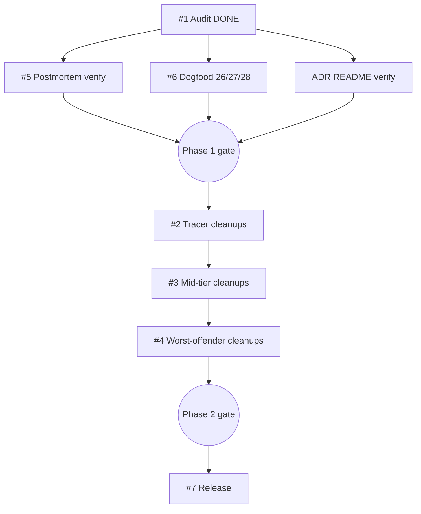

# Plan: Strip cruft from SKILL.md bodies and lock the behavioral-only convention

| Field         | Value                                                                       |
|---------------|-----------------------------------------------------------------------------|
| Plan ID       | `plans/v1.21.0-body-cleanup`                                                |
| ADR           | [`adrs/adr-behavioral-only-skill-body`](../adrs/adr-behavioral-only-skill-body.md) (integer assigned at release per ADR-0020) |
| Tier          | Balanced (inherited from spec)                                              |
| Status        | Active                                                                       |
| Last updated  | 2026-05-26                                                                  |
| Owner         | Modie (HITL slices); AFK fleet via `parallel-dev` (Slices 5 + 6)             |

## Goal

Every habeebs-skill SKILL.md body contains behavioral instructions only — no inline ADR-NNNN citations, no version-archaeology tags, no dated incident references — and three new dogfood scenarios prevent regression on every future PR.

## Success measure

After the v1.21.0 tag lands, all 14 dogfood scenarios (5 baselines + 21-25 + 26-28) pass on `main` AND `grep -rn "ADR-[0-9]\{4\}\|Added in v\|Phase [0-9.]\+ (added\|documented [0-9]\{4\}-" skills/*/SKILL.md` returns 0 lines outside Pattern-D-exception footers and HTML-commented regions.

## Phases

### Phase 1 — Foundation: AFK parallel prep + verification

**Slices:** #1 (DONE — audit already written), #5, #6, plus pre-Slice-2 ADR-README verification

**Acceptance gate:** ALL of the following hold:
- `docs/agents/adrs/README.md` has up-to-date `## Affects:` back-references for ADRs 0001-0021 (DX-2 from grill)
- Dogfood scenarios 26, 27, 28 exist and pass on the clean-baseline worktree (zero cruft hits on uncleaned SKILL.md bodies would be the wrong answer; they should currently FAIL on uncleaned bodies — see note below)
- Postmortem migration verification confirms zero new postmortem files needed (single dated incident already covered by `2026-05-12-missed-architectural-categories.md`)
- 5 baseline dogfood scenarios + 21/22/23/24/25 still pass

**Note on scenarios 26/27/28 acceptance:** Built fresh in Slice 6 to FAIL against the current cruft-laden bodies (proving they detect). They will start passing only AFTER Phase 2 completes the per-file cleanup. The Phase 1 gate requires scenarios to EXIST and to FAIL on uncleaned bodies (loud-fail proving detection) — not to pass. The Phase 2 gate is where they must pass.

**Top risks:**
1. ADR README back-refs may be stale on 0020/0021 (added by v1.20.0 release-skill rename). If stale, refresh README before Phase 1 gate passes.
2. Scenarios 26/27/28 false-positive on the Pattern-D empirical-claim footer in parallel-dev/using-worktrees (the `## Sources for this section:` block carrying external paper / man-page links). Regex must exclude footer regions AND HTML-commented regions.
3. Postmortem-migration verification surfaces an undocumented incident in any SKILL.md body — would expand v1.21.0 scope beyond the audit's single dated-incident finding.

**Rollback hook:** Single `git revert <commit-sha>` undoes scenario additions + README refresh. Postmortem verification is read-only; no rollback needed.

### Phase 2 — Sequential HITL cleanups (lowest-hit first → worst offenders last)

**Slices:** #2 (tracer 4-5 files, 7 hits) → #3 (mid-tier 4 files, 28 hits) → #4 (worst-offenders 2 files, 23 hits)

**Acceptance gate:** ALL of:
- Every cruft hit enumerated in `docs/agents/specs/v1.21.0-body-cleanup-audit.md` has been resolved per its proposed action (REMOVE / RESTATE / MOVE / KEEP)
- Dogfood scenarios 26, 27, 28 PASS against the cleaned-up repo (regression detection now green)
- 5 baseline dogfood scenarios + 21/22/23/24/25 still pass
- `verify-output` returns DONE or DONE_WITH_CONCERNS on the cumulative phase diff
- Chain-handoff smoke: invoke `prior-art-research` Phase 0 against the cleaned-up worktree; SYSTEM_CONTEXT writer-semantics still work

**Top risks:**
1. Worst-offender restated rules lose chain-handoff semantics on the 13-hit files. Mitigation: grill OQ-A6 validated 3 specific examples; the remaining 20 hits in Slice 4 land with per-commit user approval (not per-batch).
2. Per-file user-approval cadence creates serialization. If Modie is unavailable mid-Phase 2, cleanup stalls. Mitigation: tracer batch (Slice 2) is small enough for one session; worst offenders (Slice 4) are budgeted for separate sessions per file.
3. Scenarios 26/27/28 flag legitimate Pattern-D empirical-claim footers in parallel-dev or using-worktrees. Mitigation: Phase 1 Slice 6 must verify scenarios correctly exclude these footers BEFORE Phase 2 starts. If false positive surfaces mid-Phase 2, halt and refine regex (Phase 1 rollback hook restores prior state).

**Rollback hook:** Each slice is one (or a small number of) commits. `git revert <slice-commit>` undoes any specific file's cleanup without affecting the others. Per-file granularity provides surgical rollback.

### Phase 3 — Self-dogfood v1.21.0 release

**Slices:** #7

**Acceptance gate:** ALL 14 dogfood scenarios pass post-aggregation (5 baselines + 21/22/23/24/25 + 26/27/28). `release` skill returns clean through Phase 10. PR is open with the structured release body. After Modie merges PR, tag `v1.21.0` pushed via `git push origin refs/tags/v1.21.0`. GitHub release published.

**Top risks:**
1. Release aggregator regex bug (the v1.20.0 dogfood scenario 23 caught one; could recur if a CHANGELOG format edge case slipped through). Mitigation: the v1.20.0 aggregator fix is in `skills/release/scripts/aggregate-changesets.sh` line 166 — re-verify via dry-run before live aggregation.
2. Late-binding ADR rename collision: only one ADR added in v1.21.0 (`adr-behavioral-only-skill-body.md`), so no slug-tie risk. Confirmed.
3. Dogfood scenarios 26/27/28 mis-fire post-aggregation if the release commit itself introduces cruft (the `## v1.21.0` CHANGELOG section is markdown, not a SKILL.md — but if scenarios accidentally scan CHANGELOG.md, they'd hit). Mitigation: scenarios MUST scope to `skills/*/SKILL.md` only.

**Rollback hook:** Pre-tag: changeset is unaggregated until aggregator runs; no rollback needed. Aggregator's atomic-or-rollback semantics (proven in v1.20.0 dogfood scenario 23, case (e)) keep the working tree clean on any write failure. Post-tag: `git tag -d v1.21.0` locally + `git push origin :refs/tags/v1.21.0` to delete remote, then revert PR merge.

## Slice table

| ID  | Name                                          | Label                 | Phase | pgroup    | Blocked by | Est | Rollback hook                    |
|-----|-----------------------------------------------|-----------------------|-------|-----------|------------|-----|----------------------------------|
| #1  | Audit doc (hand-audited, DONE)                | HITL:approval-gate    | 1     | —         | —          | DONE | N/A — already in worktree         |
| #5  | Postmortem migration (verify-only, ~no-op)    | AFK:full-auto         | 1     | pgroup-1A | #1         | 0.1d | Read-only; no rollback           |
| #6  | Dogfood scenarios 26 + 27 + 28                | AFK:full-auto         | 1     | pgroup-1A | #1         | 0.5d | `git revert` scenario commits    |
| —   | ADR README `## Affects:` verification (DX-2)  | HITL:inline           | 1     | pgroup-1B | —          | 0.1d | `git revert` README refresh      |
| #2  | Tracer cleanups (deep-modules / devex-review / setup-habeebs-skill / write-plan / using-worktrees) | HITL:per-file approval | 2 | pgroup-2A | #1, #6, README-verify | 0.5d | `git revert` per-file commits |
| #3  | Mid-tier cleanups (release / verify-output / tdd-loop / parallel-dev) | HITL:per-file approval | 2 | pgroup-2B | #2 | 1d | `git revert` per-file commits |
| #4  | Worst-offender cleanups (prior-art-research / using-habeebs-skill) | HITL:per-commit approval | 2 | pgroup-2C | #3 | 0.5d | `git revert` per-file commits |
| #7  | Self-dogfood v1.21.0 release                  | HITL:approval-gate    | 3     | —         | #2, #3, #4, #5, #6 | 0.5d | `git tag -d` + revert PR merge |

**Label legend:**
- `AFK:full-auto` — no human in the loop; safe for `parallel-dev` autonomous dispatch
- `HITL:inline` — human reviews/decides in the chat session mid-slice
- `HITL:approval-gate` — human approves out-of-band (audit doc review, release tag-push authorization)
- `HITL:per-file approval` — human approves each file's commit before the next file's cleanup starts
- `HITL:per-commit approval` — escalation for chain-handoff-load files (Slice 4); approval per commit, not per batch

**Estimate convention:** **d** = ideal engineer-days (or agent-session-days). Estimates are illustrative; gates are contractual.

## Dependency DAG



ASCII fallback:

```
#1 ──┬──→ #5 ─┐
     ├──→ #6 ─┼──→ Phase 1 gate ──→ #2 ──→ #3 ──→ #4 ──→ Phase 2 gate ──→ #7
     └→ README verify ┘
```

## Parallelization map

- `pgroup-1A` = {#5, #6} — Phase 1 AFK parallel via `parallel-dev` write-task dispatch
- `pgroup-1B` = {ADR README verify} — Phase 1 HITL:inline (one-line file edit if stale; can run concurrently with pgroup-1A in practice since file scope is `docs/agents/adrs/README.md`, disjoint from postmortems/ and tests/dogfood/)
- `pgroup-2A` = {#2} — Phase 2 single slice (tracer batch)
- `pgroup-2B` = {#3} — Phase 2 single slice (mid-tier batch)
- `pgroup-2C` = {#4} — Phase 2 single slice (worst-offender batch)
- Sequential after Phase 2: {#7}

**Independence sanity for pgroup-1A** (#5 + #6) per `parallel-dev` Phase 2 checklist:

1. **File overlap** — #5 reads `docs/agents/postmortems/` (verify-only, likely no writes); #6 writes `tests/dogfood/26-*/`, `tests/dogfood/27-*/`, `tests/dogfood/28-*/`. Disjoint. ✓
2. **State dependency** — neither slice consumes the other's output. ✓
3. **Resource contention** — both are pure FS operations against disjoint paths. ✓
4. **Ordering semantics** — completion order doesn't affect correctness; gate evaluates both. ✓
5. **Implicit shared state** — none. ✓

pgroup-1A qualifies as a `parallel-dev` write-task dispatch. Cognition-restricted gates apply: per-worktree isolation (#5 + #6 each in their own sub-worktree per `using-worktrees`), ≤8 concurrent (2 < 8), Phase 2 independence verified above.

Sequential HITL chain (#2 → #3 → #4) cannot parallelize — per-file user approval cadence is the bottleneck by design.

## Risk register

| #   | Phase | Risk                                                                                                | Likelihood | Impact | Mitigation                                                                 |
|-----|-------|-----------------------------------------------------------------------------------------------------|------------|--------|----------------------------------------------------------------------------|
| R1  | 1     | ADR README back-refs stale on 0020 / 0021                                                           | Medium     | Low    | Phase 1 gate explicitly verifies; refresh on the spot if stale             |
| R2  | 1     | Scenarios 26/27/28 false-positive on Pattern-D empirical-claim footers (parallel-dev, using-worktrees) | High       | High   | Slice 6 acceptance criteria mandate exclusion of `## Sources for this section:` blocks AND HTML-commented regions before Phase 1 gate passes |
| R3  | 1     | Postmortem verification surfaces an undocumented incident                                            | Low        | Medium | Audit's per-line scan already enumerated dated-incident hits; only one (prior-art-research line 118), already has postmortem |
| R4  | 2     | Worst-offender restated rules lose chain-handoff semantics                                          | Medium     | High   | Per-commit (not per-batch) approval cadence on Slice 4; smoke-test invokes `prior-art-research` Phase 0 against cleaned tree |
| R5  | 2     | Per-file approval serialization stalls cleanup                                                       | Medium     | Low    | Tracer slice (#2) compact enough for one session; worst offenders (#4) budgeted across separate sessions |
| R6  | 2     | Scenarios 26/27/28 mis-fire mid-Phase-2 cleanup                                                      | Low        | Medium | Phase 1 acceptance gate proves scenarios fail loud on uncleaned bodies; mid-Phase-2 mis-fire would surface as unexpected passing scenario → investigate before continuing |
| R7  | 3     | Release aggregator regex bug recurs                                                                  | Low        | High   | `aggregate-changesets.sh` line 166 fix verified in v1.20.0 dogfood scenario 23 case (a); dry-run mandatory before live aggregation |
| R8  | 3     | Scenarios 26/27/28 accidentally scope to CHANGELOG.md instead of skills/*/SKILL.md                    | Medium     | Low    | Slice 6 acceptance criteria explicitly scope grep to `skills/*/SKILL.md` only |
| R9  | All   | A SKILL.md edited mid-Phase-2 by a parallel session (no other open worktree currently has SKILL.md edits in flight, verified at worktree creation) | Low | High | Single-writer guarantee: only this worktree edits SKILL.md during v1.21.0; cross-session-conflict detection scenario 19 enforces |

## Revisit triggers

(Inherited from ADR — fire any of these and halt at current phase gate to re-run `socratic-grill`:)

- habeebs-skill distributed into regulated/compliance substrate where inline citation stamps function as audit evidence
- 3+ skills accumulate genuine external attribution → promote to `docs/agents/skill-origins.md` registry
- A future ADR introduces a SKILL.md migration where the `<details>` "Old patterns" disclosure-fence escape valve becomes load-bearing
- Any SKILL.md exceeds 500 lines after cleanup (currently none do)
- Dogfood scenarios 26/27/28 produce >1 false positive per release cycle → re-evaluate regex

Plan-specific revisit:

- ADR README back-refs stale → re-verify before each release (DX-2 becomes a recurring requirement, not just v1.21.0)

## Change log

- 2026-05-26 — Initial plan written from `adr-behavioral-only-skill-body.md`. Slice 1 (audit doc) already DONE at plan-creation time; the spec originally said "audit script + report"; user pivoted mid-stream to hand-audit, which lives at `docs/agents/specs/v1.21.0-body-cleanup-audit.md`. The script becomes a future regression-prevention tool covered by Slice 6 scenarios 26/27/28.

## References

- ADR: [`adrs/adr-behavioral-only-skill-body`](../adrs/adr-behavioral-only-skill-body.md) (integer assigned at v1.21.0 release per ADR-0020)
- Spec: [`specs/v1.21.0-body-cleanup`](../specs/v1.21.0-body-cleanup.md) (Status: Grilled)
- Audit: [`specs/v1.21.0-body-cleanup-audit`](../specs/v1.21.0-body-cleanup-audit.md) (per-line, 58 hits + 7 KEEPs; 2026-05-26 Amendment captures grill refinements)
- Grill: [`specs/v1.21.0-body-cleanup-grill`](../specs/v1.21.0-body-cleanup-grill.md) (7 OQs resolved; codified Pattern-D empirical-claim exception)
- Research: [`research/2026-05-25-skill-md-body-shape`](../research/2026-05-25-skill-md-body-shape.md) (27/27 cross-population convergence)
- SYSTEM_CONTEXT: [`SYSTEM_CONTEXT.md`](../SYSTEM_CONTEXT.md)
- v1.20.0 changeset mechanism: [`plans/v1.20.0-methodology-overhaul`](v1.20.0-methodology-overhaul.md) — the substrate Slice 7 self-dogfoods
