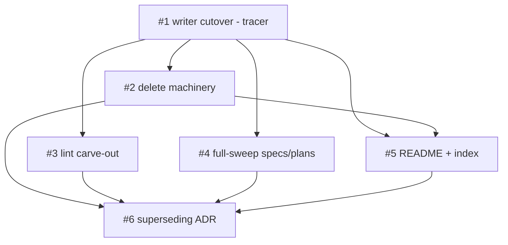

# Plan: Decouple decision identity from releases via dated artifact naming

## TL;DR

We're changing how habeebs-skill names its decision and design artifacts. Right now an ADR has no real identity until a release happens — `decision-record` writes a placeholder `adr-<slug>.md` and the `release` skill renames it to `0025-...` at release time. That's wrong for a methodology meant to work in repos that don't cut releases. After this plan, `decision-record` writes the final name — `YYYY-MM-DD-<slug>.md` — the moment the decision is made, and no release step ever touches it. The same dated convention extends to specs, plans, and grill-records, with the version moving into frontmatter so release traceability survives. The 24 existing integer-named ADRs (0001-0024) stay exactly as they are — nothing is renamed, no cross-reference breaks. We ship in three phases: first prove the new write path on ADRs (the tracer), then tear down the old release-rename machinery and extend the convention to the other artifacts, then record the decision itself as the first ADR born under the new convention.

| Plan ID | `plans/v1.23.0-dated-artifact-naming` |
|---|---|
| ADR | Slice 6 of this plan (self-dogfooding; locked decision lives in the grill record until then) |
| Tier | Deep (inherited from spec) |
| Status | Proposed |
| Owner | Modie (HITL) + AFK fleet |

## Goal

A new architectural decision gets a stable, human-legible, release-independent identifier at the moment it's written — `YYYY-MM-DD-<slug>.md` — and the old release-coupled rename machinery is gone.

## Success measure

A new ADR can be created and fully referenced with no release step, the late-binding machinery (`assign-adr-ids.sh`, release Phase 3.5, dogfood scenario 21) is deleted, and all surviving dogfood scenarios — including the untouched Changesets suite (22/23/25) — pass on `main` after the v1.23.0 release tag pushes.

## Phases

### Phase 1 — Writer cutover (the tracer)

This phase exists to prove the entire decision on the smallest possible surface before we tear anything down: change `decision-record` to write `YYYY-MM-DD-<slug>.md` directly, create one real ADR the new way, and confirm it lands with its permanent name needing no release step. This is the tracer slice — everything else depends on the new write path existing and working. It is HITL because the same-day collision rule and the cross-reference convention (resolved in grill) must be encoded correctly in the skill body, and a human confirms the first dated ADR reads right.

**Acceptance gate.** The phase is done when all four of these are simultaneously true: (1) `decision-record/SKILL.md` instructs writing `YYYY-MM-DD-<slug>.md` at creation, with no remaining instruction to write `adr-<slug>.md` or `NNNN-<slug>.md`; (2) the skill body documents the halt-loud rule — if the target filename already exists, refuse and demand a more specific slug; (3) the skill body documents the title+link cross-reference convention (new ADRs cite each other by title+link, frozen ADRs stay `ADR-00NN`); (4) a new dogfood scenario asserts the dated write target and simulates a same-day-same-slug collision producing the halt.

**Top risks.** The biggest risk is encoding the halt-loud rule as a silent overwrite by accident, which would lose a decision. Mitigation: the dogfood scenario's collision case asserts a non-zero exit and that neither file is modified. The second risk is the skill body retaining stale `adr-<slug>.md` instructions that contradict the new ones. Mitigation: the acceptance gate's grep-for-absence criterion (1) fails loud if any old write-target text survives.

**Rollback hook.** Single `git revert` of the Slice 1 commit restores the prior `decision-record` write path; nothing downstream has landed yet.

### Phase 2 — Teardown and extension

With the new write path live, this phase removes the now-dead release-rename machinery and extends the dated convention to the rest of the artifacts. Deleting `assign-adr-ids.sh`, the release skill's ADR-assignment phase, and dogfood scenario 21 (the teardown) runs in parallel with carving out the dated-string lint so dated filenames don't trip it. After the teardown settles index ownership, `decision-record` takes over README index maintenance and the cutover note goes in. Separately, the full-sweep extension moves specs, plans, and grill-records onto dated naming with the version preserved in frontmatter. This phase is where the bulk of the file churn happens, and it is the one to watch for accidentally touching the Changesets machinery — which must stay untouched.

**Acceptance gate.** The phase is done when all five of these are simultaneously true: (1) `assign-adr-ids.sh`, the release SKILL.md ADR-assignment phase (3.5), and `tests/dogfood/21-late-binding-adr/` are deleted, with no live reference to any of them remaining; (2) the dated-string lint passes on a dated filename/frontmatter date but still fails on a dated string in a SKILL.md prose body, and its failure message distinguishes the two; (3) `adrs/README.md` carries the cutover note and `decision-record` is instructed to hand-append the index row at ADR-write time; (4) `draft-spec`, `write-plan`, and the grill-record writer instruct dated write targets with the version in a frontmatter `Version:`/`Release:` field, and a traceability check confirms a spec→plan→release link resolves through frontmatter; (5) the Changesets suite (dogfood 22/23/25) and the `.changeset/*` machinery are provably unchanged and still pass.

**Top risks.** The biggest risk is the teardown nicking the Changesets half of ADR-0020, since both mechanisms share the `release` skill as coordinator. Mitigation: the research §5 disposition confirmed they share no code or state (release Phase 3.5 is the only ADR-coupled phase), and gate criterion (5) runs the Changesets dogfood suite to prove no regression. The second risk is the full-sweep extension (Slice 4) breaking spec→plan→release traceability by removing the version from filenames. Mitigation: the version moves to a frontmatter field and a traceability check in the slice asserts the link still resolves before the slice is accepted. The third risk is Slices 2 and 5 both wanting to edit `decision-record`/release surfaces and colliding. Mitigation: Slice 5 is sequenced after Slice 2 (not co-grouped), so index ownership is settled before `decision-record` takes it over.

**Rollback hook.** `git revert` per slice reverses Phase 2; the deletions in Slice 2 are restored by reverting that commit (the deleted script and scenario return intact).

### Phase 3 — Record and self-dogfood

This phase closes the loop by recording the decision as an ADR written under the very convention it establishes — the first dated ADR, proving the whole change end-to-end on a real decision. It fully supersedes ADR-0020 while explicitly preserving ADR-0020's Changesets-shape version-bump half, and it carries the in-flight-branch migration note. It is HITL because superseding a shipped ADR and confirming the self-dogfood reads correctly is a human judgment call.

**Acceptance gate.** The phase is done when all four of these are simultaneously true: (1) a new ADR exists with a dated filename and documents the full decision (halt-loud rule, title+link cross-refs, full-sweep scope, dogfood-28 carve-out rationale, freeze-old/date-new migration, and the in-flight-branch rename step); (2) ADR-0020's status is "Superseded by [the new dated ADR]" with a forward link and a one-line note that its Changesets mechanism continues under the new ADR; (3) the new ADR re-states the Changesets-shape version-bump half as retained and in-force; (4) the chain-integrity and README-index dogfood baselines still pass.

**Top risks.** The biggest risk is the wholesale supersession being misread as killing the Changesets mechanism too. Mitigation: gate criteria (2) and (3) both require the explicit "Changesets half retained" restatement, in two places. The second risk is the self-dogfood being impossible if Phase 1's writer change regressed. Mitigation: Phase 3 is gated behind Phases 1 and 2, so the convention is fully live before the ADR is written under it.

**Rollback hook.** ONE-WAY DOOR once the superseding ADR is merged and ADR-0020 is marked superseded — reverting would orphan the forward links; the gate is raised correspondingly (a human confirms the ADR before merge). Pre-merge, a `git revert` of the Slice 6 commit cleanly removes the new ADR and restores ADR-0020's status.

## Slice table

The slice list is the one table besides the status block, in dependency order. Estimates are illustrative; gates are contractual.

| ID | Name | Label | Phase | pgroup | Blocked by | Est | Rollback |
|---|---|---|---|---|---|---|---|
| #1 | decision-record writes dated names at creation (tracer) | HITL:approval-gate | 1 | pgroup-1A | — | 0.5d | `git revert` |
| #2 | Delete late-binding rename machinery | AFK:full-auto | 2 | pgroup-2A | #1 | 0.5d | `git revert` (restores script + scenario 21) |
| #3 | dogfood-28 carve-out for dated filenames | AFK:full-auto | 2 | pgroup-2A | #1 | 0.5d | `git revert` |
| #4 | Extend dated naming to specs/plans/grill-records | HITL:per-file | 2 | pgroup-2B | #1 | 1d | `git revert` (templates + writers) |
| #5 | README cutover note + decision-record hand-maintains index | AFK:full-auto | 2 | pgroup-2C | #1, #2 | 0.5d | `git revert` |
| #6 | Superseding ADR + in-flight migration note (self-dogfood) | HITL:approval-gate | 3 | pgroup-3A | #1, #2, #3, #4, #5 | 0.5d | One-way after merge; `git revert` pre-merge |

## Dependency DAG



ASCII fallback:

```
        ┌─→ #2 ─┬───────────→ #6
        │       └─→ #5 ──────→ ↑
#1 ─────┼─→ #3 ─────────────→ #6
        ├─→ #4 ─────────────→ #6
        └─→ #5 (also needs #2)
```

## Parallelization map

- `pgroup-1A = {#1}` — the tracer slice; sequential, unblocks everything. HITL:approval-gate.
- `pgroup-2A = {#2, #3}` — after #1. Disjoint file scopes: #2 deletes `skills/release/scripts/assign-adr-ids.sh` + release SKILL.md Phase 3.5 + `tests/dogfood/21-late-binding-adr/`; #3 edits the dated-string-lint dogfood scenario only. No overlap, both AFK → `parallel-dev` write-task dispatch via separate sub-worktrees.
- `pgroup-2B = {#4}` — after #1. HITL:per-file (touches `draft-spec`, `write-plan`, grill-record writers + their templates). Runs concurrently with pgroup-2A — file scopes are disjoint (writer skills + templates vs. release/ + dogfood-28) — but kept its own group because it's HITL, not AFK.
- `pgroup-2C = {#5}` — after #1 AND #2 (index ownership must settle once the rename machinery is gone). Single slice, sequential within Phase 2.
- `pgroup-3A = {#6}` — after all of Phase 1+2. The self-dogfooding ADR; sequential, HITL:approval-gate.

Independence verified against `parallel-dev`'s Phase 2 checklist (file overlap, state dependency, resource contention, ordering, implicit shared state) for pgroup-2A: #2 and #3 share no files, no state, no ordering dependency. The 20% rule holds — only 2 of 6 slices are co-parallelizable (pgroup-2A); the rest carry real ordering deps.

## Revisit triggers

This plan should be reopened — and `socratic-grill` re-run on the affected section — if any of:

- A same-day same-slug ADR collision actually occurs and the halt-loud remedy proves awkward in practice (then reconsider a sub-day `HHMMSS` suffix, per spec OQ-1 trade-off).
- Decision causal-ordering is ever misattributed because dated filenames lack monotonicity (then adopt the hybrid dated-filename + monotonic `seq:` frontmatter field, per grill OQ-7 deferral).
- A second author joins the project, raising the parallel-session collision pressure that motivated dating (re-confirm slug-as-key, or adopt forge-number-at-merge once CI exists).
- Anthropic ships a first-party ADR convention for Claude Code (audit dated naming against it).
- The Changesets-shape version-bump machinery (ADR-0020 half #2, retained here) is itself revised — re-check that this plan's teardown left it whole.

## Change log

- 2026-05-28 — Initial plan written from the locked v1.23.0-dated-artifact-naming spec + grill record. ADR is Slice 6 (self-dogfooding); locked decision lives in the grill record until then.

## References

- Spec: [`specs/v1.23.0-dated-artifact-naming`](../specs/v1.23.0-dated-artifact-naming.md)
- Grill: [`specs/v1.23.0-dated-artifact-naming-grill`](../specs/v1.23.0-dated-artifact-naming-grill.md)
- Research: [`research/2026-05-28-v1.23.0-dated-artifact-naming-research`](../research/2026-05-28-v1.23.0-dated-artifact-naming-research.md) (Deep-tier chain run)
- Superseded ADR: [`adrs/0020-late-binding-and-changesets`](../adrs/0020-late-binding-and-changesets.md) (its Changesets half is retained; ADR half superseded by Slice 6)
- SYSTEM_CONTEXT: [`SYSTEM_CONTEXT.md`](../SYSTEM_CONTEXT.md)
- GLOSSARY (cross-plan jargon definitions): [`GLOSSARY.md`](../GLOSSARY.md)

---

HANDOFF: implementation ready — plan locked at docs/agents/plans/v1.23.0-dated-artifact-naming.md. Next: `tdd-loop` on Slice #1 (Phase 1, pgroup-1A, the tracer). Gate to pass before Phase 2: decision-record writes dated names at creation, halt-loud on duplicate slug, cross-ref + collision rules documented, dogfood scenario asserts both.

HANDOFF: pgroup-dispatch-ready — when `tdd-loop` is invoked on this plan, pgroups of size ≥ 2 will auto-dispatch via `parallel-dev`. Eligible pgroups: pgroup-2A (Slices #2 + #3, after #1 lands). Each subagent runs its own red-green-refactor cycle in its own worktree per `using-worktrees`. Concurrency cap: 5 default.
