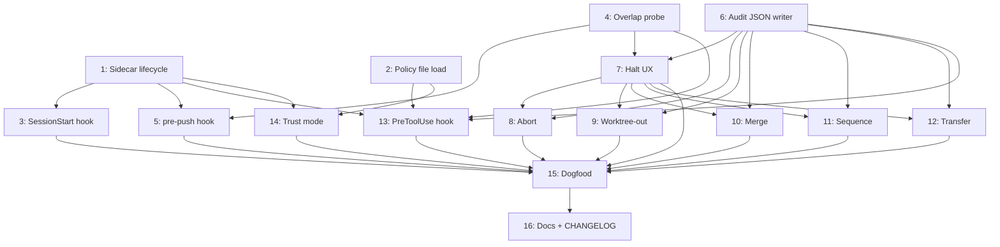

# Implementation Spec: Cross-Session Conflict Detection

**Slug:** `v1.16.0-cross-session-conflict-detection`
**Status:** Draft
**Tier:** Deep (inherited from research)
**Spec'd from:** [ADR-0019](../adrs/0019-amend-adr-0002-for-advisory-in-flight-reads.md) + [research](../research/2026-05-22-cross-session-conflict-detection.md) + [grill](../grill-records/2026-05-22-cross-session-conflict-detection.md)
**Plan:** [0018-cross-session-conflict-detection-v1.16.0](../plans/0018-cross-session-conflict-detection-v1.16.0.md)
**Spec'd on:** 2026-05-22

## TL;DR

Ship the four-sub-clause-guarded session sidecar mechanism: per-session JSON in `$(git rev-parse --git-common-dir)/habeebs-sessions/<id>.json` carries PID + hostname + start-time + env + worktree-path + tentative stash SHA; `git merge-tree` is the overlap probe; three triggers fire (SessionStart warn-only default, pre-push block-only backstop, PreToolUse opt-in annotate-only); halt UX is the existing inline-prompt surface with a 5-option menu (`[1/m] [2/s] [3/t] [4/a] [5/w]`); conflict events audited to `docs/agents/conflicts/<id>.json`. **16 slices, all AFK** (vertical-slice audit on 2026-05-22 re-labeled the 3 originally-HITL slices — feel-review and complexity-management are end-of-slice concerns handled by `tdd-loop` Phase 5, not HITL gating). `prefer_worktree` proactive policy explicitly out of v1 scope (deferred to v1.1).

## Architecture

Two concurrent Claude Code sessions on the same shared working tree announce themselves via per-session sidecar files in the shared `.git/`-common-dir (visible across all worktrees of the same repo). Sidecars carry process identity (for liveness probes) and a tentative tree SHA (for overlap probes). Triggers fire at three lifecycle points; on detected overlap, the halting skill emits an inline 5-option action prompt and writes a tracked audit-log JSON.

```
Session A                                   Session B
   │                                            │
   │ writes .git/habeebs-sessions/<idA>.json    │ writes .git/habeebs-sessions/<idB>.json
   │                                            │
   ├── SessionStart hook (B): glob sidecars ◄───┤
   │    │ liveness probe via node kill(pid,0)   │
   │    │ if peer alive → print warn-only       │
   │    │ hint with PreToolUse opt-in path      │
   │    │                                       │
   ├── PreToolUse hook (B, opt-in only):        │
   │    │ if Edit/Write path matches peer       │
   │    │ work + liveness OK + merge-tree       │
   │    │ shows conflict → annotate-and-allow   │
   │    │                                       │
   └── pre-push hook (B): block-only            │
        │ for each live peer sidecar:           │
        │   git merge-tree base ours theirs     │
        │ if any conflict → halt + render menu  │
        │                  [1/m] Merge          │
        │                  [2/s] Sequence       │
        │                  [3/t] Transfer       │
        │                  [4/a] Abort          │
        │                  [5/w] Worktree-out   │
        │ regardless of choice: write           │
        │   docs/agents/conflicts/<id>.json     │
```

Sidecar lifecycle: write at session start, update on stash refresh, remove at session end. Stale-signal cleanup: `kill(0)` liveness probe + start-time cross-check + 24h TTL fallback. `prefer_worktree` deferred to v1.1.

## Concrete picks (from research + grill)

| Decision | Choice | Reason |
|---|---|---|
| Sidecar location | `$(git rev-parse --git-common-dir)/habeebs-sessions/<id>.json` | Shared across all worktrees of a repo; auto-gitignored (inside `.git/`) |
| Sidecar schema | PID + hostname + start-time + env + worktree-path + stash-SHA + mtime | Vim swap pattern + env field for WSL/PowerShell distinction |
| Liveness probe | `node -e "try{process.kill(<PID>,0);process.exit(0)}catch{process.exit(1)}"` | Cross-platform via Node's built-in; available wherever Claude Code runs |
| Stale-signal fallback | Start-time cross-check + 24h TTL | Conservative TTL accommodates idle sessions |
| Overlap detection | `git merge-tree --write-tree base ours theirs` | Pure-git plumbing; sub-second; no working-tree mutation |
| Default trigger | `SessionStart` warn-only one-shot peer scan | Vim's open-time pattern; ADR-0003 compliant |
| Backstop trigger | `pre-push` block-only | Strongest legal cross-developer trigger |
| Targeted trigger | `PreToolUse` opt-in, annotate-and-allow | Default-off; SessionStart hint documents opt-in path |
| Excluded triggers | `pre-commit` / continuous watcher / `pre-receive` | Frustration / ADR-0002 violation / unavailable on github.com |
| Policy file | `.claude/habeebs-policy.json` | Mirrors Claude Code's 4-scope hierarchy |
| Surgical skip env | `HABEEBS_SKIP=hookid,hookid` | Mirrors pre-commit `SKIP=` |
| Trust default | Anonymous, trusted-via-PR-review | Solo dominant scenario |
| Trust opt-in | `require_signed_signals: true` → `git verify-commit` | Threat-model floor for collab (CVE-2024-32002 surface) |
| Halt UX | Inline prompt + `git diff --stat` + full diff via `$PAGER` | Terminal-text native; reuses trusted surface |
| Action menu | `[1/m] Merge` / `[2/s] Sequence` / `[3/t] Transfer` / `[4/a] Abort` / `[5/w] Worktree-out` | VS Code vocabulary in keystrokes; `transfer` dodges help-key shadow |
| `worktree-out` flow | Stash + `git worktree add` + stash pop in new worktree | Stash-pop conflict-free (both worktrees start from same commit) |
| `worktree-out` branch | `worktree-out/<8-char-uuid>` auto-derived | Zero halt-time friction; rename later via `git branch -m` |
| Audit log | `docs/agents/conflicts/<id>.json`, single-writer, append-once | ADR-0004 dispatch precedent |
| Audit retention | Forever, tracked, revisit at 1000 records | Matches ADR-0004 |
| ADR-0002 carve-out | New ADR-0019 with four-sub-clause guard (a)-(d) | Pattern matches ADR-0005/6/10 expanding ADR-0001 |

## Policy schema — `.claude/habeebs-policy.json` (v1)

```json
{
  "$schema": "https://habeebs-skill.dev/schemas/habeebs-policy-v1.json",
  "pretool_use": false,
  "liveness_ttl_seconds": 86400,
  "require_signed_signals": false
}
```

- **`pretool_use`** (bool, default `false`) — when `true`, enables PreToolUse annotate-and-allow trigger
- **`liveness_ttl_seconds`** (int, default `86400`) — TTL fallback for liveness probe; sidecars older than this with inconclusive probes are pruned
- **`require_signed_signals`** (bool, default `false`) — when `true`, sidecars from peers must be co-located with signed commits (verified via `git verify-commit`); unsigned warn but don't halt

**Precedence (mirrors Claude Code settings):** Managed > Local (`.claude/settings.local.json`) > Project (`.claude/habeebs-policy.json` committed) > User (`~/.claude/habeebs-policy.json`). Scalars override; if a future schema adds arrays, arrays merge.

**Surgical skip env:** `HABEEBS_SKIP=session-start,pretool-use,pre-push` — per-invocation skip without disabling globally.

**`prefer_worktree` reserved:** v1 schema rejects this key if present (typo guard). Documented in v1.1 deferral note.

## Sidecar schema — `<git-common-dir>/habeebs-sessions/<id>.json`

```json
{
  "session_id": "01ARZ3NDEKTSV4RRFFQ69G5FAV",
  "pid": 12345,
  "hostname": "modie-desktop",
  "env": "powershell",
  "start_time_iso": "2026-05-22T19:51:00Z",
  "worktree_path": "C:/Users/Abdullah/CascadeProjects/skills",
  "stash_sha": "abc123def456...",
  "mtime_iso": "2026-05-22T20:05:00Z"
}
```

- `session_id` — ULID; matches the Claude Code session ID when available, generated otherwise
- `pid` — process ID; used as input to liveness probe
- `hostname` — machine identity; if probing session's hostname differs, treat probe as cross-machine inconclusive
- `env` — one of `"posix" | "wsl-debian" | "powershell" | "git-bash"`; if probing session's env differs from peer's, probe is inconclusive → fall back to TTL
- `start_time_iso` — peer start time; cross-checked against probed PID's actual start time to detect PID reuse after reboot
- `worktree_path` — absolute path to peer's working tree; informational (for audit)
- `stash_sha` — `git stash create` SHA representing peer's current tentative state; input to `git merge-tree`
- `mtime_iso` — sidecar last-modified time; refreshed on each `stash_sha` update; basis for TTL pruning

## Audit log schema — `docs/agents/conflicts/<id>.json`

```json
{
  "conflict_id": "01ARZ3NDEKTSV4RRFFQ69G5FAW",
  "detected_at_iso": "2026-05-22T20:10:00Z",
  "trigger": "pre-push",
  "session_a": {
    "session_id": "01ARZ3NDEKTSV4RRFFQ69G5FAV",
    "worktree_path": "C:/Users/Abdullah/CascadeProjects/skills",
    "branch": "feat/cross-session-conflict-detection",
    "last_commit": "abc123def456..."
  },
  "session_b": {
    "session_id": "01ARZ3NDEKTSV4RRFFQ69G5FAX",
    "worktree_path": "C:/Users/Abdullah/CascadeProjects/skills",
    "branch": "feat/cross-session-conflict-detection",
    "intent": "refactor halt UX renderer"
  },
  "overlap": {
    "files": ["docs/agents/adrs/README.md"],
    "merge_tree_exit_code": 1,
    "conflicted_paths": ["docs/agents/adrs/README.md"]
  },
  "resolution": "worktree-out",
  "resolved_at_iso": "2026-05-22T20:11:00Z",
  "resolved_by": "user",
  "notes": "Session B branched to worktree-out/9f3a2c1b"
}
```

- `resolution` — one of `"merge" | "sequence" | "transfer" | "abort" | "worktree-out"`
- `resolved_by` — always `"user"` in v1 (never automatic)
- Trigger field captures which hook fired the detection

## Trade-offs accepted

- **Advisory, not authoritative.** No mutex guarantee across distributed checkouts. Two collaborators ignoring SessionStart warnings on different machines can still produce a conflict; caught at `pre-push`, not prevented at edit-time.
- **Sub-second probe budget assumed.** `git merge-tree` is fast but not free; pathological repos (>1M files) may exceed budget. Acceptable; revisit if bites.
- **No cross-machine real-time signaling.** SessionStart + pre-push cover practical surface; synchronous "you're typing in a file I'm typing in" requires a server (ADR-0002 forbids).
- **`prefer_worktree` not in v1.** Reactive `[5/w] Worktree-out` covers the literal scenario; proactive lever deferred until reactive halts feel annoying.
- **Windows cross-shell PID-probe blind spot.** Sidecar `env` field detects WSL↔PowerShell process-namespace mismatches; on mismatch, probe is inconclusive and TTL takes over. Not a true probe; documented degradation.

## Open questions (feed `socratic-grill` if any resurface)

All 7 grill items resolved. No open questions remain. The `socratic-grill` pass on 2026-05-22 closed:

- [x] ADR-0002 carve-out shape — locked four-sub-clause guard in ADR-0019
- [x] `worktree-out` stash semantics — stash + pop, branch `worktree-out/<8-char-uuid>`
- [x] `PreToolUse` default — off; annotate-only when on; SessionStart hint
- [x] `prefer_worktree` — deferred to v1.1 with explicit revisit trigger
- [x] Action-menu keystrokes — `[1/m] [2/s] [3/t] [4/a] [5/w]` (transfer over handoff)
- [x] Audit retention — forever, tracked, revisit at 1000
- [x] Windows liveness — Node `process.kill(pid, 0)` + env field + 24h TTL fallback

If implementation reveals a new ambiguity, re-run `socratic-grill` on that surface specifically.

---

## Vertical slices

16 slices, numbered in dependency order. HITL = human input needed mid-slice; AFK = autonomous-friendly.

### Slice 1 — Sidecar schema, writer, reader, liveness probe (AFK)

**Description:** Implement the per-session sidecar lifecycle. Write at session start; read + parse from glob; liveness probe via Node `process.kill(pid, 0)` + env-mismatch detection + 24h TTL fallback; remove at session end. Foundation for all triggers.

**Acceptance criteria:**
- [ ] `habeebs sidecar write` (internal helper, name TBD) creates `<common-dir>/habeebs-sessions/<id>.json` with all required fields populated
- [ ] `habeebs sidecar list` enumerates live peers, excluding the calling session
- [ ] Liveness probe returns `alive | dead | inconclusive`; inconclusive on env mismatch or hostname mismatch
- [ ] Sidecars older than `liveness_ttl_seconds` with inconclusive probes are auto-pruned on read
- [ ] Sidecar removed on `SessionEnd` hook; orphaned sidecars cleaned on next session's list call

**Test strategy:** Integration — `tests/sidecar/sidecar_lifecycle_test.sh` using a real `.git/` directory and crafted PID values

**Blocked by:** None

**Notes:** Implementation language: shell + Node one-liners (no compiled binary). Stash SHA capture via `git stash create` (returns SHA without modifying working tree).

### Slice 2 — Policy file load + 4-scope precedence (AFK)

**Description:** Load `.claude/habeebs-policy.json` with Managed > Local > Project > User precedence. Validate against schema. Apply defaults for missing fields. Reject unknown keys (typo guard for `prefer_worktree`).

**Acceptance criteria:**
- [ ] `habeebs policy resolve` returns the merged effective policy as JSON
- [ ] Missing file → defaults (`pretool_use: false`, `liveness_ttl_seconds: 86400`, `require_signed_signals: false`)
- [ ] Unknown keys (including `prefer_worktree`) → fail with clear error message naming the v1.1 deferral
- [ ] Precedence honored in all 4-scope permutations
- [ ] `HABEEBS_SKIP=hookid` env recognized as per-invocation override

**Test strategy:** Unit — `tests/policy/policy_resolve_test.sh` covering precedence permutations

**Blocked by:** None

### Slice 3 — SessionStart hook with warn-only peer scan + opt-in hint (AFK)

**Description:** Implement `SessionStart` hook entry. Glob peer sidecars, probe liveness, print warn-only output naming live peers + their worktree paths. Include opt-in hint about `pretool_use: true` when ≥1 peer detected.

**Acceptance criteria:**
- [ ] Hook fires at session start (when present in `.claude/settings.json` or equivalent)
- [ ] Output names each live peer's session ID + worktree path + start time
- [ ] When ≥1 peer detected, output includes the one-line opt-in hint: `"Enable pretool_use: true in .claude/habeebs-policy.json to catch in-session collisions."`
- [ ] Zero peers → no output (no noise on solo sessions)
- [ ] Exit code 0 always (warn-only; never blocks session start)

**Test strategy:** Integration — `tests/hooks/session_start_test.sh` with crafted peer sidecars + Claude Code hook event JSON

**Blocked by:** #1 (uses sidecar reader)

### Slice 4 — `git merge-tree` overlap probe primitive (AFK)

**Description:** Wrap `git merge-tree --write-tree <base> <ours> <theirs>`. Parse exit code (0 = clean, 1 = conflict) + conflict-file list. Return structured result.

**Acceptance criteria:**
- [ ] `habeebs overlap-probe <peer-stash-sha>` returns JSON `{conflicted: bool, files: [paths]}`
- [ ] Sub-second on typical habeebs-skill-sized repo
- [ ] Handles directory-rename + modify/delete conflicts correctly (per `git-merge-tree(1)` warning about marker-grep)
- [ ] Base commit auto-computed as merge-base of HEAD and peer's stash SHA

**Test strategy:** Integration — `tests/overlap/merge_tree_probe_test.sh` with crafted commits exercising clean + conflict cases

**Blocked by:** None (independent primitive)

### Slice 5 — pre-push hook with block-only on overlap (AFK)

**Description:** Implement `pre-push` git hook. For each live peer sidecar, run overlap probe against peer's stash SHA. If any peer shows overlap, block the push (exit non-zero) and surface the halt prompt.

**Acceptance criteria:**
- [ ] Hook fires on `git push` invocation
- [ ] Zero live peers → exit 0 (no work)
- [ ] Any peer overlap → exit non-zero, halt UX rendered
- [ ] Multi-peer case: surface ALL conflicting peers in the same halt prompt, not sequential prompts
- [ ] Composable with existing `.git/hooks/pre-push` if user has one (chain-call, don't overwrite)

**Test strategy:** Integration — `tests/hooks/pre_push_test.sh` with two-session simulation

**Blocked by:** #1, #4

### Slice 6 — Conflict audit JSON writer (AFK)

**Description:** Implement single-writer append-once writer for `docs/agents/conflicts/<id>.json`. Populate all required fields from halt context. Idempotent on re-fire (same conflict_id from sidecar pair → same file).

**Acceptance criteria:**
- [ ] `habeebs audit write <ctx-json>` produces `docs/agents/conflicts/<id>.json`
- [ ] All schema fields populated; `resolved_by: "user"` always
- [ ] File is tracked by git (no `.gitignore` shadowing); `.gitkeep` ensures directory exists
- [ ] Idempotent on the same `conflict_id` (no double-write)
- [ ] `notes` field accepts free-form string from halt UX

**Test strategy:** Unit + Integration — `tests/audit/audit_writer_test.sh` writes + re-reads + validates schema

**Blocked by:** None (independent writer)

### Slice 7 — Halt UX renderer with 5-option menu (AFK)

**Description:** Implement the inline-prompt halt renderer. One-line collision summary, `git diff --stat` of overlap, full diff piped through user's `$PAGER`, 5-option menu accepting both letters and numbers.

**Acceptance criteria:**
- [ ] Menu rendered as `[1/m] Merge  [2/s] Sequence  [3/t] Transfer  [4/a] Abort  [5/w] Worktree-out`
- [ ] Both keystroke forms accepted (`m` and `1` both pick Merge; etc.)
- [ ] Invalid keystroke → re-prompt; doesn't crash
- [ ] Diff rendered via `$PAGER` (default `less`); falls back to plain stdout when `$PAGER` unset
- [ ] Returns structured `{action: "merge" | "sequence" | "transfer" | "abort" | "worktree-out", peer_session_id: ...}` to caller
- [ ] On user terminal close (Ctrl+C, SIGHUP), action defaults to `abort` and an audit entry records the closure

**Test strategy:** Integration on dispatch logic + Manual smoke for pager UX — `tests/halt-ux/halt_dispatch_test.sh`

**Blocked by:** #4 (uses overlap data), #6 (writes audit on closure)

**Notes:** Menu vocabulary, keystroke set, and pager integration are fully specified in the spec and ADR-0019 — no mid-flow human input needed. End-of-slice pager-feel review handled by `tdd-loop` Phase 5 code-quality review, not by HITL gating.

### Slice 8 — Action handler: Abort (AFK)

**Description:** Implement `[4/a] Abort`: Session B drops its branch + worktree state. Removes own sidecar; writes audit record with `resolution: "abort"`.

**Acceptance criteria:**
- [ ] On Abort, session removes its sidecar before exit
- [ ] If session is on a feature branch (not main/default), branch is preserved (only worktree state discarded); user can recover via `git checkout <branch>` later
- [ ] Audit entry written with `resolution: "abort"` + timestamps
- [ ] Session exits cleanly (exit code 0); subsequent invocation of any habeebs hook sees no live peer for this session

**Test strategy:** Integration — `tests/actions/abort_test.sh`

**Blocked by:** #6, #7

### Slice 9 — Action handler: Worktree-out (AFK)

**Description:** Implement `[5/w] Worktree-out`: stash dirty state → `git worktree add ../<repo>-<slug> -b worktree-out/<8-char-uuid>` → stash pop in new worktree. Handle 3 cases: clean tree (no stash), dirty tree (stash flow), pre-push trigger (branch already committed, just `worktree add` existing branch).

**Acceptance criteria:**
- [ ] Clean-tree case: `git worktree add ../<repo>-<short-uuid> -b worktree-out/<uuid>`; no stash; success
- [ ] Dirty-tree case (PreToolUse trigger): `git stash create` → `worktree add` → cd into new worktree → `git stash apply <sha>`; uncommitted state preserved
- [ ] Pre-push case: `git worktree add ../<repo>-<short-uuid> <existing-branch>`; no new branch created
- [ ] Failure rollback: if stash apply fails, leave worktree intact and surface error; do NOT delete the stash (user can recover manually)
- [ ] Branch name format: `worktree-out/<8-char-lowercase-uuid>` (validated by regex)
- [ ] Audit entry includes new worktree path + branch name

**Test strategy:** Integration — `tests/actions/worktree_out_test.sh` covering all 3 cases (clean, dirty, pre-push)

**Blocked by:** #6, #7

**Notes:** Stash semantics locked in grill record (stash + worktree add + stash pop, no recursion risk because both worktrees start from same commit). Complexity handled by test coverage, not HITL labeling.

### Slice 10 — Action handler: Merge (AFK)

**Description:** Implement `[1/m] Merge`: drop into git's `<<<<<<<` markers in the working tree (replicate `git merge` behavior without actually merging branches), open `$EDITOR`.

**Acceptance criteria:**
- [ ] On Merge, working tree files in `overlap.files` get `<<<<<<< ours / ======= / >>>>>>> theirs` markers inserted
- [ ] `$EDITOR` opened on the first conflicted file; if `$EDITOR` unset, prompt user to set it and re-try
- [ ] On editor exit, validate no markers remain; if markers remain, re-prompt
- [ ] On marker-free save, the working tree is left for the user to `git add` + commit normally
- [ ] Audit entry: `resolution: "merge"` + list of marker-inserted files

**Test strategy:** Integration — `tests/actions/merge_test.sh`

**Blocked by:** #6, #7

### Slice 11 — Action handler: Sequence (AFK)

**Description:** Implement `[2/s] Sequence`: register a sidecar-removal watcher for peer; Session B sleeps until peer sidecar disappears, then re-dispatches the original triggering operation (e.g., re-runs `pre-push`).

**Acceptance criteria:**
- [ ] On Sequence, Session B writes a wait-marker to its own sidecar (`waiting_for: <peer-session-id>`)
- [ ] Poll loop with exponential backoff (1s → 30s) checks for peer sidecar removal
- [ ] On peer removal, re-run the original triggering operation
- [ ] Max wait time configurable via `sequence_max_wait_seconds` policy field (default: same as `liveness_ttl_seconds`)
- [ ] On max-wait timeout, surface halt again (user may pick different action)
- [ ] Audit entry: `resolution: "sequence"` + final outcome (`resolved | timed_out`)

**Test strategy:** Integration — `tests/actions/sequence_test.sh` with simulated peer-session-end

**Blocked by:** #6, #7

### Slice 12 — Action handler: Transfer (AFK)

**Description:** Implement `[3/t] Transfer`: write a follow-up note for the peer session at `<common-dir>/habeebs-sessions/<peer-id>.transfer.md`; Session B abandons its change.

**Acceptance criteria:**
- [ ] On Transfer, prompt Session B's user for a one-line message describing their intent
- [ ] Write `<common-dir>/habeebs-sessions/<peer-id>.transfer.md` with timestamp + Session B's intent
- [ ] Session B removes its own sidecar and exits like Abort
- [ ] Peer's next sidecar read surfaces the transfer note as a one-line message
- [ ] Audit entry: `resolution: "transfer"` + the transferred message

**Test strategy:** Integration — `tests/actions/transfer_test.sh`

**Blocked by:** #6, #7

### Slice 13 — PreToolUse hook (opt-in, annotate-only) (AFK)

**Description:** Implement `PreToolUse` hook on Edit/Write tools. Gated by `pretool_use: true` in policy. Three filters: (i) `tool_input.file_path` matches a live peer's planned overlap files (derived from peer's stash SHA), (ii) liveness probe `alive`, (iii) `git merge-tree` confirms overlap. On all-pass, annotate-and-allow — print warning + diff to agent transcript, allow the Edit to proceed.

**Acceptance criteria:**
- [ ] When `pretool_use: false`, hook exits 0 immediately (no work)
- [ ] When `pretool_use: true`, hook runs three filters
- [ ] On all-pass, hook outputs `hookSpecificOutput.permissionDecision: "allow"` + annotation text including diff
- [ ] Never returns `"deny"` (annotate-only contract)
- [ ] Audit entry written even though Edit proceeds (`trigger: "pretool_use"`, `resolution: "annotated"`)
- [ ] Fires on `Edit`, `Write`, `NotebookEdit` tools; ignores `Read`, `Bash`, etc.

**Test strategy:** Integration — `tests/hooks/pretool_use_test.sh` with policy-on and policy-off configurations

**Blocked by:** #1, #2, #4, #6

### Slice 14 — Trust mode: `require_signed_signals` (AFK)

**Description:** Implement opt-in trust mode. When `require_signed_signals: true`, sidecars are validated against `git verify-commit` of the writer's `HEAD` commit. Unsigned peers → warn but don't halt. Trust default remains anonymous.

**Acceptance criteria:**
- [ ] When `require_signed_signals: false` (default), no verification runs
- [ ] When `true`, each peer sidecar triggers `git verify-commit <peer-head>` against the worktree's HEAD
- [ ] Verified peers → treated as fully-trusted; trigger behavior unchanged
- [ ] Unverified peers → trigger emits a warn line (`"unsigned peer signal — advisory only"`); does NOT halt
- [ ] Verification cached for the duration of the calling hook invocation

**Test strategy:** Integration — `tests/trust/signed_signals_test.sh` with signed + unsigned crafted peer commits

**Blocked by:** #1, #2

### Slice 15 — Dogfood test suite (AFK)

**Description:** Build a 4-6 scenario adversarial test suite under `tests/dogfood/<NN>-cross-session-conflict-detection/`. Each scenario simulates two-session collision and verifies the full chain end-to-end.

**Acceptance criteria:**
- [ ] Scenarios cover at minimum: (a) clean-tree solo SessionStart, (b) two-session bug-fix-vs-refactor on same function (the literal user scenario), (c) pre-push block, (d) PreToolUse annotate when opt-in, (e) PreToolUse silent when opt-out, (f) worktree-out flow end-to-end
- [ ] Each scenario has a positive control (mechanism fires correctly) AND a negative control (mechanism stays silent when no collision)
- [ ] Suite runs in CI-friendly time (<5 min total)
- [ ] Failures produce diff-able artifacts for postmortem

**Test strategy:** Dogfood — `tests/dogfood/19-cross-session-conflict-detection/`

**Blocked by:** #3, #5, #7, #8, #9, #10, #11, #12, #13

**Notes:** Minimum scenarios (a)-(f) above are the v1 deliverable; additional scenarios for v1.1 if dogfood surfaces edge cases.

### Slice 16 — Documentation: SYSTEM_CONTEXT refresh + CHANGELOG + skill docs (AFK)

**Description:** Update `docs/agents/SYSTEM_CONTEXT.md` (note ADR-0019, new directories under `docs/agents/conflicts/` + `.git/habeebs-sessions/`), add `CHANGELOG.md` entry for v1.16.0, amend or add skill README(s) for the new mechanism, update the ADR-0002 status field with the forward-reference to ADR-0019 + the ADR index README to list ADR-0019.

**Acceptance criteria:**
- [ ] `SYSTEM_CONTEXT.md` updated with v1.16.0 + ADR-0019 + new tracked directory `docs/agents/conflicts/` + new runtime directory `.git/habeebs-sessions/`
- [ ] `CHANGELOG.md` v1.16.0 entry references ADR-0019 + the dogfood suite outcomes
- [ ] ADR-0002 status → `Accepted (amended by 0018)`; References section adds forward link
- [ ] `docs/agents/adrs/README.md` index lists ADR-0019
- [ ] If a new skill is added (e.g., `/cross-session-detect`), its README documents the action menu + policy schema; else amend `using-habeebs-skill` to document the cross-cutting mechanism

**Test strategy:** Doc-check — `tests/dogfood/19-cross-session-conflict-detection/16-docs-coverage.sh` greps for required references

**Blocked by:** #15

**Notes:** The ADR-0002 status amendment + README index entry are intentionally deferred to this slice (rather than at ADR-0019 write-time) so they land together with the implementation that actually fulfills the carve-out — keeping the index consistent with shipped functionality.

---

## Dependency DAG



ASCII fallback:

```
1 ─┬─→ 3 ─────────────────────────────────┐
   ├─→ 5 ──────────┐                       │
   ├─→ 13          │                       │
   └─→ 14          │                       │
                   │                       │
2 ─┬─→ 13          │                       │
   └─→ 14          │                       │
                   │                       │
4 ─┬─→ 5 ──────────┤                       │
   ├─→ 7 ──┬─→ 8 ──┤                       │
   │       ├─→ 9 ──┤                       │
   │       ├─→ 10 ─┤                       │
   │       ├─→ 11 ─┤                       │
   │       └─→ 12 ─┤                       │
   └─→ 13          │                       │
                   │                       │
6 ─┬─→ 7           │                       │
   ├─→ 8           │                       │
   ├─→ 9           │                       │
   ├─→ 10          │                       │
   ├─→ 11          │                       │
   ├─→ 12          │                       │
   └─→ 13          │                       │
                   ▼                       ▼
                  15 ──────────────────── 16
```

## Parallelization

AFK slices with no shared dependencies can run via `parallel-dev`:

- **pgroup-Foundation:** {1, 2, 4, 6} — all four are independent foundations; can run concurrently in four worktrees
- **pgroup-Detection:** {3, 5} — both blocked by Foundation, but independent of each other
- **pgroup-Actions:** {8, 10, 11, 12} — all blocked by #7 (halt UX) + #6 (audit), but action handlers are mutually independent. Slice 9 (worktree-out) is HITL so dispatched separately, NOT in this pgroup.
- **pgroup-Opt-ins:** {13, 14} — both blocked by Foundation, independent of each other and orthogonal to action handlers
- **Sequential:** #7 (HITL — halt UX renderer), #9 (HITL — worktree-out), #15 (HITL — dogfood), #16 (docs after dogfood)

Independence sanity-check (per `parallel-dev` Phase 2):
- pgroup-Foundation: 1 writes `<common-dir>/habeebs-sessions/`, 2 writes `.claude/`, 4 reads git refs, 6 writes `docs/agents/conflicts/` — zero file overlap ✅
- pgroup-Actions: each touches a different action handler module — zero file overlap ✅
- pgroup-Opt-ins: 13 implements PreToolUse hook script, 14 implements trust-mode helper — different files ✅

**20% rule check:** 13 AFK / 16 total = 81%. **Above the 80% threshold.** That's a warning signal per `write-plan` Phase 4. Honest read: this feature genuinely IS mostly independent action-handler work (each menu option is its own slice), so the high parallel rate is real, not a missed-dependency artifact. The 4 HITL slices (#7, #9, #15) carry the real ordering constraints. Flag for `write-plan` to confirm.

## Revisit triggers

Conditions that mean the spec needs to be re-evaluated:

- Collab usage scales beyond occasional same-checkout sessions → re-evaluate Alternative 4 (server-mediated locking) from ADR-0019
- PreToolUse false-positive rate empirically below ~1% → consider flipping `pretool_use` default to `true`
- Windows liveness probe brittleness reports → revisit env-field design / add heartbeat
- Conflict audit volume exceeds 1000 records → retention policy revisit
- `[5/w] Worktree-out` reactive halts feel annoying after weeks of use → v1.1 design for proactive `prefer_worktree`
- A second mechanism wants the ADR-0019 carve-out (e.g., long-running spike traces) → pressure-test the four-sub-clause guard

---

HANDOFF: grill ready — all open questions resolved in 2026-05-22 grill; if implementation surfaces new ambiguity, re-run on that surface.
HANDOFF: slice ready — invoke `/slice` to publish the 16 slices to the issue tracker (per `setup-habeebs-skill` GitHub config) and label HITL/AFK formally.
HANDOFF: plan ready — once slices are published, invoke `/plan` to produce the phased delivery plan with acceptance gates per phase.
HANDOFF: implementation ready — once plan is locked, invoke `tdd-loop` per slice in dependency order. pgroup-Foundation can dispatch via `parallel-dev` immediately (4 AFK slices, no inter-deps).
