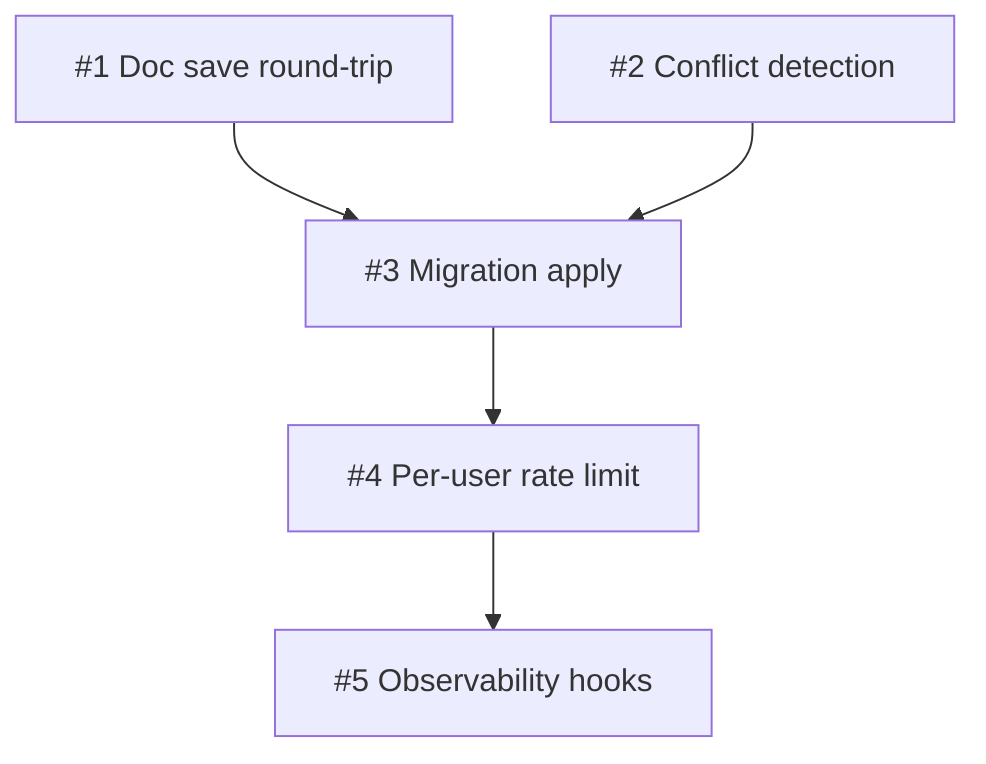

# Plan Template

Lives at `docs/agents/plans/<slug>.md` where the slug matches its source ADR. Written by `write-plan`. Updated by `write-plan` on revisions.

Copy from here. Replace bracketed placeholders. Delete sections that genuinely don't apply (rare; default is to keep all sections, marking unused ones with "N/A — reason").

---

# Plan: [present-tense action that matches ADR title]

| Field         | Value                                                     |
|---------------|-----------------------------------------------------------|
| Plan ID       | `plans/<NNNN-slug>`                                       |
| ADR           | [`adrs/<NNNN-slug>`](../adrs/<NNNN-slug>.md)              |
| Status        | Proposed \| Active \| Done \| Superseded by plans/<slug>  |
| Last updated  | YYYY-MM-DD                                                |
| Owner         | [name / team / "AFK fleet"]                               |

## Goal

[One sentence. The outcome a user sees when this plan is done.]

## Success measure

[One sentence. A binary, production-observable measurement. Examples: "p95 doc-save latency < 200ms over 7d on production traffic." "100% of canary cohort can round-trip a doc through Yjs with zero data-loss reports." NOT "tests pass" or "code reviewed."]

## Phases

### Phase 1 — [short name]

**Slices:** #1, #2, #3 (from spec)

**Acceptance gate:** [One binary, user-observable criterion. The phase is NOT done until this is true. Example: "A user can create a doc and reload it; persisted content matches input for 99.9% of round-trips over 24h."]

**Top risks:**
1. [Specific, concrete. "Yjs CRDT payload may exceed 5KB for docs > 200 paragraphs."]
2. [...]
3. [...]

**Rollback hook:** [Specific operation. "Toggle `yjs_enabled=false` in feature flags; reverts to legacy save path." OR "ONE-WAY DOOR — no rollback after gate passes; gate raised correspondingly."]

### Phase 2 — [short name]

[Same structure. Phase 2 cannot start until Phase 1's gate passes.]

### Phase 3 — [short name]

[...]

## Slice table

| ID  | Name                    | Label                 | Phase | pgroup    | Blocked by | Est | Rollback hook        |
|-----|-------------------------|-----------------------|-------|-----------|------------|-----|----------------------|
| #1  | Doc save round-trip     | AFK:full-auto         | 1     | pgroup-1A | —          | 0.5d | Flag toggle          |
| #2  | Conflict detection      | AFK:full-auto         | 1     | pgroup-1A | —          | 1d   | Flag toggle          |
| #3  | Migration apply         | HITL:approval-gate    | 1     | pgroup-1B | #1, #2     | 0.5d | `migrate resolve --rolled-back` |
| #4  | Per-user rate limit     | AFK:full-auto         | 2     | pgroup-2A | #3         | 0.5d | Config revert        |
| ... | ...                     | ...                   | ...   | ...       | ...        | ...  | ...                  |

**Label legend:**
- `AFK:full-auto` — no human in the loop; safe for `parallel-dev` autonomous dispatch
- `HITL:inline` — human reviews/decides in the chat session mid-slice
- `HITL:approval-gate` — human approves out-of-band (Slack/email; see humanlayer reference impl)

**Estimate convention:** **d** = ideal engineer-days. Estimates are illustrative for sequencing; gates are contractual.

## Dependency DAG



(ASCII fallback if the viewer doesn't render Mermaid:)

```
#1 ─┐
    ├─→ #3 ─→ #4 ─→ #5
#2 ─┘
```

## Parallelization map

- `pgroup-1A` = {#1, #2} — Phase 1, no inter-deps, AFK → `parallel-dev` can dispatch
- `pgroup-1B` = {#3} — Phase 1, single slice (sequential after 1A)
- `pgroup-2A` = {#4} — Phase 2, single slice
- ...

**Independence sanity:** all pgroup members verified against `parallel-dev` Phase 2 checklist (file overlap / state / resource / order / implicit state).

## Risk register

| #   | Phase | Risk                                                  | Likelihood | Impact | Mitigation                       |
|-----|-------|-------------------------------------------------------|------------|--------|----------------------------------|
| R1  | 1     | Yjs payload > 5KB on large docs                       | Medium     | Medium | Profile early in slice #2        |
| R2  | 1     | Migration locks production table > 1min               | Low        | High   | Off-hours window + canary first  |
| R3  | 2     | Rate-limit thresholds too aggressive, breaks UX       | Medium     | Medium | Canary 1% → 10% → 100% over 72h  |
| ... | ...   | ...                                                   | ...        | ...    | ...                              |

## Revisit triggers

- [Scale milestone — e.g., "MAU > 50k"]
- [Latency regression — e.g., "p95 > 500ms for > 10min"]
- [Capability requirement — e.g., "offline editing requested"]
- [External dependency change — e.g., "Yjs 14.x released"]
- [ADR superseded — e.g., "ADR-0008 status flips to Superseded"]

If a trigger fires, halt at the current phase gate and re-run `socratic-grill` on the affected sections before continuing.

## Change log

(Added on first revision. Each entry: date, what changed, why, who.)

- YYYY-MM-DD — Initial plan written from ADR-NNNN.
- YYYY-MM-DD — Phase 2 rollback path updated after canary surfaced X.

## References

- ADR: [`adrs/<NNNN-slug>`](../adrs/<NNNN-slug>.md)
- Spec / sliced spec: [`specs/<slug>`](../specs/<slug>.md)
- Grill record: [`grills/<slug>`](../grills/<slug>.md)
- SYSTEM_CONTEXT: [`SYSTEM_CONTEXT.md`](../SYSTEM_CONTEXT.md)
- External: [any third-party sources cited]
