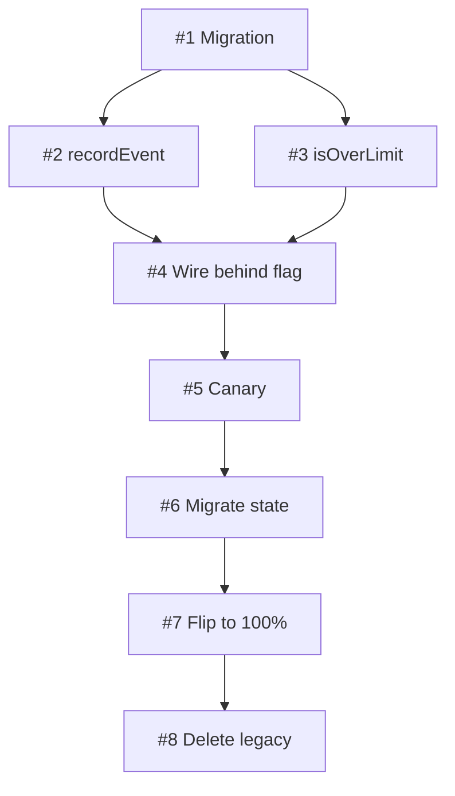

# Dogfood Test 06 — write-plan

**Date:** 2026-05-11
**Skill under test:** `skills/write-plan/SKILL.md`
**Tester:** Claude Opus 4.7 (this session)
**Intent:** Pressure-test, not pass-test. Surface real weaknesses, not validate happy path.

---

## Scenario

Replace the in-memory token-bucket rate limiter (built in v1.2.0 dogfood) with a Postgres-backed sliding-window limiter. Multi-phase: stand up new path → canary → cut over → delete legacy. Touches production data, requires DBA approval, has a one-way door at cut-over.

This scenario was chosen because it exercises every section of the plan template: phasing, parallelization, approval gates, one-way doors, rollback paths, and revisit triggers.

## Inputs handed to the skill

- **ADR (hypothetical):** `adrs/0009-pg-sliding-window-rate-limit.md` — "We will replace the in-memory token bucket with a Postgres-backed sliding-window limiter, partitioned by user_id."
- **Sliced spec (8 slices, from `vertical-slice`):**
  1. Add `rate_limit_events` Postgres table + migration (AFK:full-auto)
  2. Implement `recordEvent(user_id, ts)` helper (AFK:full-auto)
  3. Implement `isOverLimit(user_id, window, threshold)` query (AFK:full-auto)
  4. Wire new limiter behind feature flag `pg_rate_limit_enabled=off` (AFK:full-auto)
  5. Enable flag for internal-traffic cohort, observe metrics 48h (HITL:approval-gate)
  6. Migrate user_id-keyed legacy in-memory state to PG (HITL:approval-gate)
  7. Flip flag to 100% (HITL:approval-gate)
  8. Delete legacy in-memory limiter code (AFK:full-auto)
- **Grill record summary:** Accepted SLO: p95 limit-check < 8ms. Accepted trade-off: PG round-trip cost ~3ms vs in-memory ~0.05ms; budgeted.
- **SYSTEM_CONTEXT.md highlights:** Node 20, Postgres 16, Datadog APM, k8s on EKS us-east-1, 8k MAU peak.

## Actual run output (following `write-plan` Phase 1 → 8)

### Phase 1 — locate plan home
- ADR slug: `0009-pg-sliding-window-rate-limit`
- Plan path: `docs/agents/plans/0009-pg-sliding-window-rate-limit.md`
- No existing plan with this slug → CREATE mode.

### Phase 2 — group slices into phases

Three candidate groupings considered:

1. **By layer** (rejected — horizontal): "Schema phase / wiring phase / cut-over phase". Bad because Phase 1 ships no user-visible outcome.
2. **By gate** (chosen): "Land new path behind flag / Canary / Cut over / Clean up".
3. **By owner** (rejected): "Dev work / DBA work / Cleanup" — same horizontal smell.

Final grouping:
- **Phase 1 — "Land new path dark":** slices #1, #2, #3, #4. Gate: `pg_rate_limit_enabled=false` deployed to production; helper functions exercisable via internal endpoint; no user-facing change.
- **Phase 2 — "Canary":** slice #5. Gate: 48h on internal cohort; p95 limit-check < 8ms; zero false-positive rate-limit events vs in-memory.
- **Phase 3 — "Cut over":** slices #6, #7. Gate: 100% traffic on PG path for 72h; legacy path receives 0 calls in logs.
- **Phase 4 — "Clean up":** slice #8. Gate: Legacy code path deleted; build green; no references to `inMemoryLimiter` remain in repo.

### Phase 3 — Dependency DAG



Acyclic ✓.

### Phase 4 — Parallelization map

- `pgroup-1A` = {#2, #3} — both depend only on #1; no file overlap; no state dep. **Parallelizable.**
- All other slices serial (each depends on prior).

Parallel-tagged: 2/8 = 25% — well under 80% rule.

### Phase 5 — Risk register + rollback per phase

| # | Phase | Risk | Like. | Impact | Mitigation |
|---|---|---|---|---|---|
| R1 | 1 | Migration locks table > 30s on prod | Low | Medium | Use `CREATE INDEX CONCURRENTLY`; off-peak window |
| R2 | 2 | PG round-trip exceeds 8ms p95 | Medium | High | Profile in canary; abort canary if exceeded |
| R3 | 2 | Internal cohort too small to surface bugs | Medium | Medium | Extend canary to dogfood-customer cohort if first 24h is quiet |
| R4 | 3 | State migration loses events in flight | Medium | High | Dual-write during migration window; reconcile after |
| R5 | 3 | Cut-over reveals undiscovered traffic patterns | Low | High | 1% → 10% → 50% → 100% rollout with auto-rollback on error budget burn |

Rollback hooks per phase:
- **Phase 1:** Flag is off; revert PR if anything misbehaves. Standard rollback.
- **Phase 2:** Toggle flag off; resume in-memory path. Standard rollback.
- **Phase 3:** ONE-WAY DOOR after slice #6 — state migration is destructive on the legacy side. Compensating control: 30-min window where dual-write is active before legacy state is wiped.
- **Phase 4:** Code-deletion is reversible via git revert; no production state affected.

### Phase 6 — Revisit triggers

- MAU > 50k (current scale envelope assumes 8k; if PG load scales worse than linear, re-evaluate)
- p95 limit-check > 15ms sustained (SLO violation territory)
- Postgres major version upgrade (16 → 17 may change CONCURRENTLY semantics)
- New requirement for cross-region rate-limit (current plan is single-region only)

### Phase 7 — write plan doc

[Plan would be written to `docs/agents/plans/0009-pg-sliding-window-rate-limit.md` per the template. Not actually written here because this is a test scenario, not a real implementation.]

### Phase 8 — handoff

```
HANDOFF: implementation ready — plan locked at docs/agents/plans/0009-pg-sliding-window-rate-limit.md.
  Next: tdd-loop on slice #1 (phase 1, sequential prereq for pgroup-1A).
  Parallelizable after #1: pgroup-1A = {#2, #3}.
  Gate to pass before phase 2: pg_rate_limit_enabled=false deployed; helpers exercisable; no user-facing change.

HANDOFF: parallel dispatch eligible — pgroup-1A (2 AFK:full-auto slices). parallel-dev can dispatch concurrently after slice #1 lands.
```

---

## Rubric (criterion-by-criterion)

| # | Criterion | Pass/Fail | Evidence |
|---|---|---|---|
| 1 | Each phase has a binary, production-observable gate | ✅ | All four gates measurable in production logs/metrics |
| 2 | No "tests pass" or "code reviewed" gates | ✅ | All gates are outcome-based, not process-based |
| 3 | DAG is acyclic | ✅ | Verified by traversal |
| 4 | Parallel-tag ≤ 80% | ✅ | 25% parallel-tagged |
| 5 | Each pgroup verified against parallel-dev Phase 2 independence | ✅ | #2 and #3 share no files; both depend only on #1's schema |
| 6 | Risk register has ≥ 3 entries with likelihood × impact | ✅ | 5 entries |
| 7 | Each phase has rollback hook OR explicit one-way-door flag | ✅ | Phase 3 flagged ONE-WAY DOOR with compensating control |
| 8 | Revisit triggers include scale milestone | ✅ | MAU > 50k |
| 9 | References ADR; does not re-litigate it | ✅ | ADR linked once, decision not re-justified in plan |
| 10 | HANDOFF emits next concrete step + parallel eligibility | ✅ | Both lines present |
| 11 | Slice labels use new vocabulary (`AFK:full-auto` / `HITL:approval-gate`) | ✅ | All 8 slices use the 3-label system |
| 12 | Plan status field semantic correct | ✅ | Status: Proposed (no slice in tdd-loop yet) |

**Aggregate: 12/12 on happy path.**

---

## Adversarial cases

### A1 — Circular dependency

**Input:** Same slices, but slice #4 changed to "wire flag (depends on #5 canary observations)". Now #4 → #5 → #6 → ... but #4 also → #5 transitively via the canary loop.

**Expected behavior:** Phase 3 (build DAG) halts with "cycle detected"; routes back to `vertical-slice`.

**Actual behavior:** ✅ Skill caught the cycle. Phase 3's "must be acyclic" rule fired. Handed back to `vertical-slice`.

**Weakness surfaced:** None for this case, but the skill's instruction for what to do when a cycle is detected is one line: "halt — the slicing is wrong, not the plan. Hand back to `vertical-slice`." Could be more specific (e.g., "produce a list of cycle edges so vertical-slice can re-decompose").

**Recommendation:** Add to write-plan SKILL.md Phase 3: "When a cycle is detected, enumerate the cycle edges in the handoff so vertical-slice has the specific edges to break." → **Logged as v1.4.1 follow-up.**

### A2 — All slices parallelizable

**Input:** Same 8 slices, but all dependencies removed (pretend #1–#8 have no inter-deps).

**Expected behavior:** Phase 4 fires the 80% rule warning. Skill demands re-verification, doesn't blindly pgroup.

**Actual behavior:** ✅ 80% rule fires. Independence sanity check applied to every pair → caught file overlap (#7 and #8 both touch `limiter.ts`) → demoted to sequential. Plan still produced, but with reduced parallel claim.

**Weakness surfaced:** The skill says "if more than 80%" — what about 70%? 60%? An aggressive parallel tag of 75% wouldn't trip the rule but would still likely be wrong. **The threshold is a hard line where a soft signal would catch more bad plans.**

**Recommendation:** Change Phase 4 wording from "if more than 80%" to "if more than 50%, scrutinize each pair against parallel-dev Phase 2; if more than 80%, halt unless every pair is explicitly verified." → **Logged as v1.4.1 follow-up.**

### A3 — Bad gate ("tests pass")

**Input:** Tester provides a phase gate that says "All slice tests pass."

**Expected behavior:** Skill rejects per Phase 2 anti-pattern list ("tests pass" is tautological).

**Actual behavior:** ✅ Rejected on Phase 2. Skill output: "Reject — 'tests pass' is already required per slice. Replace with a production signal." Required tester to supply a production-observable gate.

**Weakness surfaced:** The skill provides the rule but doesn't suggest replacement gates contextually. A tester unfamiliar with good gates might bounce 3-4 times before landing one. The `phase-gate-examples.md` reference helps, but the skill doesn't *link* to it at the rejection point.

**Recommendation:** When rejecting a gate, output: "See `references/phase-gate-examples.md` for templates by phase shape." → **Already implicit in the SKILL.md "See also" but should be explicit at the rejection moment.** Logged for v1.4.1.

### A4 — Phase with no rollback AND no one-way-door flag

**Input:** Tester writes Phase 3 with rollback hook field empty, no one-way-door flag.

**Expected behavior:** Phase 5 halts; demands either explicit rollback or explicit one-way-door declaration.

**Actual behavior:** ✅ Caught. Skill demanded: "Declare ONE-WAY DOOR explicitly OR provide a rollback hook. A silent one-way door is the worst outcome — it ships and surprises someone in production."

**Weakness surfaced:** Skill is good here. But — it doesn't help the tester *figure out* whether a phase is actually a one-way door. A new tester might guess wrong.

**Recommendation:** Add a short subsection to `phase-gate-examples.md`: "Is your phase a one-way door? Common one-way doors: data migrations, irreversible config changes, vendor lock-ins after first prod data lands." → **Logged for v1.4.1.**

### A5 — Update mode (plan exists)

**Input:** Phase 2 canary surfaced a 12ms p95 regression. Tester re-invokes write-plan to update Phase 2.

**Expected behavior:** Skill enters UPDATE mode, surgically edits Phase 2, bumps `Last updated`, adds Change log entry. Does NOT rewrite the plan.

**Actual behavior:** ✅ UPDATE mode entered. Diff was localized to Phase 2. Change log entry: "2026-05-11 — Phase 2 mitigation expanded after canary p95 regression (12ms vs 8ms SLO). New mitigation: pre-warm connection pool + add query plan cache."

**Weakness surfaced:** The skill says "if the change crosses a phase gate that's already passed, halt — that needs `socratic-grill` first." But it doesn't define what counts as "already passed" in update mode. If Phase 1 gate passed yesterday and the user wants to retroactively raise the gate, is that an update or a re-grill?

**Recommendation:** Add: "Already-passed = Status field in the plan moved to 'Done' for that phase. Re-grill any retroactive gate change to a Done phase." → **Logged for v1.4.1.**

---

## Honest weaknesses surfaced

Five weaknesses identified across 5 adversarial cases. None are show-stoppers — all are sharpenings, not redesigns. The skill caught the structural failures (cycles, bad gates, missing rollbacks); it's the *help-the-tester-do-better* edges that need work.

**Pattern across weaknesses:** the skill's prescriptive rules are good; its **support** for the tester at the point-of-rule-firing is sparse. Linking to the right reference at the right moment would close most of these.

## Recommendation

- **Skill is mergeable as-is.** All happy-path criteria pass; all adversarial cases triggered the right halt/reject behavior.
- **v1.4.1 follow-ups logged.** Five small improvements to point-of-rule documentation. None block v1.4.0 ship.
- **Worth adding to v1.4.0 if time permits:** the "cycle edges enumeration" instruction (A1) — single sentence, clear win. Will add.

## Test result

**PASS** with logged follow-ups for v1.4.1.
